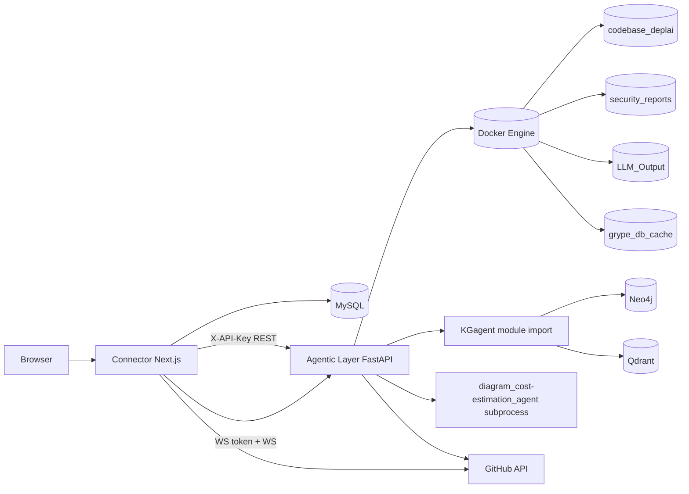

# DeplAI Architecture

This document describes the current runtime architecture in this repository.

## 1. Runtime Topology

## 2. Component Responsibilities

## Connector (`Connector/`)

- User auth/session, project ownership checks, GitHub integration.
- BFF routes for scan/remediation/pipeline APIs.
- Pipeline UI orchestration and stage state persistence.
- WebSocket token minting (`/api/scan/ws-token`) with HMAC signature.

## Agentic Layer (`Agentic Layer/`)

- Scan orchestration (`EnvironmentInitializer`).
- Remediation orchestration (`RemediationRunner`).
- Architecture/cost APIs.
- Stage 7 subprocess invocation.
- Terraform generation and runtime apply APIs.
- AWS runtime details and destroy APIs.

## Stage 7 Agent (`diagram_cost-estimation_agent/`)

- Builds diagram model from `infra_plan`.
- Estimates cost from static AWS pricing table first.
- Uses Groq fallback for unknown resource types.
- Computes budget gate `PASS | WARN | FAIL`.
- Returns approval payload used by Stage 7.5 UI gate.

## KGagent (`KGagent/`)

- Imported by remediation path through `run_analysis_agent`.
- Provides CVE/CWE context from graph/vector data.
- Remediation continues even when KG dependencies are unavailable.

## 3. Security and Auth Boundaries

- Connector -> Agentic REST is protected with `X-API-Key` (`DEPLAI_SERVICE_KEY`).
- WebSocket connections use short-lived HMAC token bound to:
  - `sub` (user id)
  - `project_id`
  - `exp` timestamp
- Backend verifies token signature, expiry, project scope, and `sub`/context match.
- Project ownership is checked in Connector before forwarding requests.

## 4. Data Boundaries

## Persistent metadata

- MySQL tables in `Connector/database.sql`:
  - `users`
  - `github_installations`
  - `github_repositories`
  - `projects`
  - `chat_sessions`
  - `chat_messages`

## Runtime execution data

- Docker volumes:
  - `codebase_deplai` (repo working copy per project id)
  - `security_reports` (Bearer/Syft/Grype JSON output)
  - `LLM_Output` (remediation summary)
  - `grype_db_cache` (scanner cache)

## 5. Stage Flow Mapping

Pipeline stages surfaced in UI:

- `0` preflight (non-blocking health overview)
- `1` scan
- `2` KG analysis
- `3` remediation
- `4` remediation PR
- `4.5` merge confirmation gate
- `4.6` post-merge action gate
- `6` QA context gate
- `7` architecture + cost
- `7.5` approval gate
- `8` IaC generation
- `9` policy gate (budget/secrets/critical findings)
- `10` deploy

Backend remediation loop cap:

- Max 2 remediation cycles (`MAX_REMEDIATION_CYCLES = 2`).

## 6. IaC and Deploy Path

- Backend `/api/terraform/generate` calls `terraform_runner.py`.
- `terraform_runner.py` is intentionally non-RAG in this repository and returns unavailable so Connector can use template fallback.
- Connector `/api/pipeline/iac`:
  - validates architecture contract,
  - blocks if scan state is invalid,
  - tries backend generator,
  - falls back to template bundle when needed,
  - can open IaC PR for GitHub projects.
- Connector `/api/pipeline/deploy`:
  - enforces budget guardrail,
  - `runtime_apply=true` -> backend runtime Terraform apply (AWS only),
  - `runtime_apply=false` -> GitOps repo+workflow push.

## 7. Health Model

- Agentic `/health` currently checks:
  - Docker daemon
  - Neo4j connectivity
- Connector `/api/pipeline/health` composes this into service-level checks:
  - `scan`, `remediation`, `kg_agent`, `architecture`, `diagram`, `cost`, `terraform`, `gitops_deploy`, `runtime_deploy`.

## 8. Current Architectural Notes

- `terraform_agent/` (top-level) exists but is not the active runtime generation path.
- KG server process is not required for baseline flow; KG logic is imported in-process.
- Delivery UI currently drives AWS-specific architecture/IaC/deploy behavior.
