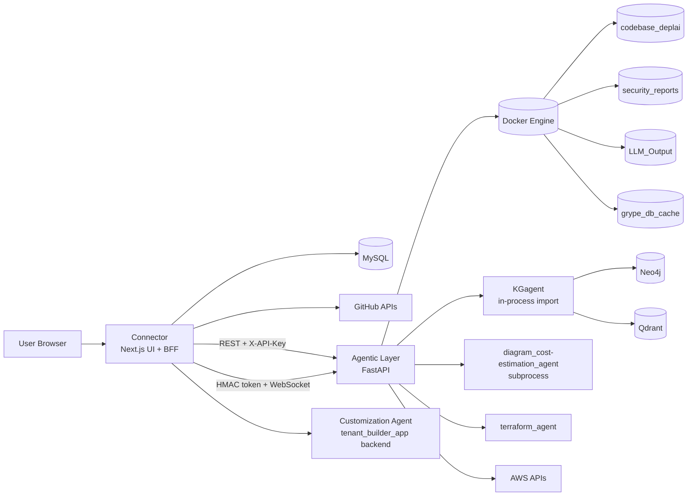
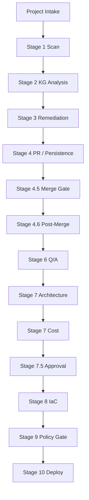
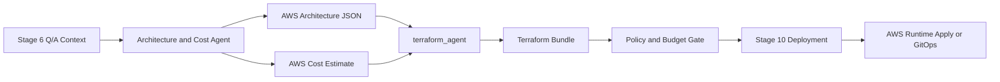
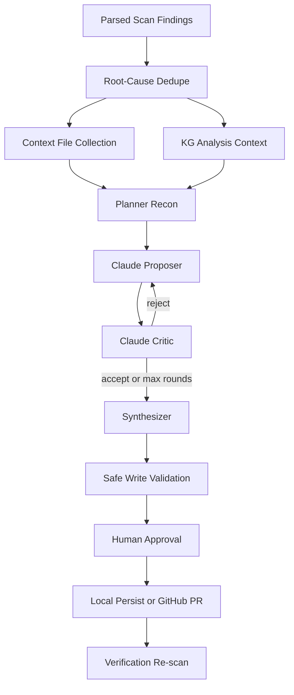

# DeplAI Architecture

This document describes the active runtime architecture in this repository. It focuses on what the code actually does today.

## 1. System Summary

DeplAI is a staged DevSecOps orchestration platform with:

- a Next.js control plane and BFF in `Connector`
- a FastAPI orchestration runtime in `Agentic Layer`
- a KG-backed analysis path for remediation enrichment
- a Stage 6 planning layer for repository analysis and architecture Q/A
- a Stage 7 subprocess for diagram and cost packaging with deterministic fallback
- Terraform generation and AWS-focused runtime deployment
- a separate tenant customization runtime integrated through Connector proxy routes

The platform is optimized for:

- repository intake
- security scanning
- supervised remediation
- AWS architecture and cost planning
- IaC generation
- gated deployment

## 2. Runtime Topology

## 3. Major Components

### 3.1 Connector

`Connector/` is the user-facing control plane and backend-for-frontend.

Responsibilities:

- user authentication and session management
- project ownership validation
- GitHub App and OAuth flows
- project sync and repository operations
- dashboard state and pipeline stage orchestration
- API proxying into Agentic Layer
- WebSocket token minting
- some local fallback generation flows for IaC and deployment packaging

Frameworks and libraries:

- Next.js 16
- React 19
- TypeScript 5
- Tailwind CSS 4
- `iron-session`
- `@octokit/auth-app`
- `@octokit/rest`

### 3.2 Agentic Layer

`Agentic Layer/` is the orchestration runtime.

Responsibilities:

- scan validation and scan execution
- remediation orchestration and rescan loop
- AWS architecture generation
- architecture review start and complete flows
- AWS cost estimation
- Stage 7 approval payload generation
- Terraform generation
- runtime Terraform apply and destroy flows
- pipeline and health endpoints

Frameworks and libraries:

- FastAPI
- Uvicorn
- Pydantic v2
- Docker SDK for Python
- LangGraph
- LangChain packages
- Anthropic SDK
- boto3

### 3.3 KGagent

`KGagent/` is imported in-process by the backend remediation flow. It is not a required separate HTTP service in the active runtime path.

Responsibilities:

- query graph-backed security intelligence
- correlate top CVEs and CWEs
- feed structured business and vulnerability context back to remediation

Dependencies:

- Neo4j
- Qdrant
- sentence-transformers

Behavioral note:

- outages should degrade KG enrichment only, not block remediation entirely

### 3.4 Stage 7 Agent

Stage 7 execution is bridged by `Agentic Layer/stage7_bridge.py`.

Responsibilities:

- diagram generation
- cost estimation packaging
- Stage 7.5 approval payload preparation

Operational behavior:

- the bridge currently resolves the subprocess runner at `diagram_cost-estimation_agent/run_stage7.py`
- if the subprocess path is missing, returns empty output, or returns invalid JSON, the bridge emits a deterministic fallback approval payload

### 3.5 Terraform Engine

Terraform generation is consumed through imports like `terraform_agent.agent.*` in Agentic Layer. In this repository, the active engine implementation is under `Terraform Agent/agent/`, while Connector also contains a local IaC fallback path. Runtime apply is executed from Agentic Layer using the HashiCorp Terraform image.

### 3.6 Stage 6 Planning Services

Stage 6 planning is implemented directly in Agentic Layer through:

- `repository_analysis.service` for framework/runtime/process/data-store/build inference
- `architecture_decision.service` for question generation, answer completion, deployment profile synthesis, and Stage 7 approval wiring

Primary routes:

- `POST /api/repository-analysis/run`
- `POST /api/architecture/review/start`
- `POST /api/architecture/review/complete`

### 3.7 Customization Runtime

`Customization Agent/tenant_builder_app` provides tenant-specific customization flows and is integrated through Connector proxy routes in `Connector/src/app/api/customization/[...path]/route.ts`.

Current integration behavior:

- default upstream is `http://127.0.0.1:8010`
- Connector rewrites shorthand paths (for example implement/reset-repo/assets) to backend tenant endpoints
- repo-bound calls resolve and inject `base_repo_path` before proxying
- preview routes can serve either base repo files or tenant `SubSpace-*` working copies

## 4. Stage Model

The UI exposes the following canonical stage order:

1. `0` preflight
2. `1` scan
3. `2` KG analysis
4. `3` remediation
5. `4` remediation PR
6. `4.5` merge gate
7. `4.6` post-merge actions
8. `6` Q/A context gathering
9. `7` architecture + cost
10. `7.5` approval gate
11. `8` IaC generation
12. `9` GitOps/policy gate
13. `10` deploy

Key runtime constraints:

- remediation cycles are capped at `2`
- runtime apply is AWS-only
- deployment can be blocked by budget checks

## 5. End-to-End Flow

## 5.1 Q/A To Terraform To Deploy

This is the AWS delivery path from planning input to deployment output.

## 6. Agent Architecture

### 6.1 Security analysis agent

The KG-backed analysis path is run before remediation:

- take parsed scan data
- pick top CVEs and CWEs
- query KGagent concurrently
- produce:
  - `business_logic_summary`
  - `vulnerability_summary`
  - structured UI context

### 6.2 Remediation agent stack

The remediation path is the most agentic part of the system.

Current behavior:

- remediation is Claude-only
- Anthropic SDK is the only active remediation provider path
- provider overrides are normalized to Claude server-side
- remediation is repo-wide, not micro-batched
- findings are deduped before prompt construction
- a shared Claude budget tracker spans supervisor and fallback remediation

### 6.3 Remediation supervision loop

The supervisor currently follows this model:

1. Build targeted context from deduped root causes.
2. Run a proposer prompt to generate file changes.
3. Run a critic prompt to review those changes.
4. If rejected and under max rounds, retry with critique feedback.
5. Synthesize validated changes and write only safe updates.
6. Stop early if the Claude budget cap would be exceeded.

### 6.4 Root-cause dedupe

To avoid wasting budget on redundant findings:

- code-security findings are grouped by `CWE + relative file path`
- supply-chain findings are grouped by `package + installed version + fix version`
- only the highest-impact unique groups are sent to KG/remediation

This improves the odds of useful repo-wide fixes under the configured budget cap, but it does not guarantee full remediation of very large repositories in one run.

## 7. Request and Control Flows

### 7.1 Connector to backend

Connector calls Agentic Layer over REST using `DEPLAI_SERVICE_KEY` in `X-API-Key`.

### 7.2 WebSocket execution

Connector issues short-lived HMAC WebSocket tokens using `WS_TOKEN_SECRET`.

Backend verifies:

- signature
- expiry
- project binding
- user identity binding

### 7.3 Remediation persistence

For GitHub projects:

- remediation changes are committed to a generated branch
- GitHub push is attempted
- a PR is created through GitHub API

For local projects:

- files are copied back into `Connector/tmp/local-projects/...`

### 7.4 Deployment modes

There are two active deploy modes:

- `runtime_apply=false`
  - GitOps/repository-oriented path
- `runtime_apply=true`
  - backend runtime Terraform apply
  - currently AWS-only

### 7.5 Chat LLM Provider Routing

Connector chat supports user-supplied provider configs and built-in fallback.

Supported providers in route logic:

- `claude`
- `openai`
- `gemini`
- `groq`
- `openrouter`
- `ollama`

Built-in fallback chain when no client provider call succeeds:

- Groq -> Ollama Cloud -> OpenRouter

## 8. Data and State Architecture

### 8.1 Persistent metadata

Connector uses MySQL for application metadata such as:

- users
- repositories
- installations
- projects
- chat sessions

### 8.2 Execution artifacts

Agentic Layer relies on Docker volumes:

- `codebase_deplai`
- `security_reports`
- `LLM_Output`
- `grype_db_cache`

### 8.3 In-memory orchestration state

Agentic Layer maintains in-memory maps for:

- active scans
- active remediations
- pipeline subscribers
- active Terraform applies
- cached Terraform results

## 9. Framework and Tooling Inventory

### Frontend

- Next.js
- React
- Tailwind CSS
- TypeScript
- ESLint

### Backend

- FastAPI
- Uvicorn
- Docker SDK
- Pydantic
- boto3
- httpx
- requests

### Agent/LLM

- Anthropic SDK
- LangGraph
- LangChain

### Security scanning and infra

- Bearer
- Syft
- Grype
- HashiCorp Terraform image

## 10. Security Boundaries

- Connector validates session and project ownership before forwarding actions
- Agentic Layer trusts only requests signed with `DEPLAI_SERVICE_KEY`
- WebSocket execution is scoped with short-lived HMAC tokens
- remediation does not expose service keys to the client
- deployment paths enforce runtime and budget guardrails

## 11. Operational Constraints

- `docker-compose.yml` starts only `agentic-layer`
- MySQL, Neo4j, and Qdrant must be started separately
- runtime deployment remains AWS-only
- some planning and IaC artifacts are still shaped in Connector rather than persisted as a single backend run object
- Terraform generation can intentionally fall back to local template generation
- directory naming is mixed in the current workspace:
  - Stage 7 implementation is active under `Diagram-Cost-Agent/`, while bridge lookup currently targets `diagram_cost-estimation_agent/`
  - Terraform implementation is active under `Terraform Agent/agent/`, while `terraform_agent/` at repo root is currently an empty placeholder

## 12. Source-of-Truth Files

When docs and runtime differ, these files win:

- `Connector/src/app/api/**`
- `Agentic Layer/main.py`
- `Agentic Layer/remediation.py`
- `Agentic Layer/agent/remediation_supervisor.py`
- `Agentic Layer/claude_remediator.py`
- `Agentic Layer/stage7_bridge.py`
- `Connector/src/features/pipeline/**`
- `Agentic Layer/repository_analysis/service.py`
- `Agentic Layer/architecture_decision/service.py`
- `Connector/src/app/api/customization/[...path]/route.ts`

## 13. Related Docs

- `README.md`
- `RUNBOOK.md`
- `ARCHITECTURE_CONTRACTS.md`
- `UI_AGENT_HANDOFF.md`
