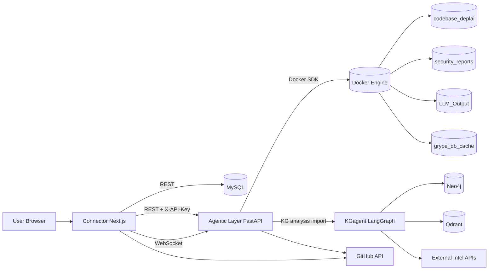
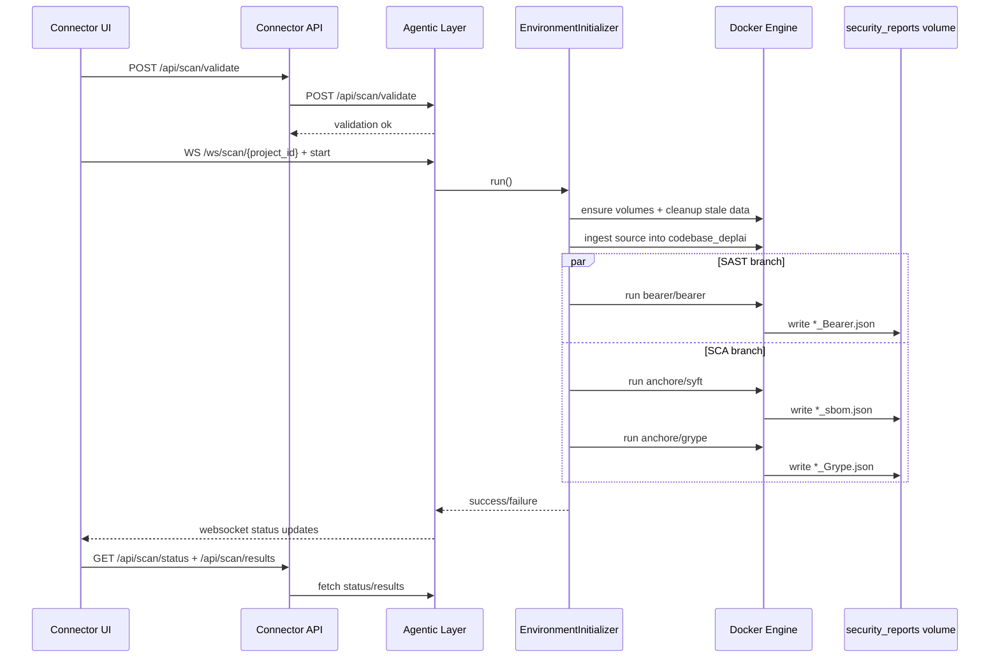
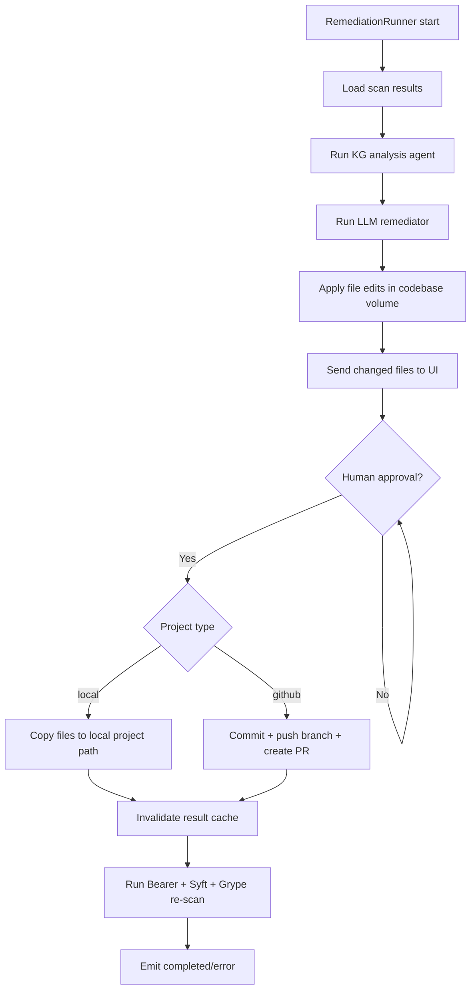
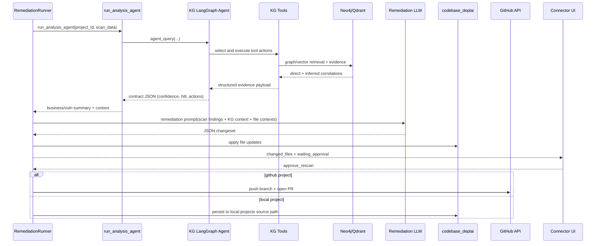

# DeplAI Architecture

This document describes runtime architecture, orchestration, and agent interactions.

## 1. System Architecture

## 2. Scan Orchestration

`EnvironmentInitializer` is the scan orchestrator in `Agentic Layer/environment.py`.

Responsibilities:
- validate Docker availability
- ensure Docker volumes exist
- clear stale codebase and stale project report files
- ingest source (GitHub clone or local project copy)
- run scanners:
  - Bearer for SAST
  - Syft + Grype for SCA
- stream progress over websocket to Connector

## 3. Remediation Orchestration

`RemediationRunner` is the remediation orchestrator in `Agentic Layer/remediation.py`.

Responsibilities:
- ingest parsed scan results
- run KG intelligence analysis (`run_analysis_agent`)
- call remediation LLM and apply file edits in `codebase_deplai`
- emit changed files to UI
- enforce human approval gate before persistence
- persist to local codebase or GitHub (branch + PR)
- invalidate cache and run post-fix re-scan

## 4. Agent Orchestration and Interaction Model

There are two major agent loops in this system:

1. **Pipeline Orchestrators (workflow control)**
- `EnvironmentInitializer` (scan pipeline)
- `RemediationRunner` (remediation pipeline)

2. **Knowledge/Reasoning Agents (security intelligence + fix generation)**
- `KGagent` LangGraph planner/tool loop
- LLM remediator (`run_claude_remediation` with provider abstraction)

### 4.1 Agent Interaction Diagram

### 4.2 Orchestration Guarantees

- Shared scan/remediation websocket protocol (`start`, `approve_rescan`)
- Explicit terminal statuses (`completed`, `error`, `waiting_approval`)
- Cache invalidation before UI re-fetches results
- Empty scanner report guardrails to avoid false-clean outcomes
- Human-in-the-loop checkpoint before post-fix persistence + re-scan

## 5. Data Boundaries

- **Metadata boundary**: MySQL (`users`, `github_installations`, `github_repositories`, `projects`)
- **Transient execution boundary**: Docker volumes (`codebase_deplai`, `security_reports`, `LLM_Output`, `grype_db_cache`)
- **External boundary**: GitHub APIs, optional LLM providers, optional Neo4j/Qdrant infra

## 6. Security Posture Notes

- `DEPLAI_SERVICE_KEY` secures Connector -> Agentic REST calls and websocket tokening
- GitHub remediation uses either runtime token or installation token
- Runtime LLM API keys are sent for remediation execution and should be handled as secrets
- Do not commit real credentials to repo files

