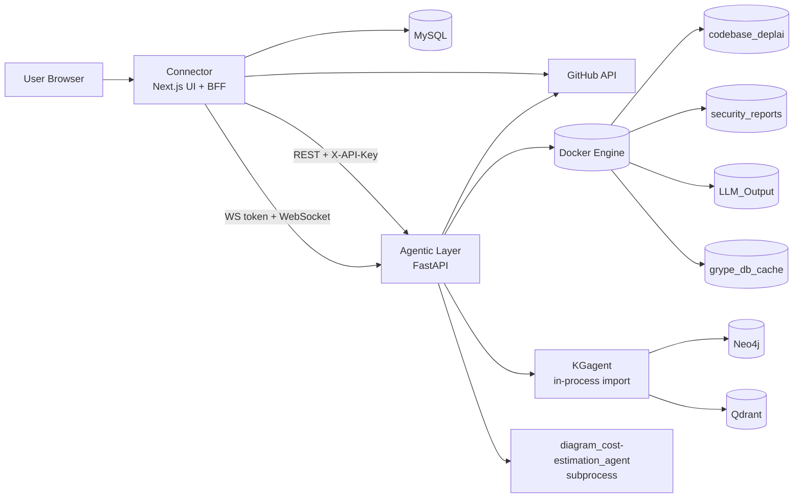
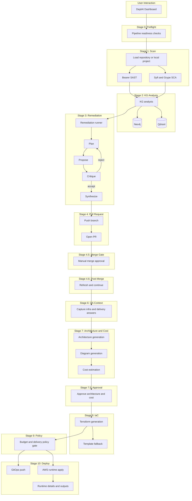

# DeplAI Architecture

This document describes the active runtime architecture in this repository. It is intentionally implementation-first: the goal is to explain the system that actually runs today, not an older target-state design.

## System Overview

DeplAI is a staged DevSecOps control plane built around three runtime layers:

- `Connector`: the user-facing Next.js application and backend-for-frontend layer
- `Agentic Layer`: the FastAPI orchestration service for scan, remediation, architecture, cost, and deploy actions
- Supporting analysis modules: `KGagent` and `diagram_cost-estimation_agent`

The platform accepts a GitHub repository or local project, runs security analysis, guides remediation through human approval, generates architecture and delivery artifacts, applies policy checks, and then deploys through GitOps or AWS runtime apply.

## Runtime Topology

## Architectural Flow

## Core Components

### Connector

`Connector/` is the control plane entry point and BFF.

Responsibilities:

- user authentication and session handling
- project ownership and authorization checks
- GitHub OAuth, GitHub App, repository sync, and PR/deploy integration
- pipeline stage orchestration in the dashboard
- WebSocket token minting for scan and remediation streams
- policy checks and request shaping before calling the backend

Important characteristics:

- persists project and chat metadata in MySQL
- exposes pipeline routes under `Connector/src/app/api`
- holds local project uploads under `Connector/tmp/local-projects`
- drives most later pipeline stages over HTTP rather than queue workers

### Agentic Layer

`Agentic Layer/` is the orchestration runtime.

Responsibilities:

- scan validation and scan execution orchestration
- remediation execution and cycle management
- architecture generation and cost estimation APIs
- Stage 7 subprocess invocation
- Terraform generation handoff
- Terraform runtime apply, stop, status, destroy, and runtime details
- health and readiness reporting

Important runtime state in memory:

- active scan runners
- active remediation runners
- pipeline websocket subscribers
- active Terraform apply contexts
- cached apply results

Important characteristics:

- protected by `DEPLAI_SERVICE_KEY`
- verifies HMAC-bound WebSocket tokens using `WS_TOKEN_SECRET`
- uses Docker to manage working volumes and scanner execution

### KGagent

`KGagent/` is not a required standalone service in the active path. It is imported by the remediation flow inside the backend.

Responsibilities:

- enrich remediation with graph-backed CVE and CWE context
- query Neo4j and optional vector retrieval dependencies
- tolerate dependency unavailability without hard-failing the full remediation flow

### Stage 7 Agent

`diagram_cost-estimation_agent/` is executed by the backend as a subprocess during approval-pack generation.

Responsibilities:

- transform infra planning data into diagram output
- estimate cost across cloud providers
- produce approval payloads for the Stage 7.5 gate
- feed the downstream IaC and deployment stages with structured artifact data

## Stage Mapping

The active stage order surfaced in the UI is defined in `Connector/src/features/pipeline/data.ts`.

Stages:

- `0` preflight
- `1` scan
- `2` KG analysis
- `3` remediation
- `4` remediation PR
- `4.5` merge gate
- `4.6` post-merge actions
- `6` QA context gathering
- `7` architecture and cost
- `7.5` approval gate
- `8` IaC generation
- `9` GitOps and policy gate
- `10` deploy

Operational note:

- remediation is hard-capped at `MAX_REMEDIATION_CYCLES = 2`

## Data Architecture

### Persistent metadata

MySQL is used by Connector for durable application metadata, including:

- users
- GitHub installations
- GitHub repositories
- projects
- chat sessions
- chat messages

### Runtime execution state

The backend uses Docker-managed volumes for execution artifacts:

- `codebase_deplai`: working copy of the project under analysis
- `security_reports`: scanner outputs from Bearer, Syft, and Grype
- `LLM_Output`: remediation summaries and related artifacts
- `grype_db_cache`: vulnerability database cache

### Client-side transient state

Not every pipeline artifact is server-persisted yet. Some stage data is still carried in UI state or browser storage, especially around QA answers, architecture outputs, cost outputs, and deployment continuation.

## Security Boundaries

### Connector to backend

- REST calls from Connector to Agentic Layer use `X-API-Key`
- the shared secret is `DEPLAI_SERVICE_KEY`

### WebSocket control

- Connector signs short-lived WebSocket tokens with `WS_TOKEN_SECRET`
- tokens are bound to `sub`, `project_id`, and expiry
- Agentic Layer verifies signature, expiry, project binding, and user context match

### Project authorization

- Connector performs project ownership checks before forwarding scan, remediation, or delivery actions
- backend trust is scoped around the authenticated and prevalidated request coming from Connector

### Deployment controls

- budget guardrails are enforced before deployment proceeds
- runtime deploy control plane includes status, stop, destroy, and runtime details endpoints
- GitOps repository updates are performed through GitHub API calls from Connector

## Deployment Architecture

There are two deployment modes in the current system.

### GitOps mode

Triggered when `runtime_apply=false`.

Behavior:

- Connector writes generated IaC and workflow assets into a GitHub repository
- repository variables and workflow files are configured
- deployment execution is delegated to GitHub Actions or repository workflow logic

### Runtime apply mode

Triggered when `runtime_apply=true`.

Behavior:

- Connector forwards the apply request to Agentic Layer
- Agentic Layer executes Terraform apply for AWS-focused deployments
- apply state is tracked in memory and exposed through status and stop endpoints
- post-deploy details are returned through runtime detail routes

## Health Model

### Backend health

`/health` in Agentic Layer currently checks at least:

- Docker daemon availability
- Neo4j connectivity

### Connector health composition

`/api/pipeline/health` in Connector turns backend and local checks into a service-level readiness model, including:

- scan
- remediation
- KG agent
- architecture
- diagram
- cost
- terraform
- GitOps deploy
- runtime deploy

## Active Versus Legacy Paths

This repository contains code that is not the primary runtime path.

Active path:

- Connector BFF routes
- Agentic Layer orchestration
- in-process KG analysis
- Stage 7 subprocess execution
- Connector-managed IaC fallback and deployment orchestration

Legacy or non-primary path:

- top-level `terraform_agent/` as a standalone generator runtime
- older queue and worker style documentation
- Terraform RAG-based generation path

## Current Constraints

- `docker-compose.yml` starts `agentic-layer` only
- MySQL, Neo4j, and Qdrant are not provisioned by the compose file
- runtime deployment is AWS-only
- delivery UX remains AWS-first
- not all workflow artifacts are yet persisted as a single canonical run object
- Terraform generation can intentionally fall back to static templates

## Related Documents

- operational guide: `RUNBOOK.md`
- platform overview: `README.md`
- architecture contract notes: `ARCHITECTURE_CONTRACTS.md`
