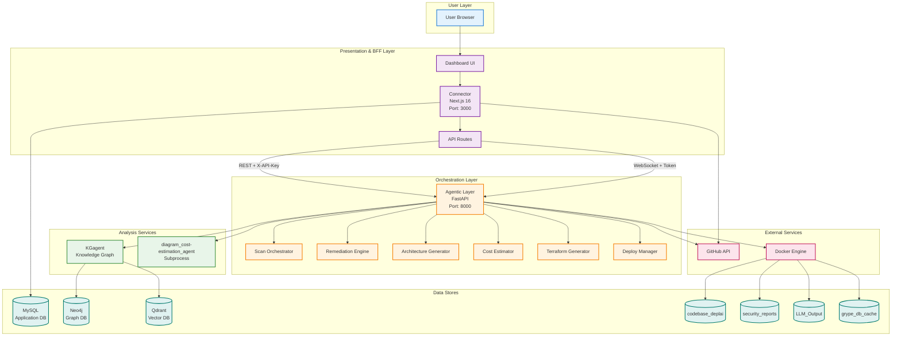
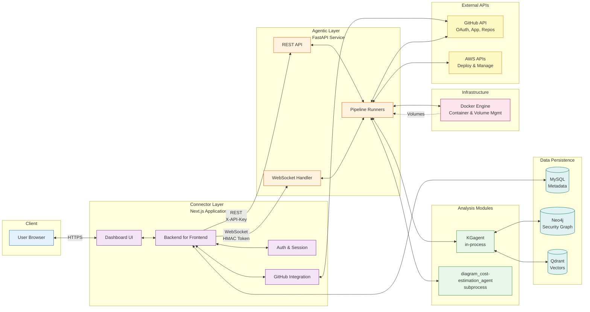
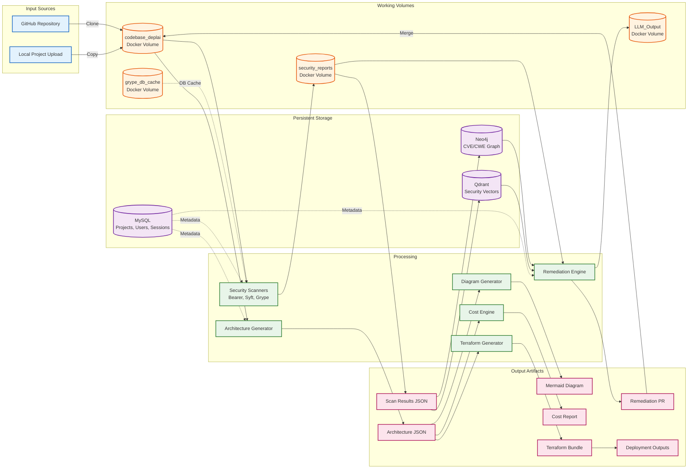
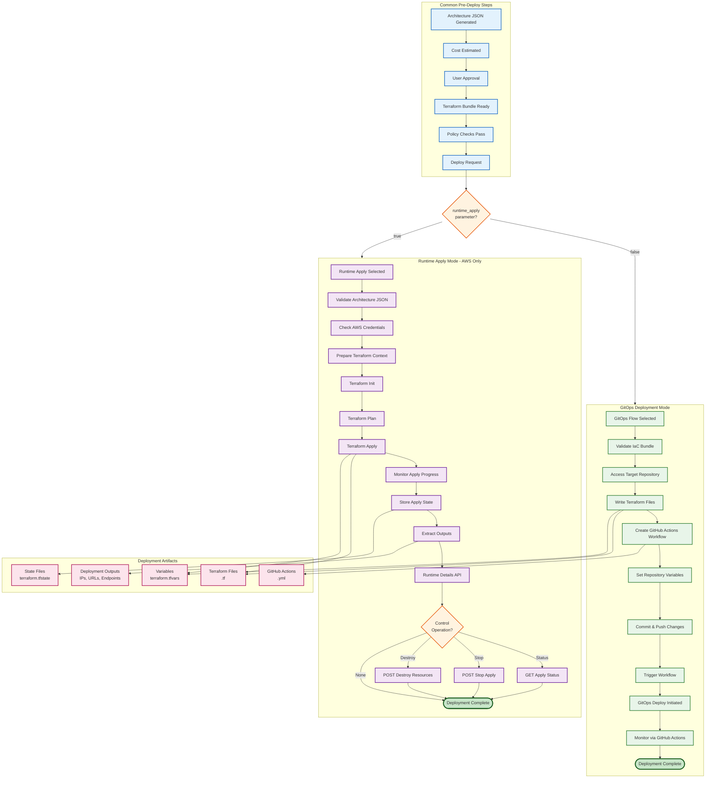
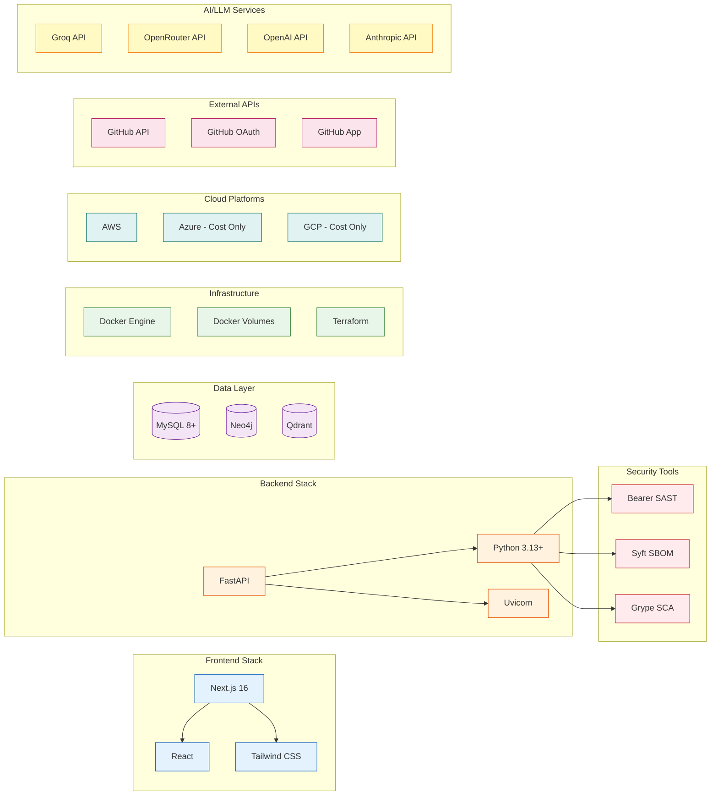

# DeplAI Architecture Diagrams

This document provides comprehensive Mermaid diagrams visualizing the DeplAI platform architecture from multiple perspectives.

## Table of Contents

1. [System Component Overview](#system-component-overview)
2. [High-Level Runtime Topology](#high-level-runtime-topology)
3. [Detailed Component Architecture](#detailed-component-architecture)
4. [Pipeline Flow Architecture](#pipeline-flow-architecture)
5. [Data Flow Architecture](#data-flow-architecture)
6. [API Layer Architecture](#api-layer-architecture)
7. [Security and Authentication Flow](#security-and-authentication-flow)
8. [Deployment Modes](#deployment-modes)

---

## System Component Overview



---

## High-Level Runtime Topology



---

## Detailed Component Architecture

```mermaid
graph TB
    subgraph "Connector - Next.js Frontend & BFF"
        subgraph "UI Components"
            DASH[Dashboard]
            PIPELINE_UI[Pipeline UI]
            CHAT_UI[Chat Interface]
        end

        subgraph "API Routes - /api"
            AUTH_API[/auth/*<br/>Login, Callback, Session]
            PROJECTS_API[/projects/*<br/>Create, List, Upload]
            SCAN_API[/scan/*<br/>Validate, Status, Results, WS-Token]
            REMEDIATE_API[/remediate/*<br/>Start, Status]
            ARCH_API[/architecture<br/>Generate]
            COST_API[/cost<br/>Estimate]
            PIPELINE_API[/pipeline/*<br/>Health, Diagram, Stage7, IaC, Deploy]
            GITHUB_API[/github/*<br/>Installations, Repos, Webhooks]
        end

        subgraph "Business Logic"
            SESSION[Session Manager]
            PROJECT_AUTH[Project Authorization]
            WS_TOKEN[WebSocket Token Minter]
        end

        subgraph "Data Access"
            MYSQL_CLIENT[(MySQL Client)]
            GITHUB_CLIENT[GitHub SDK]
        end
    end

    subgraph "Agentic Layer - FastAPI Backend"
        subgraph "API Endpoints"
            SCAN_EP[/api/scan/*]
            REMEDIATE_EP[/api/remediate/*]
            ARCH_EP[/api/architecture/*]
            COST_EP[/api/cost/*]
            STAGE7_EP[/api/stage7/*]
            TF_EP[/api/terraform/*]
            AWS_EP[/api/aws/*]
            HEALTH_EP[/health]
        end

        subgraph "WebSocket Handlers"
            WS_SCAN[/ws/scan/{project_id}]
            WS_REMEDIATE[/ws/remediate/{project_id}]
            WS_PIPELINE[/ws/pipeline/{project_id}]
        end

        subgraph "Core Services"
            SCAN_SVC[Scan Service<br/>Bearer, Syft, Grype]
            REMEDIATE_SVC[Remediation Service<br/>Plan, Propose, Critique]
            ARCH_SVC[Architecture Service<br/>JSON Generator]
            COST_SVC[Cost Service<br/>Multi-Cloud Pricing]
            TF_SVC[Terraform Service<br/>IaC Generation]
            DEPLOY_SVC[Deploy Service<br/>Apply, Status, Stop]
        end

        subgraph "Integrations"
            KG_INT[KGagent Import<br/>Graph Analysis]
            STAGE7_INT[Stage7 Subprocess<br/>Diagram & Cost]
            DOCKER_INT[Docker SDK<br/>Volume & Container Mgmt]
        end
    end

    DASH --> PROJECTS_API
    PIPELINE_UI --> SCAN_API
    PIPELINE_UI --> REMEDIATE_API
    PIPELINE_UI --> PIPELINE_API
    CHAT_UI --> GITHUB_API

    AUTH_API --> SESSION
    PROJECTS_API --> PROJECT_AUTH
    SCAN_API --> WS_TOKEN

    SESSION --> MYSQL_CLIENT
    PROJECT_AUTH --> MYSQL_CLIENT
    GITHUB_API --> GITHUB_CLIENT

    SCAN_API -->|HTTP| SCAN_EP
    REMEDIATE_API -->|HTTP| REMEDIATE_EP
    ARCH_API -->|HTTP| ARCH_EP
    COST_API -->|HTTP| COST_EP
    PIPELINE_API -->|HTTP| STAGE7_EP
    PIPELINE_API -->|HTTP| TF_EP
    PIPELINE_API -->|HTTP| AWS_EP

    PIPELINE_UI -->|WebSocket| WS_SCAN
    PIPELINE_UI -->|WebSocket| WS_REMEDIATE

    SCAN_EP --> SCAN_SVC
    REMEDIATE_EP --> REMEDIATE_SVC
    ARCH_EP --> ARCH_SVC
    COST_EP --> COST_SVC
    STAGE7_EP --> STAGE7_INT
    TF_EP --> TF_SVC
    AWS_EP --> DEPLOY_SVC

    WS_SCAN --> SCAN_SVC
    WS_REMEDIATE --> REMEDIATE_SVC

    SCAN_SVC --> DOCKER_INT
    REMEDIATE_SVC --> KG_INT
    REMEDIATE_SVC --> DOCKER_INT
    STAGE7_INT --> ARCH_SVC
    STAGE7_INT --> COST_SVC
    DEPLOY_SVC --> DOCKER_INT

    classDef ui fill:#e1f5fe,stroke:#01579b
    classDef api fill:#f3e5f5,stroke:#4a148c
    classDef logic fill:#fff3e0,stroke:#e65100
    classDef data fill:#e8f5e9,stroke:#2e7d32
    classDef endpoint fill:#fce4ec,stroke:#880e4f
    classDef service fill:#fff9c4,stroke:#f57f17
    classDef integration fill:#e0f2f1,stroke:#004d40

    class DASH,PIPELINE_UI,CHAT_UI ui
    class AUTH_API,PROJECTS_API,SCAN_API,REMEDIATE_API,ARCH_API,COST_API,PIPELINE_API,GITHUB_API api
    class SESSION,PROJECT_AUTH,WS_TOKEN logic
    class MYSQL_CLIENT,GITHUB_CLIENT data
    class SCAN_EP,REMEDIATE_EP,ARCH_EP,COST_EP,STAGE7_EP,TF_EP,AWS_EP,HEALTH_EP,WS_SCAN,WS_REMEDIATE,WS_PIPELINE endpoint
    class SCAN_SVC,REMEDIATE_SVC,ARCH_SVC,COST_SVC,TF_SVC,DEPLOY_SVC service
    class KG_INT,STAGE7_INT,DOCKER_INT integration
```

---

## Pipeline Flow Architecture

```mermaid
flowchart TB
    START([User Initiates Pipeline]) --> STAGE0

    subgraph STAGE0["Stage 0: Preflight"]
        PF_CHECK[Health Checks]
        PF_CHECK --> PF_DOCKER{Docker<br/>Available?}
        PF_CHECK --> PF_NEO4J{Neo4j<br/>Available?}
        PF_DOCKER --> PF_READY[Pipeline Ready]
        PF_NEO4J --> PF_READY
    end

    STAGE0 --> STAGE1

    subgraph STAGE1["Stage 1: Scan"]
        INGEST[Ingest Repository/Upload]
        INGEST --> BEARER[Bearer SAST Scan]
        INGEST --> SYFT[Syft SBOM Generation]
        SYFT --> GRYPE[Grype SCA Scan]
        BEARER --> SCAN_RESULTS[Aggregate Results]
        GRYPE --> SCAN_RESULTS
    end

    STAGE1 --> STAGE2

    subgraph STAGE2["Stage 2: KG Analysis"]
        KG_INGEST[Ingest Scan Results]
        KG_INGEST --> KG_GRAPH[Build Knowledge Graph]
        KG_GRAPH --> KG_NEO4J[(Neo4j)]
        KG_GRAPH --> KG_VECTOR[Generate Embeddings]
        KG_VECTOR --> KG_QDRANT[(Qdrant)]
    end

    STAGE2 --> STAGE3

    subgraph STAGE3["Stage 3: Remediation"]
        REM_PLAN[Plan Remediation]
        REM_PLAN --> REM_PROPOSE[Propose Changes]
        REM_PROPOSE --> REM_CRITIQUE[Critique & Validate]
        REM_CRITIQUE -->|Reject| REM_PLAN
        REM_CRITIQUE -->|Accept| REM_SYNTH[Synthesize Changes]
        REM_SYNTH --> REM_CYCLES{Max Cycles<br/>Reached?}
        REM_CYCLES -->|No| REM_PLAN
        REM_CYCLES -->|Yes| REM_DONE[Remediation Complete]
    end

    STAGE3 --> STAGE4

    subgraph STAGE4["Stage 4: Pull Request"]
        PR_BRANCH[Create Branch]
        PR_BRANCH --> PR_COMMIT[Commit Changes]
        PR_COMMIT --> PR_PUSH[Push to GitHub]
        PR_PUSH --> PR_OPEN[Open Pull Request]
    end

    STAGE4 --> STAGE45

    subgraph STAGE45["Stage 4.5: Merge Gate"]
        HUMAN_REVIEW[Human Review]
        HUMAN_REVIEW --> MERGE_DECISION{Approved?}
        MERGE_DECISION -->|No| MERGE_REJECT[Reject & Stop]
        MERGE_DECISION -->|Yes| MERGE_ACCEPT[Merge PR]
    end

    STAGE45 --> STAGE46

    subgraph STAGE46["Stage 4.6: Post-Merge"]
        REFRESH[Refresh Repository]
        REFRESH --> RESCAN{Need<br/>Re-scan?}
        RESCAN -->|Yes| STAGE1
        RESCAN -->|No| CONTINUE[Continue Pipeline]
    end

    STAGE46 --> STAGE6

    subgraph STAGE6["Stage 6: QA Context"]
        QA_INFRA[Infrastructure Questions]
        QA_INFRA --> QA_DELIVERY[Delivery Preferences]
        QA_DELIVERY --> QA_CONTEXT[Context Complete]
    end

    STAGE6 --> STAGE7

    subgraph STAGE7["Stage 7: Architecture & Cost"]
        ARCH_GEN[Generate Architecture JSON]
        ARCH_GEN --> DIAGRAM_GEN[Generate Mermaid Diagram]
        DIAGRAM_GEN --> COST_EST_AWS[AWS Cost Estimation]
        DIAGRAM_GEN --> COST_EST_AZURE[Azure Cost Estimation]
        DIAGRAM_GEN --> COST_EST_GCP[GCP Cost Estimation]
        COST_EST_AWS --> APPROVAL_PACK[Build Approval Pack]
        COST_EST_AZURE --> APPROVAL_PACK
        COST_EST_GCP --> APPROVAL_PACK
    end

    STAGE7 --> STAGE75

    subgraph STAGE75["Stage 7.5: Approval Gate"]
        SHOW_ARCH[Show Architecture & Cost]
        SHOW_ARCH --> APPROVE_DECISION{User<br/>Approves?}
        APPROVE_DECISION -->|No| APPROVE_REJECT[Reject & Revise]
        APPROVE_REJECT --> STAGE6
        APPROVE_DECISION -->|Yes| APPROVE_ACCEPT[Proceed to IaC]
    end

    STAGE75 --> STAGE8

    subgraph STAGE8["Stage 8: IaC Generation"]
        IAC_ATTEMPT[Attempt Terraform Gen]
        IAC_ATTEMPT --> IAC_CHECK{Generation<br/>Success?}
        IAC_CHECK -->|No| IAC_FALLBACK[Use Static Template]
        IAC_CHECK -->|Yes| IAC_VALIDATE[Validate Terraform]
        IAC_FALLBACK --> IAC_BUNDLE[Create IaC Bundle]
        IAC_VALIDATE --> IAC_BUNDLE
    end

    STAGE8 --> STAGE9

    subgraph STAGE9["Stage 9: Policy Gate"]
        POLICY_BUDGET[Budget Check]
        POLICY_BUDGET --> POLICY_DELIVERY[Delivery Policy]
        POLICY_DELIVERY --> POLICY_DECISION{Policies<br/>Pass?}
        POLICY_DECISION -->|No| POLICY_FAIL[Block Deployment]
        POLICY_DECISION -->|Yes| POLICY_PASS[Proceed to Deploy]
    end

    STAGE9 --> STAGE10

    subgraph STAGE10["Stage 10: Deploy"]
        DEPLOY_MODE{Deploy<br/>Mode?}
        DEPLOY_MODE -->|GitOps| GITOPS_PUSH[Push to GitOps Repo]
        GITOPS_PUSH --> GITOPS_WORKFLOW[Configure GitHub Actions]
        GITOPS_WORKFLOW --> GITOPS_DONE[GitOps Deploy Complete]

        DEPLOY_MODE -->|Runtime| RUNTIME_APPLY[Terraform Apply]
        RUNTIME_APPLY --> RUNTIME_MONITOR[Monitor Apply]
        RUNTIME_MONITOR --> RUNTIME_DETAILS[Collect Runtime Details]
        RUNTIME_DETAILS --> RUNTIME_DONE[Runtime Deploy Complete]
    end

    STAGE10 --> END([Pipeline Complete])

    classDef stage fill:#e1f5fe,stroke:#01579b,stroke-width:2px
    classDef decision fill:#fff3e0,stroke:#e65100,stroke-width:2px
    classDef success fill:#e8f5e9,stroke:#2e7d32,stroke-width:2px
    classDef failure fill:#ffebee,stroke:#c62828,stroke-width:2px
    classDef data fill:#f3e5f5,stroke:#6a1b9a,stroke-width:2px

    class PF_CHECK,INGEST,BEARER,SYFT,GRYPE,KG_INGEST,KG_GRAPH,REM_PLAN,REM_PROPOSE,REM_CRITIQUE,PR_BRANCH,QA_INFRA,ARCH_GEN,IAC_ATTEMPT,POLICY_BUDGET,GITOPS_PUSH,RUNTIME_APPLY stage
    class PF_DOCKER,PF_NEO4J,REM_CYCLES,MERGE_DECISION,RESCAN,APPROVE_DECISION,IAC_CHECK,POLICY_DECISION,DEPLOY_MODE decision
    class PF_READY,SCAN_RESULTS,REM_DONE,PR_OPEN,MERGE_ACCEPT,CONTINUE,APPROVAL_PACK,APPROVE_ACCEPT,IAC_BUNDLE,POLICY_PASS,GITOPS_DONE,RUNTIME_DONE success
    class MERGE_REJECT,APPROVE_REJECT,IAC_FALLBACK,POLICY_FAIL failure
    class KG_NEO4J,KG_QDRANT data
```



---

## Data Flow Architecture



---

## API Layer Architecture

```mermaid
graph TB
    subgraph "Client Layer"
        BROWSER[Browser/UI]
    end

    subgraph "Connector API Routes - Next.js"
        subgraph "Authentication"
            API_LOGIN[POST /api/auth/login]
            API_CALLBACK[GET /api/auth/callback]
            API_SESSION[GET /api/auth/session]
            API_LOGOUT[POST /api/auth/logout]
        end

        subgraph "Projects"
            API_PROJ_LIST[GET /api/projects]
            API_PROJ_CREATE[POST /api/projects]
            API_PROJ_UPLOAD[POST /api/projects/upload]
            API_PROJ_GET[GET /api/projects/{id}]
        end

        subgraph "Scan Operations"
            API_SCAN_VALIDATE[POST /api/scan/validate]
            API_SCAN_STATUS[GET /api/scan/status]
            API_SCAN_RESULTS[GET /api/scan/results]
            API_SCAN_TOKEN[GET /api/scan/ws-token]
        end

        subgraph "Remediation"
            API_REM_START[POST /api/remediate/start]
        end

        subgraph "Pipeline Operations"
            API_PIPE_HEALTH[GET /api/pipeline/health]
            API_PIPE_DIAGRAM[POST /api/pipeline/diagram]
            API_PIPE_STAGE7[POST /api/pipeline/stage7]
            API_PIPE_IAC[POST /api/pipeline/iac]
            API_PIPE_DEPLOY[POST /api/pipeline/deploy]
            API_PIPE_STATUS[POST /api/pipeline/deploy/status]
            API_PIPE_STOP[POST /api/pipeline/deploy/stop]
            API_PIPE_DESTROY[POST /api/pipeline/deploy/destroy]
            API_PIPE_DETAILS[POST /api/pipeline/runtime-details]
        end

        subgraph "GitHub Integration"
            API_GH_INSTALL[GET /api/installations]
            API_GH_REPOS[GET /api/repositories]
            API_GH_WEBHOOK[POST /api/webhooks/github]
        end
    end

    subgraph "Agentic Layer API - FastAPI"
        subgraph "Scan Endpoints"
            EP_SCAN_VALIDATE[POST /api/scan/validate]
            EP_SCAN_STATUS[GET /api/scan/status/{project_id}]
            EP_SCAN_RESULTS[GET /api/scan/results/{project_id}]
            WS_SCAN[WS /ws/scan/{project_id}]
        end

        subgraph "Remediation Endpoints"
            EP_REM_VALIDATE[POST /api/remediate/validate]
            WS_REMEDIATE[WS /ws/remediate/{project_id}]
        end

        subgraph "Architecture Endpoints"
            EP_ARCH_GEN[POST /api/architecture/generate]
        end

        subgraph "Cost Endpoints"
            EP_COST_EST[POST /api/cost/estimate]
        end

        subgraph "Stage7 Endpoints"
            EP_STAGE7[POST /api/stage7/approval]
        end

        subgraph "Terraform Endpoints"
            EP_TF_GEN[POST /api/terraform/generate]
            EP_TF_APPLY[POST /api/terraform/apply]
            EP_TF_STATUS[POST /api/terraform/apply/status]
            EP_TF_STOP[POST /api/terraform/apply/stop]
        end

        subgraph "AWS Endpoints"
            EP_AWS_DETAILS[POST /api/aws/runtime-details]
            EP_AWS_DESTROY[POST /api/aws/destroy-runtime]
        end

        subgraph "Health"
            EP_HEALTH[GET /health]
        end

        subgraph "Pipeline WebSocket"
            WS_PIPELINE[WS /ws/pipeline/{project_id}]
        end
    end

    BROWSER --> API_LOGIN
    BROWSER --> API_PROJ_LIST
    BROWSER --> API_SCAN_VALIDATE
    BROWSER --> API_PIPE_HEALTH

    API_SCAN_VALIDATE -->|X-API-Key| EP_SCAN_VALIDATE
    API_SCAN_STATUS -->|X-API-Key| EP_SCAN_STATUS
    API_SCAN_RESULTS -->|X-API-Key| EP_SCAN_RESULTS
    API_SCAN_TOKEN -.->|Token| WS_SCAN

    API_REM_START -->|X-API-Key| EP_REM_VALIDATE
    API_REM_START -.->|Token| WS_REMEDIATE

    API_PIPE_DIAGRAM -->|X-API-Key| EP_ARCH_GEN
    API_PIPE_STAGE7 -->|X-API-Key| EP_STAGE7
    API_PIPE_IAC -->|X-API-Key| EP_TF_GEN
    API_PIPE_DEPLOY -->|X-API-Key| EP_TF_APPLY
    API_PIPE_STATUS -->|X-API-Key| EP_TF_STATUS
    API_PIPE_DETAILS -->|X-API-Key| EP_AWS_DETAILS

    API_PIPE_HEALTH -->|X-API-Key| EP_HEALTH

    classDef client fill:#e3f2fd,stroke:#1565c0,stroke-width:2px
    classDef connectorAPI fill:#f3e5f5,stroke:#6a1b9a,stroke-width:2px
    classDef agenticAPI fill:#fff3e0,stroke:#e65100,stroke-width:2px
    classDef websocket fill:#e8f5e9,stroke:#2e7d32,stroke-width:2px

    class BROWSER client
    class API_LOGIN,API_CALLBACK,API_SESSION,API_LOGOUT,API_PROJ_LIST,API_PROJ_CREATE,API_PROJ_UPLOAD,API_PROJ_GET,API_SCAN_VALIDATE,API_SCAN_STATUS,API_SCAN_RESULTS,API_SCAN_TOKEN,API_REM_START,API_PIPE_HEALTH,API_PIPE_DIAGRAM,API_PIPE_STAGE7,API_PIPE_IAC,API_PIPE_DEPLOY,API_PIPE_STATUS,API_PIPE_STOP,API_PIPE_DESTROY,API_PIPE_DETAILS,API_GH_INSTALL,API_GH_REPOS,API_GH_WEBHOOK connectorAPI
    class EP_SCAN_VALIDATE,EP_SCAN_STATUS,EP_SCAN_RESULTS,EP_REM_VALIDATE,EP_ARCH_GEN,EP_COST_EST,EP_STAGE7,EP_TF_GEN,EP_TF_APPLY,EP_TF_STATUS,EP_TF_STOP,EP_AWS_DETAILS,EP_AWS_DESTROY,EP_HEALTH agenticAPI
    class WS_SCAN,WS_REMEDIATE,WS_PIPELINE websocket
```

---

## Security and Authentication Flow

```mermaid
sequenceDiagram
    actor User
    participant Browser
    participant Connector
    participant MySQL
    participant GitHub
    participant Agentic
    participant Docker

    Note over User,Docker: Authentication Flow
    User->>Browser: Access Dashboard
    Browser->>Connector: GET /
    Connector->>Connector: Check Session
    alt No Session
        Connector->>Browser: Redirect to /api/auth/login
        Browser->>Connector: GET /api/auth/login
        Connector->>GitHub: OAuth Redirect
        GitHub->>User: Login Prompt
        User->>GitHub: Authenticate
        GitHub->>Connector: Callback with Code
        Connector->>GitHub: Exchange Code for Token
        GitHub->>Connector: Access Token
        Connector->>MySQL: Store Session
        Connector->>Browser: Set Session Cookie
    end

    Note over User,Docker: Project Authorization
    Browser->>Connector: GET /api/projects
    Connector->>Connector: Verify Session
    Connector->>MySQL: Query User Projects
    MySQL->>Connector: Project List
    Connector->>Browser: Projects JSON

    Note over User,Docker: Scan Request with Security
    Browser->>Connector: POST /api/scan/validate
    Connector->>Connector: Check Project Ownership
    Connector->>Connector: Add X-API-Key Header
    Connector->>Agentic: POST /api/scan/validate
    Note right of Connector: Header: X-API-Key: DEPLAI_SERVICE_KEY
    Agentic->>Agentic: Verify X-API-Key
    alt Invalid Key
        Agentic->>Connector: 401 Unauthorized
    else Valid Key
        Agentic->>Docker: Initialize Volumes
        Agentic->>Connector: 200 Validation Success
    end

    Note over User,Docker: WebSocket Security
    Browser->>Connector: GET /api/scan/ws-token
    Connector->>Connector: Generate HMAC Token
    Note right of Connector: HMAC(sub, project_id, exp, WS_TOKEN_SECRET)
    Connector->>Browser: Signed WebSocket Token
    Browser->>Agentic: WS Connect /ws/scan/{project_id}
    Note right of Browser: Token in query params
    Agentic->>Agentic: Verify HMAC Signature
    Agentic->>Agentic: Check Expiry
    Agentic->>Agentic: Validate project_id Match
    alt Invalid Token
        Agentic->>Browser: Close Connection
    else Valid Token
        Agentic->>Browser: Connection Established
        Agentic-->>Browser: Stream Scan Progress
    end

    Note over User,Docker: Deployment Authorization
    Browser->>Connector: POST /api/pipeline/deploy
    Connector->>Connector: Verify Session
    Connector->>Connector: Check Budget Policy
    Connector->>Connector: Add X-API-Key
    Connector->>Agentic: POST /api/terraform/apply
    Agentic->>Agentic: Verify X-API-Key
    Agentic->>Docker: Terraform Apply
    Agentic->>Connector: Deploy Status

    classDef actor fill:#e3f2fd,stroke:#1565c0
    classDef service fill:#fff3e0,stroke:#e65100
    classDef storage fill:#f3e5f5,stroke:#6a1b9a
    classDef external fill:#e8f5e9,stroke:#2e7d32
```

---

## Deployment Modes



---

## Technology Stack Summary



---

## Notes

- All diagrams are generated from the current codebase structure as of 2026-04-01
- Runtime topology reflects the active deployment paths in the repository
- Legacy paths (e.g., `terraform_agent/` as standalone service) are not shown
- Remediation cycles are capped at 2 iterations (MAX_REMEDIATION_CYCLES=2)
- Runtime deployment is AWS-only; Azure and GCP support cost estimation only
- WebSocket tokens use HMAC signatures with `WS_TOKEN_SECRET`
- REST API calls use `X-API-Key` header with `DEPLAI_SERVICE_KEY`
- KGagent is imported in-process by the Agentic Layer, not a separate HTTP service
- Stage 7 agent runs as a subprocess, not a standalone service
