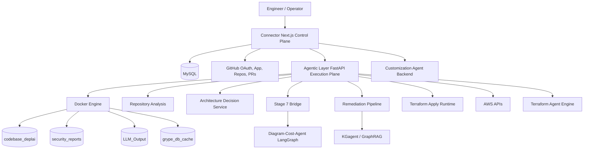
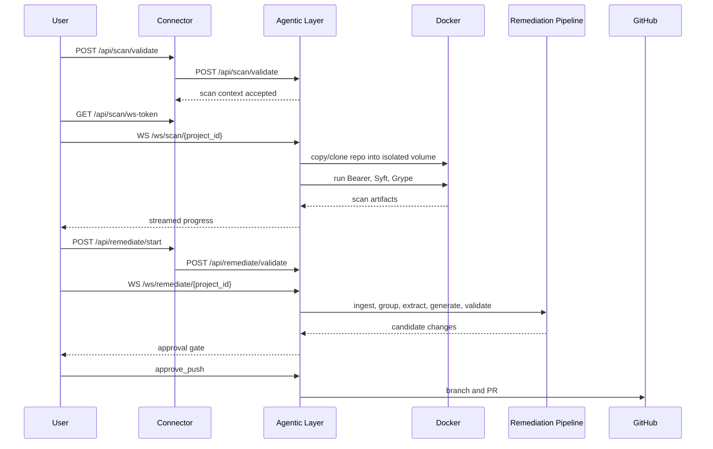
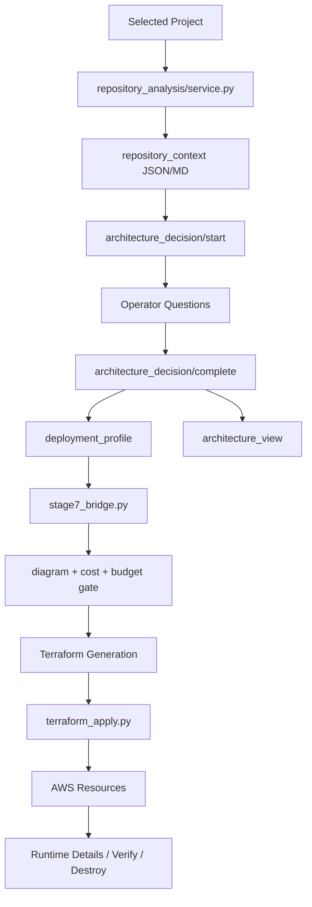
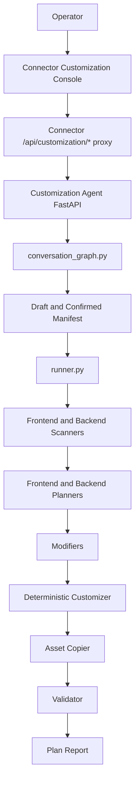

# DeplAI

DeplAI is an enterprise-grade AI engineering platform for taking a software repository from intake to security analysis, remediation, deployment planning, infrastructure generation, runtime deployment, tenant customization, and operator workflow control.

The platform is intentionally split into product tracks. Each track has its own execution model, agents, contracts, artifacts, and operational boundaries, but all tracks are surfaced through a shared authenticated control plane.

## Contents
- [Executive Summary](#executive-summary)
- [Product Tracks](#product-tracks)
- [Platform Architecture](#platform-architecture)
- [Agentic Capabilities](#agentic-capabilities)
- [Track 1: Security Analysis and Remediation](#track-1-security-analysis-and-remediation)
- [Track 2: Deployment Planning and Runtime Deployment](#track-2-deployment-planning-and-runtime-deployment)
- [Track 3: Tenant Customization](#track-3-tenant-customization)
- [Track 4: Operator Experience and Chat Orchestration](#track-4-operator-experience-and-chat-orchestration)
- [Data, Contracts, and Persistence](#data-contracts-and-persistence)
- [Tools and Frameworks](#tools-and-frameworks)
- [Security Model](#security-model)
- [Operational Model](#operational-model)
- [Local Development](#local-development)
- [API Surface](#api-surface)
- [Repository Map](#repository-map)
- [Existing Gaps and Roadmap](#existing-gaps-and-roadmap)
- [Documentation](#documentation)

## Executive Summary

DeplAI is not a single chatbot or a single pipeline. It is a multi-service platform composed of:

- `Connector/`: Next.js control plane, dashboard UI, authenticated API facade, GitHub integration, project registry, settings, runtime views, and chat orchestration.
- `Agentic Layer/`: FastAPI execution plane for long-running scan, remediation, repository analysis, deployment planning, Stage 7 approval, Terraform apply, AWS runtime inspection, and cleanup workflows.
- `remediation_pipeline/`: modular remediation engine for ingestion, grouping, context extraction, fix generation, validation, routing, and PR handoff.
- `Terraform Agent/`: Terraform generation and infrastructure bundle engine, including deterministic rendering and a Cloud Posse/Atmos foundation.
- `Diagram-Cost-Agent/`: Stage 7 diagram, cost estimation, budget gate, and approval packaging graph.
- `KGagent/`: knowledge graph and GraphRAG layer for vulnerability intelligence and contextual security enrichment.
- `Customization Agent/`: tenant-builder backend for conversational manifest authoring and code customization.

Primary outcomes:

| Track | Enterprise Outcome | Main Runtime |
|---|---|---|
| Security | Scan repositories, enrich findings, generate fixes, validate diffs, and create remediation PRs | `Connector`, `Agentic Layer`, `remediation_pipeline`, `KGagent` |
| Deployment | Analyze a repo, ask architecture questions, create a deployment profile, estimate cost, generate IaC, deploy to AWS, and inspect/destroy runtime resources | `Connector`, `Agentic Layer`, `Terraform Agent`, `Diagram-Cost-Agent` |
| Customization | Convert tenant requirements into manifests, modify tenant-specific frontend/backend code, manage assets, and generate implementation reports | `Customization Agent`, `Connector` proxy routes |
| Operations | Provide dashboards, settings, project inventory, runtime instance management, documentation, and chat-assisted workflows | `Connector`, MySQL, GitHub APIs |

## Product Tracks

### Security Track

Purpose:
- Identify application and dependency risks.
- Normalize scan output into operator-facing findings.
- Deduplicate and prioritize fix work.
- Generate validated remediation diffs.
- Push approved changes into GitHub PRs.

Built with:
- Bearer for SAST.
- Syft for SBOM generation.
- Grype for dependency vulnerability scanning.
- Docker volumes for project-scoped isolation.
- FastAPI websocket runners for live progress.
- Optional Neo4j/Qdrant KG enrichment.
- LLM-assisted remediation with provider override support.

### Deployment Track

Purpose:
- Convert repository signals and operator answers into a deployment profile.
- Generate architecture views, cost estimates, and approval payloads.
- Produce Terraform files.
- Apply infrastructure to AWS or export IaC through GitOps.
- Inspect, verify, stop, and destroy runtime deployments.

Built with:
- Repository analyzer services.
- Architecture review contracts.
- Stage 7 diagram/cost/budget gate.
- Terraform generation paths.
- AWS runtime apply endpoints backed by Terraform and boto3.
- Connector UI stages persisted in browser/session state.

### Customization Track

Purpose:
- Capture tenant requirements conversationally.
- Build and confirm a tenant manifest.
- Modify code in tenant-specific working copies.
- Apply branding, text, theme, feature, asset, frontend, and backend changes.
- Validate output and create plan reports.

Built with:
- FastAPI tenant-builder backend.
- LangGraph conversation and customization graphs.
- Deterministic fallback services.
- Manifest state management.
- Repo scanner, planner, modifier, validator, reporter agents.

### Operator Track

Purpose:
- Give engineers a single control surface across security, deployment, customization, docs, settings, and runtime assets.
- Provide authenticated project/repository management.
- Keep long-running work visible through websocket streams and REST reconciliation.

Built with:
- Next.js App Router.
- MySQL-backed users, GitHub installations, repositories, projects, and chat history.
- GitHub OAuth and GitHub App installation tokens.
- API facade routes that validate sessions and ownership before calling backend services.

## Platform Architecture



### Control Plane

`Connector/` is the product-facing control plane. It owns:

- browser and server-side dashboard experiences
- session authentication using `iron-session`
- user, project, repository, and GitHub installation ownership checks
- GitHub App token generation and repository synchronization
- local project upload and GitHub project registration
- API facade routes under `Connector/src/app/api`
- security analysis UI, deployment track UI, customization console, documentation, settings, instance management, and chat
- persisted UI snapshots for deployment stages, generated IaC, AWS runtime config, deployment history, and approval state

Connector does not directly execute scanners, Terraform, or cloud operations. It validates the user and request, then calls the execution plane with service-to-service credentials.

### Execution Plane

`Agentic Layer/` is the long-running backend execution plane. It owns:

- scan validation and websocket execution
- remediation validation and websocket execution
- pipeline event websocket bus
- repository analysis and architecture decision APIs
- architecture generation and cost estimation APIs
- Stage 7 approval payload generation
- Terraform generation, Cloud Posse consultation, apply, status, stop, and output parsing
- AWS runtime details, instance action, and best-effort destroy endpoints
- Docker volume management and scanner/runtime isolation

### Specialized Engines

The platform delegates high-context work to specialized engines rather than one general-purpose agent:

- `remediation_pipeline/` for vulnerability-specific remediation.
- `KGagent/` for graph and vector-backed vulnerability intelligence.
- `Diagram-Cost-Agent/` for Stage 7 approval payloads.
- `Terraform Agent/` for IaC generation and Cloud Posse/Atmos bundle creation.
- `Customization Agent/` for tenant-specific code mutation.

## Agentic Capabilities

DeplAI uses different agent patterns for different problem classes.

| Pattern | Used For | Why |
|---|---|---|
| Imperative runners | scan setup, scan execution, remediation websocket sessions, Terraform apply | deterministic progress, cancellation, and operational control |
| Contract transformers | repository context, deployment answers, deployment profile, architecture view, approval payload | stable handoffs between UI, planning, IaC, and runtime |
| LangGraph flows | Terraform Agent, Diagram-Cost-Agent, KGagent, Customization Agent | multi-step reasoning with explicit nodes and state |
| Deterministic fallbacks | Stage 7 payloads, architecture baseline, IaC fallback, customization fallback | pipeline continuity when an LLM or graph service is unavailable |
| UI-side multi-agent chat | workspace assistance, intent routing, narrative response, tool binding | operator guidance without coupling chat to backend execution internals |

### UI Chat Orchestrator

Connector includes a separate conversational orchestration layer under `Connector/src/chat-agent/`.

Agents:

- Memory Forensics Keeper
- Signal Warden
- Tool Contract Sentinel
- Chain Choreographer
- Adversarial Verifier
- Action-UI Binder
- Recovery Marshall
- Narrative Blacksmith

This layer is an operator assistant and intent router. It is not the same process as the security scan runner, remediation runner, Terraform runtime, or customization graph.

## Track 1: Security Analysis and Remediation

### Business Capability

The security track provides a closed loop from source intake to remediation PR:

1. Validate the selected project.
2. Copy or clone the repository into a project-scoped workspace.
3. Run SAST and/or SCA scanners.
4. Parse and normalize findings.
5. Enrich findings with KG context where available.
6. Group findings into remediable root causes.
7. Extract relevant code snippets.
8. Generate candidate fixes.
9. Validate diffs.
10. Ask for operator approval.
11. Push changes and open a PR.

### Architecture



### Implementation Details

Core files:

- `Agentic Layer/environment.py`: scan setup and scanner orchestration.
- `Agentic Layer/main.py`: scan/remediation HTTP and websocket endpoints.
- `Agentic Layer/result_parser.py`: scan status and result parsing.
- `remediation_pipeline/orchestrator.py`: remediation execution.
- `remediation_pipeline/track_runner.py`: interactive remediation flow.
- `remediation_pipeline/ingester.py`: input normalization.
- `remediation_pipeline/grouper.py`: root-cause grouping.
- `remediation_pipeline/extractor.py`: snippet and context extraction.
- `remediation_pipeline/generator.py`: fix generation.
- `remediation_pipeline/validator.py`: diff validation.
- `KGagent/`: optional KG and GraphRAG enrichment.

### Features

- Local and GitHub project support.
- SAST-only, SCA-only, or combined scan mode.
- Websocket progress streaming.
- REST status and result recovery.
- Project ID validation before shell/Docker usage.
- Docker volume isolation.
- Large-finding throttling and batching.
- Remediation scope controls for `major` or `all`.
- LLM provider override support for remediation.
- Approval-gated PR creation.
- Cache invalidation after scan completion and remediation.

### Agentic Behavior

The remediation engine does not blindly patch every finding. It follows a staged workflow:

- ingests scanner artifacts
- groups related vulnerabilities
- limits context size
- extracts only relevant files/snippets
- generates fixes with bounded LLM budget
- validates patch shape before handoff
- waits for operator action before pushing

This makes the track more operationally defensible than a one-shot "fix my repo" agent.

### Current Gaps

- Scan and remediation active contexts are in memory; process restarts lose active workflow state.
- KG enrichment is optional and depends on Neo4j/Qdrant availability.
- Scanner coverage depends on Bearer/Syft/Grype output quality and language support.
- Remediation quality depends on available context, model selection, and test coverage in the target repo.
- PR automation is implemented, but repository-specific CI policy enforcement is outside the current core loop.

## Track 2: Deployment Planning and Runtime Deployment

### Business Capability

The deployment track turns a repository into deployable infrastructure:

1. Analyze repository structure, runtime, build commands, health endpoint, processes, frameworks, data stores, and secrets.
2. Ask targeted architecture questions.
3. Compile answers into a canonical deployment profile.
4. Build an architecture view.
5. Generate a Stage 7 approval payload with diagram, cost estimate, and budget gate.
6. Generate Terraform.
7. Either deploy directly to AWS or export IaC through GitOps.
8. Verify endpoints, inspect runtime details, stop deployment, and destroy resources.

### Deployment UI Stages

The deployment UI in `Connector/src/features/deployment/DeploymentTrackApp.tsx` is organized into:

| Stage | Purpose |
|---|---|
| Repository Analysis | inspect selected project and derive repository context |
| Questions | gather missing runtime and architecture choices |
| Architecture Diagram | visualize the proposed architecture |
| Cost Estimation | show estimated monthly cost and cost lines |
| Approval | gate deployment on operator decision |
| Infrastructure Generation | generate and edit Terraform files |
| AWS Config | collect runtime credentials and state settings |
| Deploy | stream live Terraform/runtime execution |
| Outputs | expose keys, endpoints, verification checks, history, and destroy controls |

### Architecture



### Implementation Details

Core files:

- `Agentic Layer/repository_analysis/service.py`: repository context extraction.
- `Agentic Layer/architecture_decision/service.py`: question generation and deployment profile compilation.
- `Agentic Layer/deployment_planning_contract.py`: Python-side deployment planning contracts.
- `Connector/src/lib/deployment-planning-contract.ts`: TypeScript-side deployment planning contracts.
- `Agentic Layer/stage7_bridge.py`: Stage 7 bridge and fallback.
- `Diagram-Cost-Agent/graph.py`: Stage 7 LangGraph workflow.
- `Terraform Agent/agent/graph.py`: Terraform generation graph.
- `Terraform Agent/agent/engine/cloudposse_atmos.py`: Cloud Posse/Atmos bundle support.
- `Agentic Layer/terraform_apply.py`: Terraform runtime apply engine.
- `Connector/src/app/api/pipeline/iac/route.ts`: Connector IaC generation route.
- `Connector/src/app/api/pipeline/deploy/route.ts`: Connector deploy route.
- `Connector/src/features/deployment/state.ts`: client-side deployment persistence helpers.

### Generated Artifacts

Repository and planning artifacts are written under runtime folders such as:

- `runtime/repo-analyzer/<workspace>/context.json`
- `runtime/repo-analyzer/<workspace>/context.md`
- `runtime/arch-decision/<workspace>/review_payload.json`
- `runtime/arch-decision/<workspace>/deployment_profile.json`
- `runtime/arch-decision/<workspace>/architecture_view.json`

Generated IaC and runtime metadata are also persisted through Connector session/local state and backend run identifiers.

### IaC Strategy

DeplAI currently has two IaC lanes.

#### Deterministic DeplAI Terraform Lane

This is the most reliable first-success path today.

Capabilities:

- AWS-first EC2 root bundle.
- Runtime deploy through Agentic Layer.
- generated key pair handling.
- endpoint and runtime detail extraction.
- free-tier EC2 guardrail support.
- deploy status reconciliation.
- destroy endpoint for DeplAI-tagged AWS resources.

#### Cloud Posse/Atmos Lane

This is the intended enterprise IaC lane.

Capabilities already present in code:

- component catalog loading
- Cloud Posse component support classification
- consultant conversation for component decisions
- pinned component lock metadata
- Atmos stack and vendor file generation
- deploy sequence metadata
- post-vendor patch script support
- Atmos-aware execution support in runtime apply

The Cloud Posse path is designed for:

- reusable version-pinned infrastructure components
- stack composition instead of ad hoc root modules
- safer upgrades through component catalog metadata
- clear deploy sequence and lock records
- stronger enterprise governance over generated infrastructure

Current status:

- The Cloud Posse/Atmos foundation is substantial.
- The default Connector deployment flow still prioritizes the deterministic AWS bundle for reliability.
- Cloud Posse/Atmos is not yet the default end-to-end product path.

### Features

- Repository analysis before infrastructure decisions.
- Architecture Q/A with defaults.
- Canonical deployment profile.
- Architecture view and diagram model.
- Cost estimate and budget cap.
- Budget override guardrail in UI.
- Terraform file viewer/editor.
- Runtime config for region, state bucket, and lock table.
- AWS deploy, status, stop, runtime details, endpoint verification, and destroy controls.
- Deployment history snapshots.
- GitOps path for IaC PR/export flows.
- Websocket pipeline event display and REST reconciliation.

### Agentic Behavior

The deployment track is contract-first. Agents and services transform one structured artifact into the next:

- `repository_context`: what the repo appears to be
- `architecture_answers`: what the operator confirmed
- `deployment_profile`: deployable intent
- `architecture_view`: human-readable topology
- `approval_payload`: diagram, cost, budget gate
- `terraform_bundle`: files, manifest, renderer metadata
- `runtime_result`: outputs and live cloud metadata

This design reduces hidden prompt coupling and makes each stage inspectable.

### Current Gaps

- Runtime deployment is AWS-first; Azure and GCP runtime apply are not implemented as first-class deploy paths.
- Cloud Posse/Atmos is not yet the primary default path in Connector.
- Cloud Posse V1 only supports a subset of AWS shapes and rejects unsupported profiles.
- Existing non-Cloud Posse Terraform state is not migrated into Cloud Posse/Atmos.
- DNS/TLS and richer multi-service topologies are still limited.
- Some deployment UI state is client/session persisted rather than durably stored in backend workflow tables.

## Track 3: Tenant Customization

### Business Capability

The customization track lets operators create tenant-specific software variants from natural-language instructions and uploaded assets.

End-to-end flow:

1. Operator chats with the customization backend.
2. Conversation graph extracts tenant requirements.
3. Draft manifest is updated.
4. Operator confirms the manifest.
5. Customization pipeline creates or reuses a tenant repo copy.
6. Scanner agents identify frontend/backend targets.
7. Planner agents create change plans.
8. Modifier agents apply code edits.
9. Deterministic services apply additional guaranteed patches.
10. Validator checks syntax and consistency.
11. Reporter writes the plan and modified file report.

### Architecture



### Implementation Details

Core files:

- `Customization Agent/tenant_builder_app/backend/main.py`: API layer.
- `Customization Agent/tenant_builder_app/backend/graph/conversation_graph.py`: conversational manifest graph.
- `Customization Agent/tenant_builder_app/backend/graph/customization_graph.py`: code customization graph.
- `Customization Agent/tenant_builder_app/backend/manifest_state.py`: draft/confirmed manifest state.
- `Customization Agent/tenant_builder_app/backend/runner.py`: graph and deterministic service orchestration.
- `Customization Agent/tenant_builder_app/backend/agents/*`: scanner, planner, modifier, validator, reporter agents.
- `Customization Agent/tenant_builder_app/backend/services/*`: repo, indexing, manifest validation, asset, deterministic customization, and plan report services.
- `Connector/src/app/api/customization/[...path]/route.ts`: authenticated proxy from Connector to customization backend.

### Manifest Model

The tenant manifest includes:

- branding
- theme
- domains
- portals
- features
- integrations
- flow rules
- extensions

`extensions` stores free-form or scoped customization commands, including exact replacement intents and `scope.key` style values.

### Features

- Conversational manifest authoring.
- Confirmation gate before implementation.
- Re-confirmation requirement after draft changes.
- Tenant repo provisioning under `SubSpace-{tenant}`.
- Safety guard for destructive reset operations.
- Frontend-only and full-stack modes.
- Dual frontend target support for `frontend` and `admin-frontend`.
- Optional React templateizer.
- Exact text replacement parser.
- Deterministic customizer fallback.
- Branding asset upload and copy.
- Syntax validation.
- Plan report generation.

### Agentic Behavior

The customization track combines LLM-guided code planning with deterministic post-processing:

- LLMs help classify files and propose changes.
- Deterministic services write theme, feature flags, branding helpers, domain config, literal replacements, and asset references.
- Validators reduce the chance of syntactically broken output.
- Plan reports make tenant changes auditable.

### Current Gaps

- Broad natural-language intents can still depend on LLM extraction quality.
- Templateizer is conservative and targets React/Next-style text nodes rather than a full AST transformation for all frameworks.
- Backend customization is gated by detected backend intent and classified backend targets, so some implicit backend needs may be skipped.
- Tenant workflow persistence is file-based under backend tenant folders rather than a centralized durable workflow database.

## Track 4: Operator Experience and Chat Orchestration

### Business Capability

The operator track ties the system together:

- project intake
- GitHub installation and repository sync
- dashboard navigation
- security scan launch and result review
- remediation action controls
- deployment track execution
- runtime instance inventory
- customization console
- documentation and settings
- chat-assisted workflows

### Implementation Details

Core files:

- `Connector/src/app/dashboard/*`: dashboard routes.
- `Connector/src/features/dashboard/*`: dashboard feature apps.
- `Connector/src/features/pipeline/*`: security and pipeline UI.
- `Connector/src/features/deployment/*`: deployment track and runtime UI.
- `Connector/src/components/*`: shared UI components.
- `Connector/src/chat-agent/*`: UI-side chat orchestration.
- `Connector/src/lib/*`: auth, db, GitHub, agentic client, contracts, local projects, settings, project metadata.

### Features

- Authenticated dashboard layout.
- GitHub OAuth callback and logout.
- GitHub installation sync.
- Local project upload and browsing.
- Project ownership enforcement.
- Scan progress and result views.
- Deployment progress and runtime output views.
- Instance management views.
- Settings and cleanup controls.
- Chat sessions stored in MySQL.

## Data, Contracts, and Persistence

### MySQL

Connector uses MySQL for:

- users
- GitHub installations
- GitHub repositories
- projects
- chat sessions
- chat messages

Schema file:

- `Connector/database.sql`

### Runtime Artifacts

Agentic Layer writes runtime planning artifacts under `runtime/`.

Docker-managed scan/runtime volumes:

- `codebase_deplai`
- `security_reports`
- `LLM_Output`
- `grype_db_cache`

Customization artifacts are written under tenant folders in the customization backend:

- `manifest.json`
- `draft.manifest.json`
- `repo-index.json`
- `plan.md`
- uploaded assets

### Contract Strategy

DeplAI is strongest where it uses shared contracts instead of free-form JSON.

Important contracts:

- `Agentic Layer/models.py`
- `Agentic Layer/architecture_contract.py`
- `Agentic Layer/deployment_planning_contract.py`
- `Connector/src/lib/architecture-contract.ts`
- `Connector/src/lib/deployment-planning-contract.ts`

These contracts define the boundary between:

- repository analysis
- operator answers
- deployment profile
- architecture view
- approval payload
- Terraform generation
- runtime apply

## Tools and Frameworks

### Frontend and Control Plane

| Tool | Role |
|---|---|
| Next.js 16 | App Router, dashboard, API facade |
| React 19 | UI rendering |
| TypeScript | type contracts and frontend correctness |
| Tailwind CSS 4 | styling |
| lucide-react | icon system |
| iron-session | encrypted session cookie |
| mysql2 | Connector persistence |
| Octokit | GitHub API and GitHub App access |
| simple-git | local Git operations |

### Backend and Execution Plane

| Tool | Role |
|---|---|
| FastAPI | Agentic Layer and customization backend APIs |
| Pydantic | backend request/response contracts |
| Docker SDK | scanner and runtime isolation |
| boto3 | AWS runtime and inventory operations |
| LangGraph | multi-step agent graphs |
| LangChain | LLM and graph integration support |
| Anthropic/OpenAI/Groq/OpenRouter/Ollama-compatible APIs | model backends |

### Security and Knowledge Tools

| Tool | Role |
|---|---|
| Bearer | SAST |
| Syft | SBOM generation |
| Grype | dependency vulnerability scanning |
| Neo4j | vulnerability knowledge graph |
| Qdrant | vector retrieval for GraphRAG |
| sentence-transformers | local embedding support |

### Infrastructure Tools

| Tool | Role |
|---|---|
| Terraform | runtime infrastructure provisioning |
| Cloud Posse/Atmos | intended enterprise IaC composition path |
| AWS EC2/S3/CloudFront/IAM APIs | current runtime deployment target |
| Docker Compose | local service composition |

## Security Model

### Authentication and Authorization

- Connector owns user authentication.
- Connector routes require authenticated sessions for protected operations.
- Project and repository ownership checks happen before backend calls.
- GitHub installation tokens are generated server-side and are not persisted as long-lived database secrets.

### Service-to-Service Boundary

- Agentic Layer requires `DEPLAI_SERVICE_KEY` at startup.
- Connector calls Agentic Layer with `X-API-Key`.
- Most Agentic HTTP endpoints enforce the API key dependency.

### Websocket Security

- Connector mints short-lived HMAC websocket tokens.
- Tokens include `sub`, `project_id`, and expiry.
- Agentic Layer verifies signature, expiry, and project binding.
- Agentic Layer compares token subject to stored workflow context user ID before starting work.

### Destructive Operations

- Global Docker volume cleanup is disabled unless `ALLOW_GLOBAL_CLEANUP=true`.
- AWS destroy is best-effort and targets DeplAI-managed/tagged resources for the project.
- Customization repo reset rejects paths outside the expected `SubSpace-*` safety pattern.

## Operational Model

### Required Core Services

- Node.js runtime for `Connector/`
- Python runtime for `Agentic Layer/`
- Docker engine for scanner and Terraform workflows
- MySQL database for Connector persistence

### Optional Services

- Neo4j for knowledge graph enrichment.
- Qdrant for vector retrieval.
- AWS credentials for deployment and runtime inspection.
- GitHub OAuth App and GitHub App credentials for GitHub-connected flows.
- Customization backend for tenant-builder workflows.

### Important Environment Variables

Use `.env.template` as the baseline.

Core:

- `DEPLAI_SERVICE_KEY`
- `WS_TOKEN_SECRET`
- `SESSION_SECRET`
- `NEXT_PUBLIC_APP_URL`
- `AGENTIC_LAYER_URL`
- `NEXT_PUBLIC_AGENTIC_WS_URL`

Database:

- `DB_HOST`
- `DB_PORT`
- `DB_USER`
- `DB_PASSWORD`
- `DB_NAME`

GitHub:

- `GITHUB_CLIENT_ID`
- `GITHUB_CLIENT_SECRET`
- `GITHUB_APP_ID`
- `GITHUB_PRIVATE_KEY`
- `GITHUB_WEBHOOK_SECRET`

AWS:

- `AWS_ACCESS_KEY_ID`
- `AWS_SECRET_ACCESS_KEY`
- `DEPLAI_FREE_TIER_EC2_TYPES`
- `DEPLAI_EC2_INSTANCE_TYPE`

LLM providers:

- `ANTHROPIC_API_KEY` / `CLAUDE_API_KEY`
- `GROQ_API_KEY`
- `OPENROUTER_API_KEY`
- `OLLAMA_BASE_URL`
- provider-specific model variables

Optional KG:

- `NEO4J_URI`
- `NEO4J_USER`
- `NEO4J_PASSWORD`

## Local Development

### 1. Configure Environment

```powershell
Copy-Item .env.template .env
```

Fill in at least:

- `DEPLAI_SERVICE_KEY`
- `WS_TOKEN_SECRET`
- `SESSION_SECRET`
- database settings
- provider keys for the capabilities you plan to use

### 2. Install Connector Dependencies

```powershell
cd Connector
npm install
```

### 3. Create Database

Run `Connector/database.sql` against your local MySQL server.

### 4. Start Agentic Layer

Option A: Docker Compose from repo root:

```powershell
docker compose up agentic-layer
```

Option B: local Python process:

```powershell
cd "Agentic Layer"
python -m venv .venv
.\.venv\Scripts\Activate.ps1
pip install -r requirements.txt
uvicorn main:app --reload --host 0.0.0.0 --port 8000
```

### 5. Start Connector

```powershell
cd Connector
npm run dev
```

Default URLs:

- Connector: `http://localhost:3000`
- Agentic Layer: `http://localhost:8000`

### 6. Optional Customization Backend

```powershell
cd "Customization Agent/tenant_builder_app/backend"
python -m venv .venv
.\.venv\Scripts\Activate.ps1
pip install -r requirements.txt
uvicorn main:app --reload --port 8010
```

## API Surface

### Agentic Layer

Key endpoints:

| Endpoint | Purpose |
|---|---|
| `POST /api/scan/validate` | validate and stage scan context |
| `WS /ws/scan/{project_id}` | run scan workflow |
| `GET /api/scan/results/{project_id}` | fetch parsed findings |
| `GET /api/scan/status/{project_id}` | fetch scan state |
| `POST /api/remediate/validate` | validate and stage remediation context |
| `WS /ws/remediate/{project_id}` | run interactive remediation |
| `POST /remediation/run` | run modular remediation path |
| `POST /remediation/pr` | create remediation PR |
| `WS /ws/pipeline/{project_id}` | shared pipeline event stream |
| `POST /api/repository-analysis/run` | analyze repository |
| `POST /api/architecture/review/start` | start architecture review |
| `POST /api/architecture/review/complete` | complete review and create profile |
| `POST /api/architecture/generate` | generate architecture document |
| `POST /api/cost/estimate` | estimate infrastructure cost |
| `POST /api/stage7/approval` | create Stage 7 approval payload |
| `POST /api/terraform/generate` | generate Terraform |
| `POST /api/terraform/cloudposse/consult` | Cloud Posse component consultation |
| `POST /api/terraform/apply` | run Terraform apply |
| `POST /api/terraform/apply/status` | reconcile apply status |
| `POST /api/terraform/apply/stop` | stop apply |
| `POST /api/aws/runtime-details` | inspect AWS runtime |
| `POST /api/aws/instance-action` | start/stop/reboot EC2 instance |
| `POST /api/aws/destroy-runtime` | best-effort AWS cleanup |
| `GET /health` | Docker and optional Neo4j health |
| `GET /ready` | service readiness |

### Connector

Connector exposes route handlers under:

- `Connector/src/app/api/auth/*`
- `Connector/src/app/api/projects/*`
- `Connector/src/app/api/repositories/*`
- `Connector/src/app/api/scan/*`
- `Connector/src/app/api/remediate/*`
- `Connector/src/app/api/pipeline/*`
- `Connector/src/app/api/architecture/*`
- `Connector/src/app/api/customization/*`
- `Connector/src/app/api/chat/*`
- `Connector/src/app/api/settings/*`
- `Connector/src/app/api/webhooks/github/*`

Connector routes should be treated as the public application API. Agentic Layer should be treated as an internal execution service.

## Repository Map

| Path | Responsibility |
|---|---|
| `Connector/` | Next.js control plane, dashboard UI, authenticated API facade, GitHub integration |
| `Connector/src/features/deployment/` | deployment track UI, runtime state, AWS config, outputs, history |
| `Connector/src/features/pipeline/` | security and remediation UI |
| `Connector/src/chat-agent/` | UI-side multi-agent chat orchestration |
| `Agentic Layer/` | FastAPI execution plane, scan/remediation/planning/Terraform/AWS endpoints |
| `remediation_pipeline/` | modular vulnerability remediation pipeline |
| `Terraform Agent/` | Terraform generation, renderer selection, Cloud Posse/Atmos support |
| `Diagram-Cost-Agent/` | Stage 7 diagram, cost, budget gate graph |
| `KGagent/` | knowledge graph and GraphRAG vulnerability context |
| `Customization Agent/` | tenant manifest and code customization backend |
| `docs/` | architecture and API reference |
| `frontend-designs/` | design references for major UI surfaces |
| `runtime/` | generated runtime artifacts, not core source |

## Existing Gaps and Roadmap

### Enterprise Gaps

| Area | Current State | Needed for Enterprise Hardening |
|---|---|---|
| Workflow durability | several active workflow contexts are in process memory | durable job store, resumable workers, idempotent job state |
| Runtime deployment | AWS-first | Azure/GCP runtime parity or explicit product scoping |
| IaC governance | deterministic path is default; Cloud Posse path is partial | make Cloud Posse/Atmos the default enterprise renderer |
| State management | UI/session/local state used for some deployment artifacts | backend persistence for approvals, runs, and generated bundles |
| Observability | websocket logs and health endpoints | structured logs, traces, metrics, audit events |
| Policy | budget and free-tier guardrails exist | richer policy-as-code gates for security, cost, region, IAM, network |
| Testing | targeted unit/integration tests exist | broader end-to-end tests across all tracks |
| Secrets | runtime credentials are operator supplied | vault-backed secret storage and rotation |
| Multi-tenancy | ownership checks and per-user projects exist | organization/workspace RBAC, audit trails, data retention policy |

### Known Implementation Gaps

- Cloud Posse/Atmos is implemented as a serious foundation but not the default Connector deploy path.
- Some Docker Compose paths still reflect older naming conventions for the Stage 7 agent; verify mounted directory names before container-only runs.
- Runtime destroy is best-effort and tag-based; it is not a full Terraform-state-backed destroy for every generated resource type.
- KGagent can degrade when Neo4j or Qdrant are not configured.
- LLM-backed customization and remediation can fall back or fail when provider response formats are malformed or unavailable.

### Recommended Next Work

1. Promote Cloud Posse/Atmos to the default enterprise deployment renderer for supported AWS profiles.
2. Add a durable workflow database for scan, remediation, planning, IaC generation, deploy, and customization runs.
3. Add audit logs for every approval, PR creation, deploy, destroy, and instance action.
4. Expand policy gates for IAM exposure, public ingress, state backend requirements, region allowlists, and cost caps.
5. Add end-to-end tests that exercise scan -> remediate -> PR and analyze -> approve -> generate -> deploy.
6. Normalize runtime artifact storage so UI reloads never depend on browser-only state.
7. Add first-class production deployment docs with network topology, secrets handling, and backup/restore procedures.

## Documentation

Additional docs:

- [docs/architecture.md](docs/architecture.md)
- [docs/api-reference.md](docs/api-reference.md)
- [CHANGELOG.md](CHANGELOG.md)
- [Terraform-generation-plan.md](Terraform-generation-plan.md)
- [Terraform Agent/README.md](Terraform%20Agent/README.md)
- [Diagram-Cost-Agent/README.md](Diagram-Cost-Agent/README.md)
- [KGagent/README.md](KGagent/README.md)
- [Customization Agent/CUSTOMIZATION_ENGINE_DETAILED_GUIDE.md](Customization%20Agent/CUSTOMIZATION_ENGINE_DETAILED_GUIDE.md)

## Current State

DeplAI is already a capable multi-track AI engineering platform with a clear control-plane/execution-plane split, working security and deployment flows, tenant customization, GitHub integration, and AWS runtime operations.

The most important architectural truth is that DeplAI is transitioning from a reliable prototype-to-runtime platform into an enterprise-governed platform. The core gaps are not conceptual; they are hardening work: durable workflow state, Cloud Posse defaulting, observability, policy controls, broader runtime support, and production-grade auditability.
