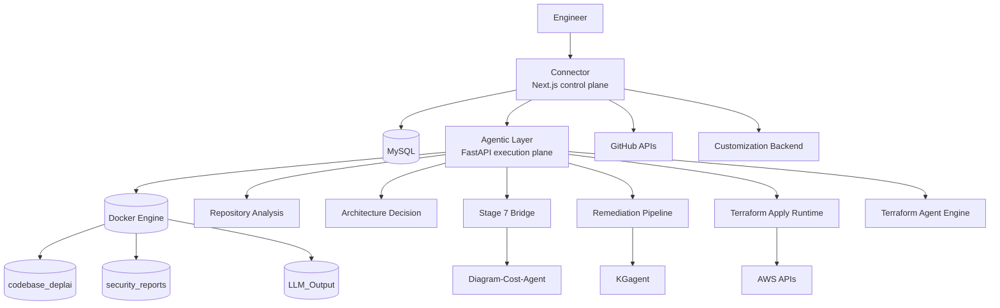

# DeplAI
Enterprise AI platform for repository security analysis, remediation, deployment planning, infrastructure generation, runtime deployment, tenant customization, and operator-facing workflow control.

DeplAI is not a single agent. It is a platform made of:
- a user-facing control plane in `Connector/`
- an execution plane in `Agentic Layer/`
- specialized engines for security remediation, knowledge-graph enrichment, Terraform generation, Stage 7 cost/diagram approval, and tenant customization

The system is organized around product tracks rather than one monolithic pipeline.

## Executive Summary
DeplAI takes a repository from intake to action across three major workstreams:

| Track | Outcome | Primary Components |
|---|---|---|
| Security Track | Scan code and dependencies, enrich findings with KG context, generate validated fixes, raise a PR | `Connector`, `Agentic Layer`, `remediation_pipeline`, `KGagent` |
| Deployment Track | Infer runtime architecture, ask deployment questions, produce a deployment profile, estimate cost, generate IaC, deploy to AWS | `Connector`, `Agentic Layer`, `Terraform Agent`, `Diagram-Cost-Agent` |
| Customization Track | Capture tenant requirements, build a manifest, modify tenant-specific frontend/backend code, preview changes | `Customization Agent`, `Connector` proxy routes |

Shared platform capabilities include:
- GitHub OAuth and GitHub App integration
- project registry for local and GitHub repositories
- operator dashboards for pipeline progress, documentation, settings, runtime inventory, and deployment history
- websocket progress streaming plus REST recovery/status endpoints
- contract validation between UI, planning services, and execution services

## Platform Architecture


### Control Plane
`Connector/` is the authenticated product surface. It owns:
- session auth and project ownership checks
- GitHub installations, repository syncing, webhook handling, and repo CRUD
- dashboard experiences for security, deployment, customization, documentation, settings, and instance management
- API facade routes that normalize requests before forwarding to the execution plane
- browser-side pipeline state, approval state, deployment history snapshots, and runtime UI persistence

### Execution Plane
`Agentic Layer/` is the long-running workflow service. It owns:
- scan orchestration through Docker-isolated workspaces
- remediation workflow execution and websocket streaming
- repository analysis and deployment decision generation
- Stage 7 approval payload generation
- Terraform runtime apply, stop, status, destroy, and runtime inspection
- AWS runtime lifecycle actions

## Product Tracks
### 1. Security Track
Security is implemented as an operator-visible pipeline:

1. Preflight checks
2. `run_scan (SAST/SCA)`
3. `KG Agent analysis`
4. `Remediate vulnerabilities`
5. `Create PR`
6. `Merge gate`
7. `Post-merge actions`

How it works:
- `EnvironmentInitializer` copies or clones the selected repository into project-scoped Docker volumes.
- Bearer handles SAST, Syft builds the SBOM, and Grype performs dependency vulnerability analysis.
- Results are parsed into normalized `code_security` and `supply_chain` structures.
- `KGagent` can enrich significant CVEs and CWEs with direct and inferred graph correlations.
- `RemediationTrackRunner` drives the interactive websocket flow.
- `RemediationOrchestrator` runs ingestion, grouping, snippet extraction, fix generation, and diff validation.
- Approved fixes can be committed into a GitHub branch and raised as a PR.

Security design characteristics:
- project-level isolation in Docker volumes
- websocket streaming for live progress, with REST fallback for status/results
- approval gates before PR creation
- severity-based throttling for large repositories
- optional Claude-forced mode for staged large-repo remediation

### 2. Deployment Track
Deployment is implemented as a second, separate decision-and-execution pipeline:

1. Repository analysis
2. Q/A context gathering
3. Architecture review questions
4. Deployment profile generation
5. Stage 7 diagram and cost approval
6. IaC generation
7. Runtime deployment or GitOps export
8. Runtime verification, inspection, and destroy actions

How it works:
- `repository_analysis/service.py` scans the repository and emits a structured `repository_context`.
- `architecture_decision/service.py` converts that context into targeted deployment questions and default answers.
- Completed answers are compiled into a canonical `deployment_profile` plus a derived `architecture_view`.
- `stage7_bridge.py` invokes `Diagram-Cost-Agent` to build a diagram, estimate cost, and evaluate the budget gate.
- IaC can then be generated and either:
  - applied directly through `Agentic Layer` runtime apply endpoints, or
  - pushed into GitHub through the Connector GitOps path

Deployment design characteristics:
- the `deployment_profile` is the intended source of truth for Terraform generation
- contract validation exists on both Python and TypeScript sides
- Stage 7 has a deterministic fallback if the specialized graph runner is unavailable
- runtime apply, status, stop, destroy, and runtime-details routes are AWS-first

### 3. Customization Track
Customization is a distinct tenant-builder workflow rather than an extension of the security/deployment paths.

How it works:
- `Customization Agent/tenant_builder_app/backend/` exposes a dedicated FastAPI service.
- `conversation_graph.py` handles the conversational manifest-building loop.
- `customization_graph.py` runs repository scanners, planners, modifiers, validation, and final reporting.
- The backend can store branding assets, keep per-tenant manifests, create tenant working copies, compute diffs, and reset tenant repos.
- `Connector/src/app/api/customization/[...path]/route.ts` proxies authenticated preview and customization operations into the tenant builder backend.

Customization graph flow:
- `frontend_scanner -> backend_scanner -> frontend_planner -> frontend_modifier -> backend_planner -> backend_modifier -> validator -> reporter`

## Agentic Orchestration
DeplAI contains multiple orchestration styles because each track solves a different class of problem.

### Workflow Runners
These are imperative runners with websocket streaming:
- `EnvironmentInitializer` for scan setup and execution
- `RemediationTrackRunner` for the security remediation experience
- Terraform apply execution in `terraform_apply.py`

### Structured Document Pipelines
These transform repository signals into machine-validated planning artifacts:
- `repository_context`
- `architecture_answers`
- `deployment_profile`
- `architecture_view`
- `approval_payload`

These artifacts are persisted under:
- `runtime/repo-analyzer/<workspace>/`
- `runtime/arch-decision/<workspace>/`

### LangGraph-Based Engines
Several specialized engines use LangGraph:
- `Terraform Agent/agent/graph.py`
  - `repo_parser -> infra_planner -> terraform_generator -> validator -> refiner -> final_output`
- `Diagram-Cost-Agent/graph.py`
  - `diagram_builder -> cost_estimator -> budget_gate -> approval_packager`
- `KGagent/pipeline/langgraph_agent.py`
  - hybrid graph/vector retrieval for vulnerability intelligence
- `Customization Agent/.../graph/*.py`
  - conversation and code-customization flows

### UI Chat Orchestrator
The Connector also contains a separate conversational orchestration layer in `Connector/src/chat-agent/`.

It is intentionally multi-agent and stepwise:
1. Memory Forensics Keeper
2. Signal Warden
3. Tool Contract Sentinel
4. Chain Choreographer
5. Adversarial Verifier
6. Action-UI Binder
7. Recovery Marshall
8. Narrative Blacksmith

This is not the same as the deployment/security execution pipeline. It is the UI-side intent router for workspace chat interactions.

## Repository Map
| Path | Responsibility |
|---|---|
| `Connector/` | Next.js control plane, dashboard UI, authenticated API facade, GitHub integration, deployment/customization workspaces |
| `Agentic Layer/` | FastAPI execution plane for scan, remediation, planning, cost, Terraform apply, AWS runtime operations |
| `remediation_pipeline/` | Modular remediation pipeline: ingester, grouper, extractor, generator, validator, router, track runner |
| `Terraform Agent/` | Terraform generation engine, renderer selection, bundle building, execution helpers, CloudPosse/Atmos support |
| `Diagram-Cost-Agent/` | Stage 7 engine for diagram creation, cost estimation, budget gate packaging |
| `KGagent/` | Knowledge graph and GraphRAG engine for vulnerability intelligence |
| `Customization Agent/` | Tenant customization backend, manifest workflows, repo mutation pipeline, preview support |
| `docs/` | Secondary architecture and API documentation |
| `runtime/` | Generated planning artifacts created at runtime, not core source code |

## Source-of-Truth Contracts
DeplAI is strongest where it uses contracts instead of free-form JSON.

Key contracts implemented in both backend and Connector:
- `architecture_contract` / `architecture-contract.ts`
- `deployment_planning_contract` / `deployment-planning-contract.ts`
- request and response models in `Agentic Layer/models.py`

This contract-first approach is what lets the platform separate:
- repository understanding
- operator answers
- deployment intent
- approval state
- Terraform rendering
- runtime execution

## Terraform Strategy
### Intended Architecture
The intended Terraform architecture is more ambitious than a simple HCL template generator.

The intended flow is:
1. derive a canonical `deployment_profile`
2. optionally run the CloudPosse consultant to choose catalog components and stack configuration
3. select a renderer:
   - `cloudposse_atmos`
   - `deplai_deterministic`
4. emit a bundle plus metadata such as deploy sequence and lock payload
5. run `atmos vendor pull`, `validate`, `terraform init/plan/apply` when the bundle is Atmos-based

The CloudPosse path already exists in code:
- component catalog in `Terraform Agent/agent/engine/cloudposse_component_catalog.json`
- renderer support classification in `cloudposse_atmos.py`
- bundle generation in `build_cloudposse_profile_bundle`
- execution support in `Agentic Layer/terraform_apply.py`
- consultant conversation endpoint through `/api/terraform/cloudposse/consult`

### What We Intended To Use CloudPosse For
CloudPosse/Atmos was meant to be the enterprise IaC lane:
- reusable, version-pinned infrastructure components
- stack composition instead of one-off handcrafted root modules
- clearer deployment sequences and component lock metadata
- safer upgrades through catalog versioning
- a path toward more standardized Terraform across projects

### Where We Failed
We did not finish CloudPosse as the default end-to-end Terraform path.

Current reality in the shipped Connector flow:
- `Connector/src/app/api/pipeline/iac/route.ts` still generates the default AWS bundle through a deterministic EC2 root path
- that route explicitly notes that Cloud Posse/Atmos is bypassed for first-success runtime deploys
- website assets are reduced to a bootstrap HTML strategy in the default EC2 path, not a full enterprise CloudPosse component composition path

Current CloudPosse limitations visible in code:
- V1 only supports `deployment_profile` input and AWS
- V1 rejects workspaces with existing non-CloudPosse Terraform state
- custom `dns_and_tls` is not supported in Cloud Posse V1
- unsupported compute and networking shapes are rejected by the support classifier
- there is still decision drift risk between consultant output and generated stack variables

In short:
- the backend contains a serious CloudPosse/Atmos foundation
- the runtime apply path can execute Atmos bundles
- but the primary product path still falls back to deterministic Terraform because that was the more reliable route to a working AWS deployment

That is the main architecture gap in the current platform.

## Operational Model
Core dependencies:
- Node.js for `Connector/`
- Python for `Agentic Layer/`, `Terraform Agent/`, `KGagent/`, and `Customization Agent/`
- Docker for scan isolation and runtime Terraform execution
- MySQL for Connector persistence

Optional dependencies by capability:
- Neo4j and Qdrant for KG-enhanced security analysis
- AWS credentials for runtime deployment and inspection
- GitHub OAuth App and GitHub App credentials for repo-connected flows
- Anthropic, Groq, OpenRouter, or Ollama depending on the selected LLM path

## Running Locally
Minimal local bring-up:

```powershell
cd Connector
npm install

cd "..\\Agentic Layer"
python -m venv .venv
.\\.venv\\Scripts\\Activate.ps1
pip install -r requirements.txt

uvicorn main:app --reload --host 0.0.0.0 --port 8000
```

In another terminal:

```powershell
cd Connector
npm run dev
```

Optional services:
- start the customization backend if you need tenant customization flows
- provision Neo4j and Qdrant if you want live KG enrichment instead of degraded fallback behavior

## Documentation
- [docs/architecture.md](docs/architecture.md)
- [docs/api-reference.md](docs/api-reference.md)
- [CHANGELOG.md](CHANGELOG.md)

## Current State
DeplAI is already a capable multi-track orchestration platform.

What is production-shaped:
- control plane and execution plane separation
- security scan and remediation loop
- deployment planning contracts and approval flow
- AWS runtime apply and runtime inspection
- tenant customization backend and preview path

What is still transitional:
- CloudPosse/Atmos as the primary Terraform renderer
- multi-cloud runtime execution
- durable backend persistence for every long-running workflow state
- full convergence between the experimental Terraform engine and the Connector's default AWS deploy path
