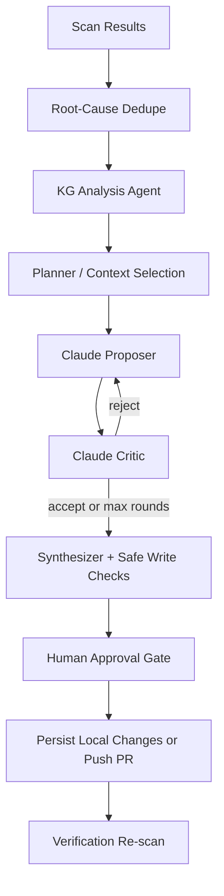
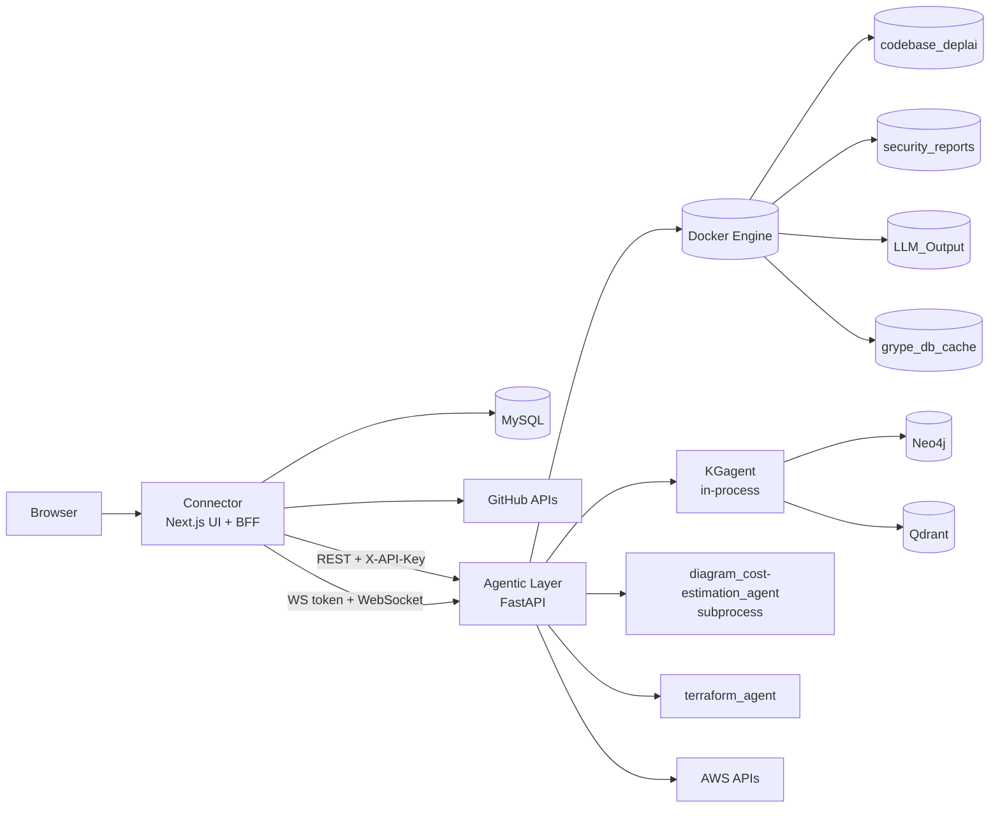
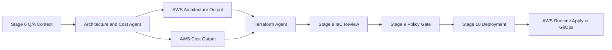

# DeplAI

DeplAI is an agentic DevSecOps platform for taking a repository from security scan through remediation, architecture planning, cost estimation, IaC generation, and deployment.

The active runtime in this repository is:

- `Connector`: Next.js 16 control plane and backend-for-frontend
- `Agentic Layer`: FastAPI orchestration service
- `KGagent`: graph-backed security context injected into remediation
- `diagram_cost-estimation_agent`: Stage 7 diagram and cost subprocess
- `terraform_agent`: backend Terraform engine dependency, plus Connector fallback bundle generation

## What DeplAI Does

DeplAI is built around a stage-oriented delivery workflow:

1. Validate and ingest a GitHub repo or local project.
2. Run SAST and SCA scans with Bearer, Syft, and Grype.
3. Enrich findings with KG-backed vulnerability context.
4. Run a supervised remediation loop with explicit human approval.
5. Push a remediation PR or persist changes locally.
6. Gather deployment Q/A context.
7. Generate architecture and cost outputs.
8. Produce IaC artifacts.
9. Enforce budget and delivery policy checks.
10. Deploy through GitOps or AWS runtime apply.

## Current Features

- GitHub and local-project intake
- Security scanning with streamed progress updates
- Claude-only remediation workflow via Anthropic SDK
- Repo-wide remediation pass with root-cause dedupe to reduce redundant prompt spend
- Human approval gate before persistence and re-scan
- GitHub branch push and PR creation for remediation changes
- Local-project persistence for non-GitHub projects
- Knowledge graph-assisted vulnerability analysis with graceful degradation
- AWS architecture generation and cost planning
- Stage 7.5 approval payload generation
- Terraform bundle generation plus template fallback
- Budget-aware deployment gating
- AWS runtime Terraform apply, status, stop, destroy, and runtime-details flows
- Pipeline dashboard with WebSocket-backed stage telemetry

## Key Capabilities

### Security and remediation

- Bearer SAST plus Syft/Grype SCA
- CWE/CVE summarization
- KG-enriched remediation context
- Proposer/critic remediation supervision
- Safe-change validation before files are written
- Per-run Claude budget cap
- Remediation cycles capped at `2`

### Planning and delivery

- AWS architecture JSON generation
- AWS cost estimation
- Diagram generation
- Stage approval contracts
- IaC generation and review
- GitOps or runtime deployment mode

### Control plane and operations

- Session-backed Next.js control plane
- GitHub App and OAuth integrations
- Short-lived HMAC WebSocket tokens
- Backend health and pipeline health endpoints
- Docker-volume-based execution artifacts

## How The Agents Work

### Active agent roles

- `EnvironmentInitializer`: validates scan prerequisites and prepares scan execution
- `run_analysis_agent`: queries KGagent for CVE/CWE intelligence and produces remediation context
- `run_remediation_supervisor`: LangGraph-style proposer/critic/synthesizer remediation loop
- `run_claude_remediation`: fallback single-pass Claude remediator
- `diagram_cost-estimation_agent`: subprocess agent for diagram plus cost payload generation
- `terraform_agent`: Terraform generation engine used by backend generation paths

### Remediation architecture

The remediation path is now Claude-only and budget-aware:

- Connector normalizes remediation requests to Claude-only inputs.
- Agentic Layer normalizes and enforces Claude-only remediation again server-side.
- The remediation runner builds one repo-wide pass per cycle.
- Findings are deduped into root causes before prompt construction:
  - code findings are grouped by `CWE + file path`
  - supply-chain findings are grouped by `package + installed version + fix version`
- KG analysis runs before remediation and injects graph context.
- The supervisor runs proposer and critic rounds, then writes only validated changes.
- If the supervisor fails, fallback remediation may run, but the shared Claude budget tracker still applies.
- Human approval is required before persistence and verification re-scan.



## Runtime Architecture



## Q/A To Deploy Flow



## Frameworks and Technology Stack

### Frontend and BFF

- Next.js `16.1.1`
- React `19.2.3`
- TypeScript `5`
- Tailwind CSS `4`
- ESLint `9`
- `iron-session` for session handling
- `@octokit/*` for GitHub integration

### Backend orchestration

- FastAPI
- Uvicorn
- Pydantic v2
- Docker SDK for Python
- `httpx` and `requests`
- `boto3` for AWS-related backend flows

### Agent and LLM stack

- Anthropic SDK for remediation
- LangGraph and LangChain packages
- KGagent with Neo4j and Qdrant integrations

### Scanning and execution

- Docker volumes and containers
- Bearer
- Syft
- Grype
- HashiCorp Terraform image for runtime apply

## Repository Layout

```text
DeplAI/
|- Connector/                      Next.js UI, BFF routes, auth, GitHub integration
|- Agentic Layer/                  FastAPI orchestration for scan, remediation, architecture, cost, IaC, deploy
|- KGagent/                        Graph-backed security analysis used during remediation
|- diagram_cost-estimation_agent/  Stage 7 diagram and cost subprocess
|- terraform_agent/                Terraform generation engine
|- runtime/                        Runtime/deploy support artifacts
|- ARCHITECTURE.md                 Detailed runtime and agent architecture
|- RUNBOOK.md                      Startup, operations, and troubleshooting guide
|- ARCHITECTURE_CONTRACTS.md       Shared architecture JSON contract notes
```

## Getting It Running

### Prerequisites

- Node.js 20+
- Python 3.13+
- Docker Desktop / Docker Engine
- MySQL 8+
- GitHub OAuth/App credentials for repo-backed flows

Optional but recommended:

- Neo4j
- Qdrant
- AWS credentials for runtime apply and AWS pricing flows
- Anthropic API key for remediation

### Environment

Set these in repo-root `.env`:

```bash
NEXT_PUBLIC_APP_URL=http://localhost:3000
AGENTIC_LAYER_URL=http://localhost:8000
NEXT_PUBLIC_AGENTIC_WS_URL=ws://localhost:8000
DEPLAI_SERVICE_KEY=<shared-secret>
WS_TOKEN_SECRET=<ws-signing-secret>
SESSION_SECRET=<session-secret>

DB_HOST=localhost
DB_PORT=3306
DB_USER=deplai
DB_PASSWORD=<password>
DB_NAME=deplai

GITHUB_CLIENT_ID=<oauth-client-id>
GITHUB_CLIENT_SECRET=<oauth-client-secret>
GITHUB_APP_ID=<app-id>
GITHUB_PRIVATE_KEY=<pem-with-newlines>
GITHUB_WEBHOOK_SECRET=<webhook-secret>

ANTHROPIC_API_KEY=<anthropic-key>
REMEDIATION_CLAUDE_MODEL=claude-sonnet-4-5
DEPLAI_MAX_REMEDIATION_COST_USD=1.00
```

Common optional variables:

```bash
AWS_ACCESS_KEY_ID=
AWS_SECRET_ACCESS_KEY=
AWS_DEFAULT_REGION=ap-south-1

NEO4J_URI=bolt://localhost:7687
NEO4J_USER=neo4j
NEO4J_PASSWORD=
QDRANT_URL=
```

### Local startup

1. Initialize MySQL with `Connector/database.sql`.
2. Start Docker Desktop.
3. Start Agentic Layer:

```bash
docker compose up -d --build agentic-layer
```

4. Start Connector:

```bash
cd Connector
npm install
npm run dev
```

5. Open `http://localhost:3000`.

### Sanity checks

Backend health:

```bash
curl http://localhost:8000/health
```

Python syntax check:

```bash
python -m compileall "Agentic Layer" KGagent terraform_agent diagram_cost-estimation_agent
```

## Current Constraints

- `docker-compose.yml` only starts `agentic-layer`
- MySQL, Neo4j, and Qdrant are not provisioned by compose
- Runtime apply currently supports AWS only
- Terraform generation may intentionally fall back to Connector-generated bundles
- KG degradation should not block remediation
- Remediation is cost-capped; it does not guarantee that every vulnerability in a very large repo will be fixed in one run

## More Documentation

- `ARCHITECTURE.md`
- `RUNBOOK.md`
- `ARCHITECTURE_CONTRACTS.md`
- `UI_AGENT_HANDOFF.md`
