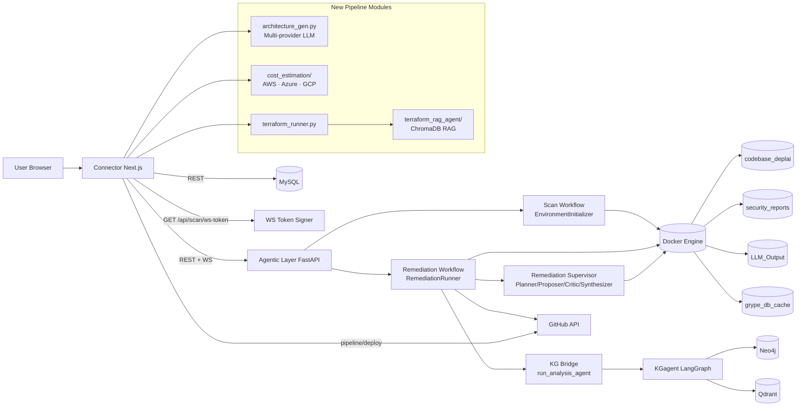
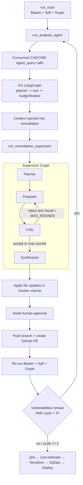

# DeplAI

DeplAI is an end-to-end agentic deployment platform. Given a codebase (GitHub repo or uploaded ZIP), it scans for security vulnerabilities, remediates them with multi-agent AI (hard-capped at 2 scan→remediate cycles), then guides the user through architecture design, diagram generation, cost estimation, Terraform IaC generation, and AWS deployment.

Project sources supported:
- GitHub repositories (public/private via GitHub App or runtime token)
- Local uploaded ZIP projects

Cloud providers supported throughout the pipeline:
- AWS (live boto3 Pricing API, Terraform, GitHub Actions with `configure-aws-credentials`)
- Azure (live Azure Retail Prices API, Terraform, GitHub Actions with `azure/login`)
- GCP (rule-based cost approximations, Terraform, GitHub Actions with `google-github-actions/auth`)

---

## Repository Structure

```
DeplAI/
├── Connector/                  Next.js 16 web app (auth, dashboard, BFF routes)
│   └── src/
│       ├── app/api/            BFF API routes (proxies to Agentic Layer)
│       │   ├── architecture/   Architecture generation proxy
│       │   ├── cost/           Cost estimation proxy
│       │   ├── pipeline/
│       │   │   ├── iac/        Terraform generation (RAG agent → static fallback)
│       │   │   └── deploy/     CI/CD workflow generation + GitHub push
│       │   ├── chat/           ReAct chat loop + session management
│       │   ├── scan/           Scan validate / status / results / ws-token
│       │   └── remediate/      Remediation start / WS streaming
│       ├── components/
│       │   └── agent-chat.tsx  Chat UI (executeTool for all tools)
│       ├── chat-agent/         Multi-agent orchestration layer (8 agents)
│       └── lib/
│           ├── scan-context.tsx  React context for scan/remediation state
│           └── db.ts             MySQL client
├── Agentic Layer/              FastAPI orchestration backend
│   ├── main.py                 All FastAPI endpoints + WebSocket handlers
│   ├── models.py               Pydantic request/response models
│   ├── architecture_gen.py     LLM-based architecture JSON generation
│   ├── cost_estimation/        Cost dispatcher + AWS/Azure/GCP backends
│   ├── terraform_rag_agent/    ChromaDB + HuggingFace RAG Terraform agent
│   ├── terraform_runner.py     Thin wrapper for terraform_rag_agent
│   ├── remediation/            Multi-agent supervisor (Planner/Proposer/Critic/Synthesizer)
│   ├── environment.py          Docker volume management + repo ingest
│   └── result_parser.py        Bearer/Syft/Grype output parser
├── KGagent/                    LangGraph vulnerability intelligence agent
│   ├── pipeline/               Query pipeline (model loader, agent tools)
│   └── ops/                    KG ops runbook
└── docker-compose.yml          Runtime for agentic-layer + Docker volume wiring
```

---

## Full Pipeline

```
[0] preflight
   Single-page pipeline checks readiness for:
   scan, remediation, architecture, diagram, cost, terraform, gitops deploy.
   If required checks are down, pipeline is blocked.
   │
   ▼
[1] run_scan
   Ingest codebase into Docker volume.
   Run SAST (Bearer) + SCA (Syft + Grype) in parallel containers.
   Stream progress over WebSocket.
   │
   ▼
[2] KG Agent analysis
   Concurrent CVE/CWE queries against Neo4j/Qdrant knowledge graph.
   Enriched context injected into remediation prompt.
   │
   ▼
[3] remediate
   Multi-agent supervisor: Planner → Proposer → Critic → Synthesizer
   Applies file patches inside Docker volume.
   Human approval gate before any persistence.
   │
   ▼
[4] create PR
   Push remediation branch to GitHub.
   Open pull request via GitHub API.
   │
   ▼
[4.5] merge gate (manual)
   Pipeline pauses in `awaiting_merge_confirmation`.
   User confirms PR merge in the UI.
   │
   ▼
[4.6] post-merge actions
   `Code Refresh` syncs repo from GitHub.
   `Re-run Scan` executes security gate.
   If major vulns remain (critical/high), IaC/deploy is blocked.
   │
   ▼
[5] re-scan  ←─────────────────────────────────────┐
   Re-run Bearer + Syft + Grype on patched codebase. │
   If vulnerabilities remain AND cycle < 3:          │
     loop back to [2] KG → [3] remediate → [4] PR ──┘
   Hard stop at 2 complete cycles regardless of result.
   │
   ▼
[6] Q/A
   Chat session: user describes deployment target and architecture.
   LLM calls generate_architecture to produce {nodes, edges} JSON.
   │
   ▼
[7] diagram + estimate_cost
   Generate Mermaid diagram from architecture JSON, then query AWS Pricing API (live).
   Returns monthly cost breakdown per service.
   │
   ▼
[8] terraform
   RAG agent (ChromaDB + HuggingFace) generates main.tf / variables.tf / outputs.tf.
   Falls back to static AWS templates if vector DB not available.
   Includes an Ansible hardening skeleton (currently a placeholder playbook).
   │
   ▼
[9] policy gate
   Enforce hard budget gate: block when estimate > $100/month unless operator override.
[10] deploy on AWS
   Manual deploy action applies generated Terraform at runtime using configured AWS credentials.
   Creates EC2 + S3 + CloudFront resources and returns CloudFront URL in UI.
```

---

## System Architecture



---

## Agent Orchestration

### Chat Agent (frontend, `Connector/src/chat-agent/`)

8 specialized agents run per chat turn:

| Agent | Role |
|---|---|
| `signal-warden` | Classifies intent → ExecutionMode |
| `tool-contract-sentinel` | Schema validation + policy enforcement |
| `chain-choreographer` | Plans multi-step tool chains (≤ 4 steps) |
| `adversarial-verifier` | 3 disproof strategies per tool call |
| `action-ui-binder` | Maps tool outcome → UI cards/buttons/route |
| `recovery-marshall` | Classifies transient/permanent/policy errors |
| `narrative-blacksmith` | Composes final markdown response |
| `memory-forensics-keeper` | Detects context drift across turns |

### Remediation Supervisor (backend, `Agentic Layer/`)



---

## Key Components

### architecture_gen.py

Generates a structured architecture JSON (`{title, nodes, edges}`) from a user prompt using a three-provider fallback chain:

1. User-supplied provider (if `llm_provider`/`llm_api_key` provided)
2. Groq (GROQ_API_KEY)
3. OpenRouter (OPENROUTER_API_KEY)

Each cloud provider (AWS/Azure/GCP) has a tailored system prompt that instructs the model to include cost-estimation-relevant attributes (instance types, tiers, storage sizes) on each node.

### cost_estimation/

| Module | Backend | Credentials |
|---|---|---|
| `aws.py` | boto3 Pricing API (live) | AWS_ACCESS_KEY_ID + AWS_SECRET_ACCESS_KEY |
| `azure.py` | Azure Retail Prices REST API (live) | None required |
| `gcp.py` | Rule-based us-central1 rates | None required |

Returns `{success, provider, total_monthly_usd, currency, breakdown, errors}`.

### terraform_rag_agent/

ChromaDB-backed RAG agent with HuggingFace embeddings and an 8-tool ReAct loop:

- Retrieves relevant Terraform snippets from vector DB
- Generates and self-corrects Terraform code
- Splits into `main.tf`, `variables.tf`, `outputs.tf`
- Falls back to static templates if vector DB not built or `openai` not installed

Build the vector DB once before using:
```bash
cd "Agentic Layer/terraform_rag_agent"
python src/indexer.py
```

Legacy compatibility:
- When present, `DeplAI_old/terraform_rag_agent/data/vector_db` is mounted and can be used as fallback vector DB for Terraform RAG retrieval.

### KGagent

LangGraph agent with:
- Neo4j graph DB for CVE → CWE → fix-pattern relationships
- Qdrant vector store for semantic similarity search
- Concurrent CVE/CWE `agent_query` calls per finding

---

## Quick Start

### Prerequisites

- Node.js 20+
- Python 3.12+
- Docker Desktop (Linux containers mode)
- MySQL 8+

### 1. Configure Environment

Copy and fill `.env` in the repo root. Minimum required:

**Web/API:**
```
NEXT_PUBLIC_APP_URL=http://localhost:3000
AGENTIC_LAYER_URL=http://localhost:8000
NEXT_PUBLIC_AGENTIC_WS_URL=ws://localhost:8000
DEPLAI_SERVICE_KEY=<shared-internal-service-key>
WS_TOKEN_SECRET=<random-secret>
```

**Auth/Session:**
```
SESSION_SECRET=<random-secret>
```

**Database:**
```
DB_HOST=localhost
DB_PORT=3306
DB_USER=deplai
DB_PASSWORD=<password>
DB_NAME=deplai
```

**GitHub OAuth + App:**
```
GITHUB_CLIENT_ID=
GITHUB_CLIENT_SECRET=
GITHUB_APP_ID=
GITHUB_PRIVATE_KEY=
GITHUB_WEBHOOK_SECRET=
```

**LLM backends (remediation + architecture gen):**
```
GROQ_API_KEY=             # primary free-tier LLM
ANTHROPIC_API_KEY=        # claude backend for remediation
OPENAI_API_KEY=           # openai backend + terraform RAG agent
OPENROUTER_API_KEY=       # fallback for architecture gen
```

**Cloud cost estimation:**
```
AWS_ACCESS_KEY_ID=        # optional: live AWS Pricing API
AWS_SECRET_ACCESS_KEY=    # optional: live AWS Pricing API
```

**Scanner timeout tuning (large repos):**
```
BEARER_TIMEOUT_SECONDS=1800
SYFT_TIMEOUT_SECONDS=1200
GRYPE_TIMEOUT_SECONDS=900
REMEDIATION_MAX_FAILED_BATCHES=4
REMEDIATION_MAX_STALLED_BATCHES=8
```

**KGagent:**
```
NEO4J_URI=bolt://localhost:7687
NEO4J_USERNAME=neo4j
NEO4J_PASSWORD=
QDRANT_URL=http://localhost:6333
TAVILY_API_KEY=           # web search tool in KG agent
```

**CORS (Agentic Layer):**
```
CORS_ORIGINS=http://localhost:3000
```

### 2. Initialize Database

```bash
mysql -u root -p < Connector/database.sql
```

### 3. Start Agentic Layer

```bash
docker compose up -d --build agentic-layer
```

Health check:
```bash
curl http://localhost:8000/health
```

### 4. Start KGagent (optional, enables KG-enriched remediation)

```bash
cd KGagent
pip install -r requirements.txt
python -m pipeline.serve
```

### 5. Build Terraform RAG Vector DB (optional, enables RAG-based Terraform gen)

```bash
cd "Agentic Layer/terraform_rag_agent"
pip install -r requirements.txt
python src/indexer.py
```

### 6. Start Connector

```bash
cd Connector
npm install
npm run dev
```

Open `http://localhost:3000`.

---

## Key API Endpoints

### Connector BFF (Next.js, port 3000)

| Method | Path | Description |
|---|---|---|
| POST | `/api/scan/validate` | Register project + start scan |
| GET | `/api/scan/status` | Poll scan status |
| GET | `/api/scan/results` | Fetch parsed findings |
| GET | `/api/scan/ws-token` | Mint short-lived WS auth token |
| POST | `/api/remediate/start` | Store remediation context |
| POST | `/api/architecture` | Generate architecture JSON |
| POST | `/api/cost` | Estimate monthly cloud costs |
| GET | `/api/pipeline/health` | Aggregated pipeline/agent readiness checks |
| POST | `/api/pipeline/diagram` | Generate renderable diagram artifact from architecture JSON |
| POST | `/api/pipeline/remediation-pr` | Resolve latest open remediation PR URL for a project |
| POST | `/api/pipeline/iac` | Generate Terraform (RAG→template) |
| POST | `/api/pipeline/deploy` | Generate CI/CD workflow + push to GitHub + budget guard |
| POST | `/api/repositories/refresh` | Refresh GitHub repository after merge |

### Agentic Layer FastAPI (port 8000)

| Method | Path | Description |
|---|---|---|
| POST | `/api/scan/validate` | Ingest repo + run scanner containers |
| GET | `/api/scan/status/{project_id}` | Scanner status |
| GET | `/api/scan/results/{project_id}` | Parsed findings JSON |
| POST | `/api/remediate/validate` | Validate remediation request |
| POST | `/api/architecture/generate` | Architecture JSON via LLM |
| POST | `/api/cost/estimate` | Cloud cost estimate |
| POST | `/api/terraform/generate` | Terraform via RAG agent |
| POST | `/api/terraform/apply` | Runtime Terraform apply (AWS) + outputs |
| WS | `/ws/scan/{project_id}` | Scan progress stream |
| WS | `/ws/remediate/{project_id}` | Remediation progress stream |

---

## Runtime Data Model

### Docker Volumes

| Volume | Contents |
|---|---|
| `codebase_deplai` | Active scanned/remediated repository copy (`/repo/{project_id}/`) |
| `security_reports` | Bearer/Syft/Grype JSON outputs |
| `LLM_Output` | Remediation summary artifacts |
| `grype_db_cache` | Grype vulnerability DB cache |

### Scan Output Naming

```
<project_name>_<project_id>_Bearer.json
<project_name>_<project_id>_sbom.json
<project_name>_<project_id>_Grype.json
```

---

## LLM Provider Selection

Users can choose their LLM backend at runtime from the dashboard settings. Supported:

| Provider | Used For |
|---|---|
| `claude` (Anthropic) | Remediation supervisor |
| `openai` | Remediation + Terraform RAG |
| `gemini` | Remediation supervisor |
| `groq` | Architecture gen (primary) + remediation fallback |
| `openrouter` | Architecture gen (fallback) + remediation |
| `ollama` | Local self-hosted LLM |

---

## Security Notes

- All WebSocket connections require short-lived signed tokens (`WS_TOKEN_SECRET`)
- WebSocket streams are currently for `scan` and `remediation` only
- Pipeline stages after remediation are orchestrated via HTTP endpoints + stage logs in UI
- Project ownership is verified on every scan/remediation/results endpoint
- `project_id` accepts only `[a-zA-Z0-9_-]{1,80}` (shell injection prevention)
- CORS origins are configurable via `CORS_ORIGINS` env var (not hardcoded)

## Pipeline Contracts

- Remediation API accepts `remediation_scope: "major" | "all"` (default: `"all"`).
- Pipeline merge checkpoint uses explicit UI state: `awaiting_merge_confirmation`.
- Deployment is hard-blocked when `estimated_monthly_usd > budget_limit_usd` (default limit used in UI: `$100`).

---

## Documentation

- Operations runbook: `RUNBOOK.md`
- KG-specific ops: `KGagent/ops/KG_OPS_RUNBOOK.md`
- KG-specific docs: `KGagent/docs/`
