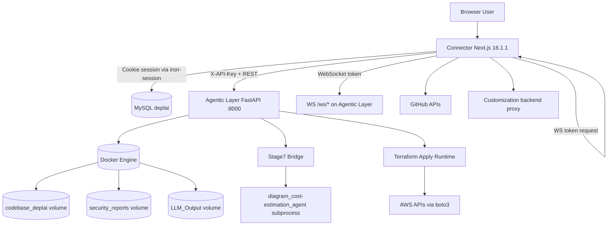

# DeplAI
> End-to-end AI-assisted deployment pipeline that scans code, proposes remediations, derives infrastructure plans, estimates cloud cost, generates IaC, and executes deployment.

**Stack**: Next.js 16.1.1 + React 19.2.3 + TypeScript 5 (Connector), FastAPI 0.115+ + Uvicorn 0.34+ + Python 3.13 (Agentic Layer), MySQL 8 (Connector persistence), Docker Engine (scan/runtime execution)
**Status**: Internal
**Owner**: adityajayashankar (latest commit author)

## Table of Contents
- Overview
- Repository Layout
- Architecture Summary
- Prerequisites
- Installation
- Configuration
- Running
- Testing
- Troubleshooting
- Additional Documentation

## Overview
DeplAI is a two-tier system:
- Connector (Next.js) is the authenticated user-facing control plane.
- Agentic Layer (FastAPI) is the execution plane for scan, remediation, architecture planning, costing, Terraform generation, Terraform apply, and AWS runtime actions.

Core execution flow implemented in code:
1. User authenticates with GitHub OAuth in Connector API auth routes.
2. User starts scan from Connector; Connector validates ownership and forwards request to Agentic Layer.
3. Agentic Layer scans repository content in Docker volumes using Bearer and Syft/Grype.
4. User starts remediation; Agentic Layer runs remediation rounds, optional PR creation, and re-scan.
5. Connector runs repository analysis and architecture review Q/A against Agentic Layer planning endpoints.
6. Connector requests Stage 7 approval payload (diagram + cost + budget gate).
7. Connector generates IaC (AWS locally generated six-file bundle in Connector route, or Azure/GCP local bundles).
8. Connector deploys via:
   - Runtime apply mode: Agentic Layer /api/terraform/apply
   - GitOps mode: creates/updates a GitHub repo, pushes files, and injects workflow variables

## Repository Layout
- Agentic Layer: FastAPI backend and orchestration runners.
- Connector: Next.js application, authenticated API facade, dashboard UI.
- Diagram-Cost-Agent: LangGraph Stage 7 implementation.
- Terraform Agent: LangGraph Terraform planner/generator implementation.
- KGagent: Knowledge graph assistant modules (Neo4j/Qdrant-based).
- runtime: Persisted planning outputs (repo-analyzer and architecture decision artifacts).

## Architecture Summary


## Prerequisites
Required runtimes and services for a full local stack:
- Docker Desktop with Docker Engine reachable from host and containers.
- Node.js 20+ for Connector development.
- npm (ships with Node.js).
- Python 3.13 (Dockerfile uses python:3.13-slim; local development should match closely).
- MySQL 8+ for Connector data model in database.sql.
- GitHub OAuth App + GitHub App credentials if GitHub repository mode is used.

Optional but used by specific features:
- AWS credentials for runtime deployment and runtime details endpoints.
- Anthropic/OpenRouter/Groq/Ollama keys for model backends.
- Neo4j for KG-enhanced remediation path and health checks.
- PuTTYgen executable on Windows for PEM to PPK conversion route.

## Installation
### 1. Clone and initialize frontend dependencies
```bash
cd Connector
npm install
```

### 2. Initialize Python dependencies for Agentic Layer
```bash
cd "../Agentic Layer"
python -m venv .venv
# PowerShell
.\.venv\Scripts\Activate.ps1
pip install -r requirements.txt
```

### 3. Initialize Connector database
Use the SQL schema in Connector/database.sql against your MySQL server:
```sql
SOURCE Connector/database.sql;
```

### 4. Configure environment variables
Create env files and populate variables documented below.

## Configuration
The tables below come directly from environment variable reads in Connector and Agentic Layer code.

### Connector variables
| Variable | Required | Default | Effect |
|---|---|---|---|
| SESSION_SECRET | Yes | none | Required by iron-session for signed auth cookie. |
| NEXT_PUBLIC_APP_URL | Yes | none | OAuth redirect base and post-login redirects. |
| WS_TOKEN_SECRET | Yes | none | Required by /api/scan/ws-token to sign WebSocket tokens. |
| GITHUB_CLIENT_ID | Yes (OAuth login) | none | GitHub OAuth authorization code flow. |
| GITHUB_CLIENT_SECRET | Yes (OAuth login) | none | GitHub OAuth token exchange in auth callback route. |
| GITHUB_APP_ID | Yes (GitHub App features) | none | Installation token issuance via Octokit auth-app. |
| GITHUB_PRIVATE_KEY | Yes (GitHub App features) | none | GitHub App private key for installation auth. |
| GITHUB_WEBHOOK_SECRET | Yes (webhook route) | none | Signature verification of GitHub webhook payloads. |
| DEPLAI_SERVICE_KEY | Required in practice | none | Forwarded as X-API-Key to Agentic Layer; backend startup fails without matching DEPLAI_SERVICE_KEY. |
| AGENTIC_LAYER_URL | No | http://localhost:8000 | Upstream URL for all Agentic Layer API calls. |
| DB_HOST | No | localhost | MySQL host for Connector pool. |
| DB_PORT | No | 3306 | MySQL port for Connector pool. |
| DB_USER | No | root | MySQL user for Connector pool. |
| DB_PASSWORD | No | empty | MySQL password for Connector pool. |
| DB_NAME | No | deplai | MySQL database name for Connector pool. |
| CLEANUP_SCAN_VOLUMES_ON_LOGOUT | No | false | If true, logout route calls Agentic /api/cleanup. |
| ALLOW_GLOBAL_CLEANUP | No | false | Used by settings UI snapshot to surface cleanup capability state. |
| AWS_ACCESS_KEY_ID | No | none | Used for runtime deploy health and some deployment defaults. |
| AWS_SECRET_ACCESS_KEY | No | none | Used for runtime deploy health and some deployment defaults. |
| GROQ_API_KEY | No | none | Chat route Groq provider auth. |
| GROQ_MODEL | No | llama-3.3-70b-versatile | Chat route Groq model selection. |
| OPENROUTER_API_KEY | No | none | Chat route OpenRouter provider auth. |
| OPENROUTER_MODEL | No | openai/gpt-oss-120b | Chat route OpenRouter model selection. |
| OLLAMA_API_KEY | No | none | Chat route Ollama cloud provider auth. |
| OLLAMA_MODEL | No | qwen2.5-coder:7b | Chat route Ollama model selection. |
| PUTTYGEN_PATH | No | auto-detected candidates | Optional explicit PuTTYgen path for /api/pipeline/keypair/ppk conversion. |
| NEXT_PUBLIC_AGENTIC_WS_URL | No | derived from AGENTIC_LAYER_URL | Optional explicit websocket URL in frontend. |
| CUSTOMIZATION_AGENT_BASE_URL | No | http://127.0.0.1:8010 | Upstream customization backend base URL. |
| CUSTOMIZATION_BACKEND_URL | No | http://127.0.0.1:8010 | Fallback alias for customization backend base URL. |

### Agentic Layer variables
| Variable | Required | Default | Effect |
|---|---|---|---|
| DEPLAI_SERVICE_KEY | Yes | none | Required at startup; validates X-API-Key headers from Connector. |
| WS_TOKEN_SECRET | No | falls back to DEPLAI_SERVICE_KEY | HMAC key for websocket token verification. |
| CORS_ORIGINS | No | http://localhost:3000 | Comma-separated CORS allowlist. |
| ALLOW_GLOBAL_CLEANUP | No | false | Enables destructive /api/cleanup endpoint when true. |
| DEPLAI_LOCAL_PROJECTS_ROOT | No | Connector/tmp/local-projects and /local-projects fallback | Root for resolving local project source path. |
| DEPLAI_GITHUB_REPOS_ROOT | No | Connector/tmp/repos and /repos fallback | Root for resolving mirrored GitHub repos. |
| HOST_PROJECTS_DIR | No | none | Fallback host mount source for local project copy path resolution. |
| CONTAINER_OP_TIMEOUT | No | 120 | Timeout for Docker volume and clone operations. |
| SCANNER_TIMEOUT_SECONDS | No | 1800 in Bearer path, 1200 in Syft path | Scan timeout budget. |
| GRYPE_TIMEOUT_SECONDS | No | 900 | Grype execution timeout. |
| NEO4J_URI | No | none | Health check connectivity and optional KG path dependency. |
| NEO4J_USER | No | none | Neo4j auth username. |
| NEO4J_PASSWORD | No | none | Neo4j auth password. |
| AWS_ACCESS_KEY_ID | No | none | Optional fallback for AWS cost estimator if credentials omitted in request. |
| AWS_SECRET_ACCESS_KEY | No | none | Optional fallback for AWS cost estimator if credentials omitted in request. |
| CLAUDE_API_KEY / ANTHROPIC_API_KEY | Required for Claude-backed flows | none | Architecture generation, remediation, and Claude deployment planning calls. |
| CLAUDE_MODEL | No | claude-3-7-sonnet-latest | Default Claude model fallback in multiple flows. |
| CLAUDE_REPO_ANALYZER_MODEL | No | claude-3-5-haiku-20241022 | Repository analysis model override. |
| CLAUDE_REVIEW_QUESTION_MODEL | No | claude-3-5-haiku-20241022 | Review question generation model override. |
| CLAUDE_INFRA_PLANNER_MODEL | No | CLAUDE_MODEL fallback | Infra planner model override. |
| DEPLAI_CLAUDE_MAX_PIPELINE_COST_USD | No | 3.0 | Upper spend guardrail for Claude deployment planning pipeline. |
| DEPLAI_MAX_REMEDIATION_COST_USD | No | 1.0 | Spend guardrail for remediation loop model calls. |
| GROQ_API_KEY | No | none | Optional Groq backend for architecture/remediation model calls. |
| GROQ_BASE_URL | No | https://api.groq.com/openai/v1 | Optional Groq API base override. |
| OPENROUTER_API_KEY | No | none | Optional OpenRouter backend API key. |
| OPENROUTER_MODEL | No | none | Default OpenRouter model fallback in backend model loaders. |
| OPENROUTER_BASE_URL | No | https://openrouter.ai/api/v1 | OpenRouter API base URL. |
| OPENROUTER_APP_NAME | No | deplai-agentic | OpenRouter app attribution header value. |
| OLLAMA_API_KEY | No | none | Optional Ollama cloud API key. |
| OLLAMA_MODEL | No | qwen2.5-coder:7b | Default Ollama model fallback. |
| REMEDIATION_* tuning variables | No | code defaults | Control remediation loop limits, token budgets, patch safety, and retry behavior. |
| DEPLAI_FREE_TIER_EC2_TYPES | No | t3.micro,t2.micro | Ordered fallback list for runtime apply EC2 instance type substitution. |
| DEPLAI_ALLOW_EC2_DISABLE_FALLBACK | No | 1 | Allows runtime apply to continue with EC2 fallback behavior when capacity/quota constraints occur. |
| DEPLAI_EC2_INSTANCE_TYPE | No | empty | Optional forced EC2 instance type override in runtime apply logic. |

## Running
### Option A: Docker Compose (recommended for integrated backend)
```bash
docker compose up --build
```
This starts Agentic Layer on port 8000 with live source mounts defined in docker-compose.yml.

### Option B: Split local dev (frontend + backend)
Terminal 1 (Agentic Layer):
```bash
cd "Agentic Layer"
.\.venv\Scripts\Activate.ps1
uvicorn main:app --reload --host 0.0.0.0 --port 8000
```

Terminal 2 (Connector):
```bash
cd Connector
npm run dev
```
Connector defaults to port 3000.

### Production build (Connector)
```bash
cd Connector
npm run build
npm run start
```

## Testing
Available tests in repository:
- Agentic Layer test file: Agentic Layer/test_repository_sources.py
- Terraform Agent tests: Terraform Agent/agent/tests

Example:
```bash
cd "Agentic Layer"
pytest -q
```

## Troubleshooting
### 1) Backend fails at startup with DEPLAI_SERVICE_KEY error
Symptom:
- Agentic Layer raises RuntimeError: DEPLAI_SERVICE_KEY environment variable is not set.

Fix:
- Define DEPLAI_SERVICE_KEY in backend env and pass the same value to Connector.

### 2) WebSocket closes immediately with code 1008
Symptom:
- /ws/scan/{project_id} or /ws/remediate/{project_id} closes with Invalid or missing token.

Fix:
- Ensure Connector /api/scan/ws-token can read WS_TOKEN_SECRET and that project ownership check passes.
- Verify project_id is included when requesting ws token.

### 3) Connector returns 502 for scan/remediation/planning
Symptom:
- Errors such as Agentic Layer is unreachable at AGENTIC_LAYER_URL.

Fix:
- Confirm AGENTIC_LAYER_URL points to reachable FastAPI service.
- Verify Docker and Agentic Layer process are running.

### 4) /api/cleanup returns 403
Symptom:
- Global cleanup is disabled message.

Fix:
- Set ALLOW_GLOBAL_CLEANUP=true for Agentic Layer process only when intentional.

### 5) Deployment blocked by budget guardrail
Symptom:
- Connector /api/pipeline/deploy returns 422 with blocked=true.

Fix:
- Increase budget_limit_usd, reduce architecture estimate, or pass budget_override=true explicitly.

### 6) Stage 7 always returns fallback approval payload
Symptom:
- warning states Stage7 agent runner not found.

Fix:
- Agentic Layer currently looks for repo-root/diagram_cost-estimation_agent/run_stage7.py.
- In this workspace, implemented code exists in Diagram-Cost-Agent, so either align pathing or add expected runtime folder.

## Additional Documentation
- Architecture deep-dive: docs/architecture.md
- API reference: docs/api-reference.md
- Changelog: CHANGELOG.md
