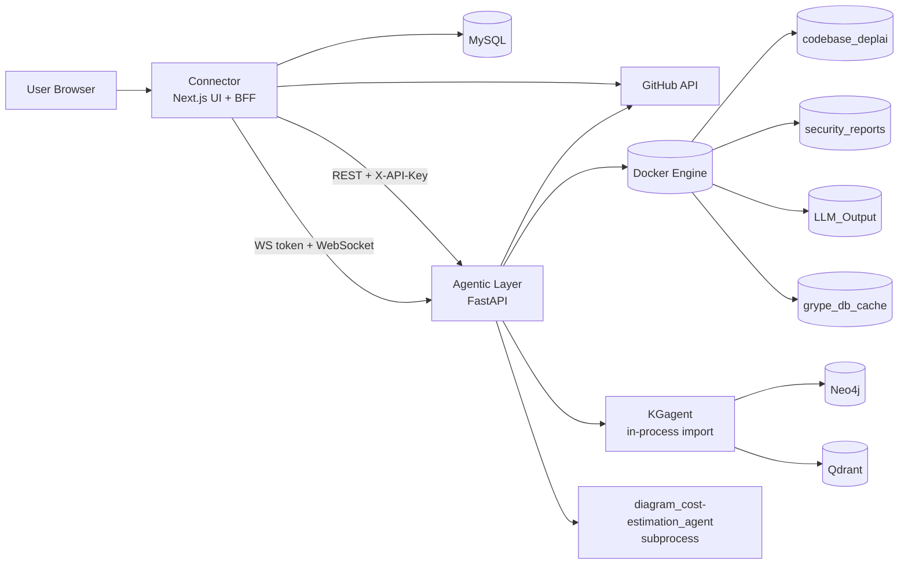
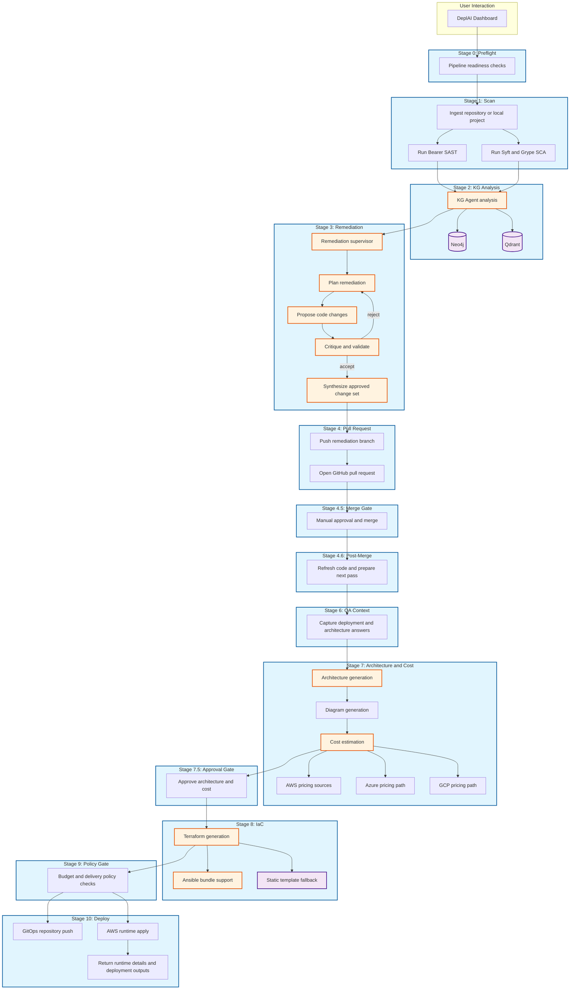

# DeplAI

DeplAI is an agentic DevSecOps platform that takes a GitHub repository or local upload, runs security analysis, drives a human-reviewed remediation loop, generates architecture and cost outputs, produces infrastructure artifacts, enforces delivery policy, and then deploys through either GitOps or direct runtime apply.

The active system in this repository is a Next.js control plane (`Connector`) backed by a FastAPI orchestration layer (`Agentic Layer`). Knowledge graph enrichment (`KGagent`) and diagram/cost generation (`diagram_cost-estimation_agent`) are integrated into that path. The top-level `terraform_agent/` directory is present, but it is not the primary runtime path today.

## Executive Summary

- Frontend and BFF: `Connector` using Next.js 16
- Backend orchestrator: `Agentic Layer` using FastAPI
- Stage 7 diagram and cost execution: `diagram_cost-estimation_agent`
- Remediation context enrichment: `KGagent` imported in-process by the backend
- Runtime deployment path: AWS-focused and backed by `/api/terraform/apply`
- Containerized local startup: `docker-compose.yml` currently starts only `agentic-layer`

## What The Platform Does

DeplAI is structured as a guided delivery pipeline rather than a single scanner or generator. The current implementation combines:

- Preflight health and readiness checks
- Source code ingestion for GitHub or local projects
- Security scanning using Bearer plus Syft and Grype
- Knowledge graph assisted vulnerability analysis
- Multi-step remediation orchestration with human approval
- Pull request creation and merge gating
- Post-merge validation and re-scan loop
- Architecture generation and cost estimation
- Terraform bundle generation with template fallback
- Budget and policy gating before deployment
- AWS runtime apply and post-deploy runtime detail retrieval

## Runtime Architecture



## End-To-End Pipeline

The pipeline surfaced in `Connector/src/features/pipeline/data.ts` is the implementation baseline for the UI and BFF routes.



## Current Delivery Scope

The repository is broader than the currently active production path. The active behavior today is:

- Scan and remediation are orchestrated through FastAPI and streamed over WebSockets
- KG analysis is integrated in-process and does not require a separate KG HTTP service
- Architecture and cost are generated from the Connector plus backend stage 7 path
- Stage 8 can call the backend Terraform path, but Connector has an explicit template fallback
- Runtime deploy is AWS-only
- GitOps deployment writes repository files and GitHub Actions workflow assets when `runtime_apply=false`

Important implementation notes:

- Remediation cycles are capped at `2` in the backend
- `skipScan` implies `skipRemediation`
- Delivery UI is AWS-centric even though some architecture and cost generation paths support other providers
- The old Terraform RAG path has been removed from the runtime flow

## Repository Layout

```text
DeplAI/
|- Connector/                      Next.js dashboard, BFF routes, GitHub integration, session/auth
|- Agentic Layer/                  FastAPI orchestration for scan, remediation, architecture, cost, terraform, deploy
|- diagram_cost-estimation_agent/  Stage 7 subprocess for diagram, pricing, and approval payload
|- KGagent/                        Knowledge graph analysis used during remediation
|- terraform_agent/                Legacy standalone terraform agent, not the active runtime path
|- ARCHITECTURE.md                 Runtime architecture details
|- RUNBOOK.md                      Operational startup and troubleshooting guide
```

## Security And Control Boundaries

- Connector to Agentic Layer REST calls are protected with `DEPLAI_SERVICE_KEY`
- Scan and remediation streams use short-lived HMAC WebSocket tokens
- Connector enforces project ownership before forwarding pipeline actions
- Deployment path enforces budget guardrails before GitOps push or runtime apply
- Runtime deploy control includes status, stop, destroy, and runtime detail endpoints

## Primary APIs

Connector BFF routes:

- `POST /api/scan/validate`
- `GET /api/scan/status`
- `GET /api/scan/results`
- `GET /api/scan/ws-token`
- `POST /api/remediate/start`
- `POST /api/architecture`
- `POST /api/cost`
- `GET /api/pipeline/health`
- `POST /api/pipeline/diagram`
- `POST /api/pipeline/stage7`
- `POST /api/pipeline/iac`
- `POST /api/pipeline/deploy`
- `POST /api/pipeline/deploy/status`
- `POST /api/pipeline/deploy/stop`
- `POST /api/pipeline/deploy/destroy`
- `POST /api/pipeline/runtime-details`

Agentic Layer routes:

- `POST /api/scan/validate`
- `WS /ws/scan/{project_id}`
- `GET /api/scan/status/{project_id}`
- `GET /api/scan/results/{project_id}`
- `POST /api/remediate/validate`
- `WS /ws/remediate/{project_id}`
- `WS /ws/pipeline/{project_id}`
- `POST /api/architecture/generate`
- `POST /api/cost/estimate`
- `POST /api/stage7/approval`
- `POST /api/terraform/generate`
- `POST /api/terraform/apply`
- `POST /api/terraform/apply/status`
- `POST /api/terraform/apply/stop`
- `POST /api/aws/runtime-details`
- `POST /api/aws/destroy-runtime`

## Prerequisites

- Node.js 20+
- Python 3.13+
- Docker Desktop
- MySQL 8+
- GitHub OAuth App and GitHub App credentials for repository-backed workflows

## Environment Configuration

Minimum required values in repo-root `.env`:

```bash
NEXT_PUBLIC_APP_URL=http://localhost:3000
AGENTIC_LAYER_URL=http://localhost:8000
NEXT_PUBLIC_AGENTIC_WS_URL=ws://localhost:8000
DEPLAI_SERVICE_KEY=<shared-secret>
WS_TOKEN_SECRET=<ws-signing-secret>
SESSION_SECRET=<session-secret>

DB_HOST=localhost
DB_PORT=3306
DB_USER=deplai
DB_PASSWORD=<password>
DB_NAME=deplai

GITHUB_CLIENT_ID=<oauth-client-id>
GITHUB_CLIENT_SECRET=<oauth-client-secret>
GITHUB_APP_ID=<app-id>
GITHUB_PRIVATE_KEY=<pem-with-\n>
GITHUB_WEBHOOK_SECRET=<webhook-secret>
```

Common optional values:

```bash
GROQ_API_KEY=
OPENROUTER_API_KEY=
OPENAI_API_KEY=
ANTHROPIC_API_KEY=

AWS_ACCESS_KEY_ID=
AWS_SECRET_ACCESS_KEY=

NEO4J_URI=bolt://localhost:7687
NEO4J_USER=neo4j
NEO4J_PASSWORD=
```

## Local Startup

Initialize the MySQL schema:

```bash
mysql -u root -p < Connector/database.sql
```

Start the backend:

```bash
docker compose up -d --build agentic-layer
```

Check backend health:

```bash
curl http://localhost:8000/health
```

Start the frontend:

```bash
cd Connector
npm install
npm run dev
```

Open `http://localhost:3000`.

Validate Python modules from repo root:

```powershell
python -m compileall "Agentic Layer" KGagent terraform_agent diagram_cost-estimation_agent
```

## Known Constraints

- `docker-compose.yml` does not start MySQL, Neo4j, or Qdrant for you
- Runtime deployment is AWS-only
- Delivery-stage UX is AWS-first
- Top-level `terraform_agent/` is not the primary runtime generator
- Terraform generation can intentionally fall back to static templates
- KG enrichment can degrade gracefully if Neo4j or Qdrant are unavailable

## Additional Documentation

- Architecture detail: `ARCHITECTURE.md`
- Operations and troubleshooting: `RUNBOOK.md`
- Architecture contract notes: `ARCHITECTURE_CONTRACTS.md`
