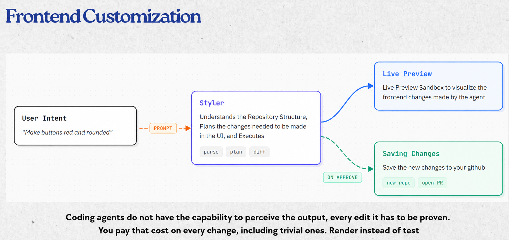
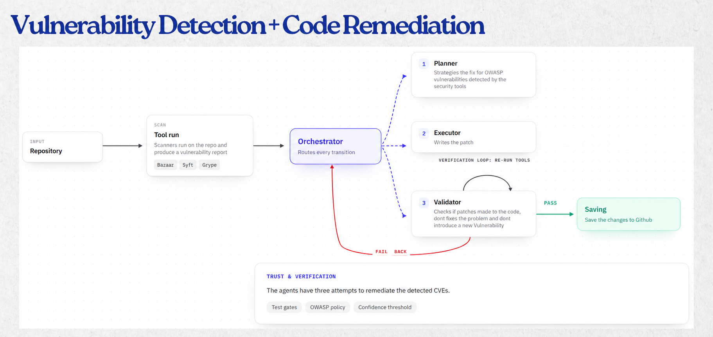
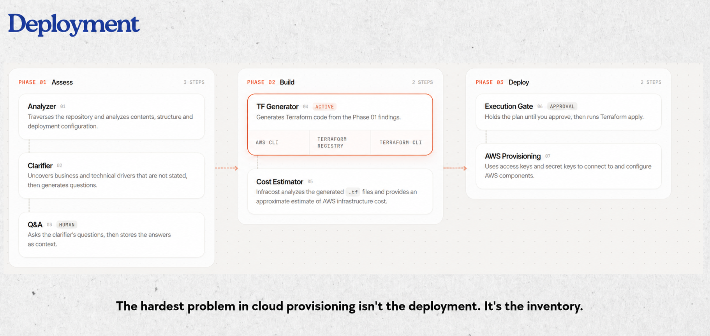

# DeplAI

DeplAI is an engineering workspace for taking an application from source code to a reviewed, deployable AWS runtime. It brings together GitHub and local-project onboarding, security analysis and remediation, architecture review, cost estimation, Terraform generation, deployment operations, and tenant-specific UI customization.

The repository is a multi-service workspace. The primary application is the **Connector** (a Next.js application); it coordinates browser requests, identity, project ownership, and service-to-service calls. The **Agentic Layer** performs the long-running security, remediation, planning, Terraform, and AWS operations. The **Terraform Agent** is the authoritative Terraform generation and execution engine.

## DeplAI at a glance

### What we are

DeplAI is a human-controlled, source-aware engineering platform for moving an
application from repository to a reviewed cloud runtime. It is not an
unattended "deploy anything" agent: it combines deterministic checks, optional
LLM assistance, observable workflows, and explicit approval before billable
infrastructure changes.

### What we are solving

Application delivery usually spans disconnected tools and handoffs: repository
access, security reports, remediation, architecture decisions, cost review,
infrastructure code, deployment, and runtime operations. Context is lost at
each boundary, and cloud changes can be made before the source code or plan has
been understood. DeplAI keeps those steps tied to one project, its source
signals, and its authenticated owner.

### Vision

Make secure cloud delivery understandable and repeatable for teams that do not
want to stitch together a separate security, planning, IaC, and operations
workflow for every project. The product direction is an explainable path from
repository evidence to a production-ready decision, with people retaining
control of source changes, pull requests, plans, credentials, and apply.

## High-level architecture

### Frontend customization



### Vulnerability detection and code remediation



### Deployment workflow



Read the documentation in this order:

1. [Product overview](docs/product-overview.md) — users, problem, vision, goals, and current scope.
2. [Technical architecture](docs/technical-architecture.md) — Level-1 system design, frameworks, data flows, and trust boundaries.
3. [Agent architecture](docs/agent-architecture.md) — the detailed workflow, orchestration, validation, and fallback design.
4. [Architecture and execution flows](docs/architecture.md) and the [API reference](docs/api-reference.md) — implementation-facing details.

**Engineering handbook:** [docs/internal/](docs/internal/README.md) — services, pipelines, Compose/Caddy, env vars, and known gaps. Prefer this over older narratives when they disagree.

**Client guide:** [docs/guide/](docs/guide/README.md) — dashboard Documentation (`/dashboard/documentation`). After editing, run `cd Connector && npm run docs:embed`.

**Production deploy:** [deploy/README.md](deploy/README.md) — Caddy TLS, `docker-compose.production.yml`, and production env.

## What the product supports today

- GitHub OAuth login with an explicit GitHub account chooser; users can select a different GitHub account after signing out of DeplAI.
- GitHub App installation discovery, repository synchronization, cloning, branch access, webhook processing, and installation-token access.
- Local ZIP project upload, extraction, browsing, and deletion.
- SAST, SCA, and Full Scan workflows (secrets, IaC, containers, Kubernetes, CI/CD, API spec checks; optional DAST with an authorized public URL) with status/result APIs and authenticated WebSocket progress streams.
- Guided remediation, optional user-supplied LLM credentials, repository changes, and pull-request handoff for GitHub projects.
- Repository analysis, architecture review, deterministic or LLM-assisted architecture generation, cost estimation, and approval payload generation.
- Terraform generation through the deterministic deployment-profile renderer, the EC2 application renderer, and the Terraform Agent pipeline.
- Runtime deployment controls, plan confirmation, live AWS details, EC2 start/stop/reboot, endpoint verification, generated SSH-key conversion, and destruction of DeplAI-managed resources.
- Repository-aware database provisioning: Prisma, Docker Compose, package dependencies, and `DATABASE_URL` signals can trigger RDS provisioning and application environment injection.
- Tenant customization through a Connector-authenticated proxy to the customization backend, including chat, manifest confirmation, implementation, preview, uploaded assets, and repository reset.
- BYOK AI platform (credentials vault, catalog, routing, usage/costs), workspace sessions, and Razorpay billing (credits, subscription, GST invoices).

## Runtime topology

```text
Browser
  │
  ▼
Connector (Next.js, port 3000)
  ├── iron-session cookie authentication
  ├── MySQL (users, GitHub, billing, AI vault, workspace sessions)
  ├── GitHub OAuth and GitHub App API access
  └── authenticated service calls (X-API-Key)
          │
          ▼
Agentic Layer (FastAPI)
  ├── local full stack (`compose.yaml`): host port 8000
  ├── hot-reload dev (`docker-compose.dev.yml`): host port 8001 → container 8000
  ├── scan and remediation runners
  ├── repository analysis and architecture review
  ├── cost, approval, Terraform, and AWS runtime APIs
  └── Terraform Agent mounted as the `terraform_agent` package
          │
          ├── Docker Engine: scanners, workspaces, and runtime execution
          └── AWS: Terraform-managed infrastructure and runtime inspection

Customization backend (FastAPI, port 8010)
  ▲
  └── Connector `/api/customization/*` proxy

Production: Caddy publishes 80/443 only. Browser WebSockets use
`wss://<APP_DOMAIN>/agentic/ws/*`; Caddy strips `/agentic` before proxying to
Agentic `/ws/*`. Connector reaches Agentic HTTP on the Docker network.
```

## Repository layout

| Path | Responsibility |
| --- | --- |
| `Connector/` | Next.js 16 control plane, landing page, dashboard UI, API routes, GitHub integration, MySQL access, and browser-side pipeline state. |
| `Agentic Layer/` | FastAPI service for scanning, remediation, repository analysis, architecture decisions, cost estimation, Terraform orchestration, and AWS runtime operations. |
| `Terraform Agent/agent/` | Terraform run engine, renderers, validation/refinement loop, state storage, lock handling, deployment profiles, templates, and execution helpers. |
| `Customization Agent/tenant_builder_app/backend/` | Tenant manifest chat, planning, repository edits, asset storage, preview orchestration, and customization quality gates. |
| `remediation_pipeline/` | Remediation extraction, grouping, generation, validation, and track orchestration used by the Agentic Layer. |
| `Connector/database.sql` | Baseline MySQL schema (users, GitHub, projects, billing, AI platform, workspace sessions). |
| `compose.yaml` | Default local full stack (`docker compose up --build`): Connector, Agentic, customization, MySQL. |
| `docker-compose.dev.yml` | Agentic hot-reload only (host port 8001) against a host-run Connector. |
| `docker-compose.production.yml` | Production stack with Caddy TLS (`deploy/.env`). |
| `deploy/` | Production Caddyfile, env template, and deployment runbook. |
| `.env.template` | Shared environment-variable template. Never commit the populated `.env` file. |
| `docs/` | Product, API, engineering handbook (`docs/internal/`), and client guide (`docs/guide/`). |

## Main user journey

1. Sign in through GitHub and choose the desired GitHub account.
2. Add a GitHub repository through the GitHub App, or upload a local ZIP project.
3. Start a security scan. The Connector validates ownership, mints a short-lived WebSocket token, then the Agentic Layer streams scan progress over a project-bound WebSocket.
4. Review findings and start remediation when appropriate. GitHub remediation can use a scoped installation token or a supplied personal token.
5. Run repository analysis and complete the architecture review questions.
6. Generate an architecture, estimate cost, review the approval payload, and choose a Terraform renderer.
7. Generate Terraform, inspect the plan, explicitly confirm it, then apply it with AWS credentials.
8. Inspect runtime details, verify endpoints, control an EC2 instance where applicable, and destroy DeplAI-managed runtime resources when finished.

## Prerequisites

- Node.js 20+ and npm for the Connector.
- Python 3.13+ for local Agentic/Customization development. The Agentic Docker image uses Python 3.13.
- Docker Desktop or a compatible Docker Engine. The Agentic Layer needs access to the Docker socket for scanner and Terraform workflows.
- MySQL 8+ reachable from the Connector.
- An AWS account and credentials for real Terraform apply, runtime inspection, or runtime destruction.
- A GitHub OAuth App for sign-in. A GitHub App is additionally required for installed-repository synchronization and app-token workflows.

## Local setup

### Quick local Docker start

For a complete local stack with no credentials required to open the UI, start
Docker Desktop and run this from the repository root:

```bash
docker compose up --build
```

Open `http://localhost:3000`. This starts the Connector, Agentic Layer,
customization backend, and MySQL on ports **3000**, **8000**, and **8010**.
GitHub sign-in, repository access, PR creation, cloud deployment, and
LLM-backed features require their respective credentials; see the full setup
below. Stop the stack with `docker compose down` (do not add `-v` unless you
intend to erase local data).

For this stack, browser WebSockets connect directly to Agentic at
`ws://localhost:8000/ws/scan/{project_id}?token=…` (no `/agentic` prefix).

### 1. Create the shared environment file

Copy `.env.template` to `.env` and set non-placeholder secrets. Values depend on how you run the stack:

| Mode | `AGENTIC_LAYER_URL` | `NEXT_PUBLIC_AGENTIC_WS_URL` |
| --- | --- | --- |
| Full stack (`compose.yaml`) | `http://localhost:8000` (host Connector uses `http://agentic-layer:8000` inside Compose) | `ws://localhost:8000` |
| Connector on host + `docker-compose.dev.yml` | `http://localhost:8001` | `ws://localhost:8001` |
| Production (Caddy) | `http://agentic-layer:8000` (Docker network) | `wss://<APP_DOMAIN>/agentic` |

At minimum, configure:

```dotenv
DEPLAI_SERVICE_KEY=<long-random-secret>
WS_TOKEN_SECRET=<different-long-random-secret>
SESSION_SECRET=<long-random-secret>

NEXT_PUBLIC_APP_URL=http://localhost:3000
AGENTIC_LAYER_URL=http://localhost:8000
NEXT_PUBLIC_AGENTIC_WS_URL=ws://localhost:8000

DB_HOST=localhost
DB_PORT=3306
DB_USER=root
DB_PASSWORD=<password>
DB_NAME=deplai

GITHUB_CLIENT_ID=<oauth-app-client-id>
GITHUB_CLIENT_SECRET=<oauth-app-client-secret>
GITHUB_APP_ID=<github-app-id>
GITHUB_PRIVATE_KEY=<github-app-private-key>
GITHUB_WEBHOOK_SECRET=<github-webhook-secret>
```

`DEPLAI_SERVICE_KEY` authenticates Connector-to-Agentic HTTP calls. `WS_TOKEN_SECRET` signs short-lived project-bound WebSocket tokens. URL resolution for browsers lives in `Connector/src/lib/agentic-websocket.ts`. In production, all secrets must be distinct, random values.

### 2. Initialize MySQL (host dev only)

The full `compose.yaml` stack creates and initializes MySQL automatically from `Connector/database.sql`. Skip this step when using `docker compose up --build`.

For a host-run Connector, create the baseline schema manually:

```bash
mysql -u root -p < Connector/database.sql
```

Use the credentials configured in `.env`. Apply `Connector/migrations/*.sql` in date order on existing databases. The Connector uses MySQL for identities, GitHub data, projects, billing, AI platform records, workspace sessions, and settings.

### 3. Start the Agentic Layer (split dev only)

If you are **not** using the full `compose.yaml` stack and want Agentic hot-reload while running the Connector on the host:

```bash
docker compose -f docker-compose.dev.yml up --build
```

This exposes Agentic at `http://localhost:8001`. Set `AGENTIC_LAYER_URL=http://localhost:8001` and `NEXT_PUBLIC_AGENTIC_WS_URL=ws://localhost:8001` in `.env`. Confirm startup with:

```bash
curl http://localhost:8001/ready
curl http://localhost:8001/health
```

If you use the full stack from **Quick local Docker start** above, Agentic is already running on port **8000** — skip this step.

### 4. Start the Connector (host dev only)

Skip this if you started the full stack with `docker compose up --build` — the Connector container is already running.

In a second terminal:

```bash
cd Connector
npm install
npm run dev
```

Open `http://localhost:3000`. The landing-page sign-in starts the GitHub OAuth flow and asks GitHub to show an account chooser.

### 5. Start customization support (optional)

The customization console is available through the Connector only when the tenant-builder backend is running. Set `CUSTOMIZATION_AGENT_BASE_URL=http://127.0.0.1:8010` (or `CUSTOMIZATION_BACKEND_URL`) in `.env`, then run:

```bash
cd "Customization Agent/tenant_builder_app/backend"
python -m venv .venv
# Windows PowerShell: .venv\Scripts\Activate.ps1
# macOS/Linux: source .venv/bin/activate
pip install -r requirements.txt
uvicorn main:app --host 127.0.0.1 --port 8010 --reload
```

The standalone customization frontend is optional; the primary DeplAI UI uses the Connector dashboard and Connector proxy.

## GitHub configuration

The implementation uses two related GitHub integrations:

1. **OAuth App** — authenticates people. The callback exchanges an authorization code, loads the GitHub profile and primary email, upserts the DeplAI user record, and creates an encrypted browser session.
2. **GitHub App** — grants repository-level access. The Connector synchronizes installations and repositories, creates scoped installation tokens, clones repositories under `Connector/tmp/repos`, and can create webhooks for push and pull-request events.

Set the OAuth callback URL to:

```text
http://localhost:3000/api/auth/callback
```

For non-local deployment, replace the origin with the canonical HTTPS Connector URL and use the same URL in `NEXT_PUBLIC_APP_URL`.

## Terraform and AWS behavior

Terraform generation supports both deployment-profile and repository-aware paths. The Agentic Layer can generate a deterministic infrastructure bundle, an EC2 application bundle, or use the Terraform Agent pipeline. Terraform output, workspace state, plan attempts, and runtime information are surfaced back through the Connector dashboard.

For repository-aware EC2 application bundles, the packaging step detects database requirements in this order:

1. `prisma/schema.prisma` and its datasource provider.
2. PostgreSQL, MySQL, or MariaDB images in Docker Compose files.
3. ORM/database client dependencies in `package.json`.
4. `DATABASE_URL` in supported environment templates.

When an external database is required, DeplAI can provision RDS and inject `DATABASE_URL`, host, port, name, user, password, `JWT_SECRET`, `NODE_ENV`, and `PORT` into the application runtime. PostgreSQL defaults to version `16.6`. The RDS configuration supports standard RDS plus Aurora-related controls, storage, backups, deletion protection, availability, public access, autoscaling, and replica settings.

Applying infrastructure is an external, billable action. Use a least-privilege AWS identity, inspect the generated plan, and confirm the plan summary before apply.

## Validation and tests

### Connector

```bash
cd Connector
npm run lint
npx tsc --noEmit
```

The current repository has pre-existing lint findings outside individual changes. Run focused ESLint against modified files when working in a constrained area, and run TypeScript validation before handoff.

### Python services

Run unit tests from the relevant service directories with the active virtual environment. The Agentic Layer and Terraform Agent both contain targeted test modules for repository sources, rendering, Terraform runs, package behavior, and execution helpers.

## Safety notes

- Never put populated `.env` values, GitHub private keys, OAuth secrets, AWS credentials, or generated private keys into source control.
- All browser-facing protected routes must enforce Connector session ownership. Do not expose `DEPLAI_SERVICE_KEY` to the browser.
- Agentic scan, remediation, and pipeline WebSockets require a short-lived HMAC token bound to both the user and project ID. Production browsers connect through Caddy at `wss://<APP_DOMAIN>/agentic/ws/*`; locally they connect directly to Agentic (e.g. `ws://localhost:8000/ws/*`). Ops diagnostic: authenticated `GET /api/scan/ws-health`.
- `POST /api/cleanup` in the Agentic Layer is globally destructive and disabled unless `ALLOW_GLOBAL_CLEANUP=true`. Do not enable it in a shared or production environment without deliberate operational controls.
- Runtime destruction is best-effort and targets resources tagged for the selected DeplAI project. Review the returned details and AWS console state after a destroy request.

## Further documentation

- [Documentation index](docs/README.md)
- [Engineering handbook](docs/internal/README.md)
- [Client guide](docs/guide/README.md)
- [Production deployment](deploy/README.md)
- [Product overview](docs/product-overview.md)
- [Technical architecture](docs/technical-architecture.md)
- [Agent and workflow architecture](docs/agent-architecture.md)
- [Architecture and execution flows](docs/architecture.md)
- [API reference](docs/api-reference.md)
