# DeplAI Runbook

Operational guide for starting, validating, running, and troubleshooting the active DeplAI stack.

## 1. What This Runbook Covers

This runbook is for the active runtime:

- `Connector` as the user-facing control plane
- `Agentic Layer` as the backend orchestrator
- Docker-based scan and remediation execution
- KG-assisted remediation context
- Stage 7 architecture/cost generation
- Terraform generation and AWS runtime deploy

## 2. Prerequisites

Required:

- Node.js 20+
- Python 3.13+
- Docker Desktop or Docker Engine
- MySQL 8+

Required for repository-backed flows:

- GitHub OAuth credentials
- GitHub App credentials

Required for remediation:

- `ANTHROPIC_API_KEY`

Optional but recommended:

- Neo4j
- Qdrant
- AWS credentials for runtime deploy and AWS pricing flows

## 3. Services You Must Run

`docker-compose.yml` only starts:

- `agentic-layer`

You must separately run or provide:

- MySQL
- Connector
- optionally Neo4j
- optionally Qdrant

## 4. Environment Configuration

Set these in repo-root `.env`.

### Core runtime

```bash
NEXT_PUBLIC_APP_URL=http://localhost:3000
AGENTIC_LAYER_URL=http://localhost:8000
NEXT_PUBLIC_AGENTIC_WS_URL=ws://localhost:8000
DEPLAI_SERVICE_KEY=<shared-secret>
WS_TOKEN_SECRET=<ws-signing-secret>
SESSION_SECRET=<session-secret>
CORS_ORIGINS=http://localhost:3000
```

### Database

```bash
DB_HOST=localhost
DB_PORT=3306
DB_USER=deplai
DB_PASSWORD=<password>
DB_NAME=deplai
```

### GitHub

```bash
GITHUB_CLIENT_ID=<oauth-client-id>
GITHUB_CLIENT_SECRET=<oauth-client-secret>
GITHUB_APP_ID=<app-id>
GITHUB_PRIVATE_KEY=<pem-with-newlines>
GITHUB_WEBHOOK_SECRET=<webhook-secret>
```

### Remediation

```bash
ANTHROPIC_API_KEY=<anthropic-key>
REMEDIATION_CLAUDE_MODEL=claude-sonnet-4-5
DEPLAI_MAX_REMEDIATION_COST_USD=1.00
```

Useful remediation tuning:

```bash
REMEDIATION_MAX_CODE_ROOT_CAUSES=10
REMEDIATION_MAX_SUPPLY_ROOT_CAUSES=8
REMEDIATION_MAX_CODE_OCCURRENCES_PER_ROOT_CAUSE=3
REMEDIATION_NO_PROGRESS_LIMIT=2
```

### Optional infra and graph dependencies

```bash
NEO4J_URI=bolt://localhost:7687
NEO4J_USER=neo4j
NEO4J_PASSWORD=
QDRANT_URL=

AWS_ACCESS_KEY_ID=
AWS_SECRET_ACCESS_KEY=
AWS_DEFAULT_REGION=ap-south-1
```

## 5. First-Time Setup

### 5.1 Initialize MySQL

Load the schema from `Connector/database.sql`.

Example:

```bash
mysql -u root -p < Connector/database.sql
```

### 5.2 Install frontend dependencies

```bash
cd Connector
npm install
cd ..
```

### 5.3 Optional Python validation

```bash
python -m compileall "Agentic Layer" KGagent terraform_agent diagram_cost-estimation_agent
```

## 6. Startup Sequence

1. Start MySQL.
2. Start Docker Desktop.
3. Start Agentic Layer:

```bash
docker compose up -d --build agentic-layer
```

4. Start Connector:

```bash
cd Connector
npm run dev
```

5. Open `http://localhost:3000`.

## 7. Health Checks

### 7.1 Backend health

```bash
curl http://localhost:8000/health
```

Expected checks include:

- Docker engine connectivity
- Neo4j health or degraded state

### 7.2 Connector pipeline health

```bash
curl http://localhost:3000/api/pipeline/health
```

Requires an authenticated session in normal usage.

### 7.3 Docker volumes

```bash
docker volume ls
```

Expected runtime volumes:

- `codebase_deplai`
- `security_reports`
- `LLM_Output`
- `grype_db_cache`

## 8. Normal Operating Flow

```mermaid
flowchart LR
    Start[Start Services] --> Health[Check Health]
    Health --> Scan[Run Scan]
    Scan --> Results[Inspect Results]
    Results --> Remediate[Run Remediation]
    Remediate --> Approve[Approve Changes]
    Approve --> Verify[Re-scan / Verify]
    Verify --> QA[Provide Q/A Context]
    QA --> Agent[Architecture and Cost Agent]
    Agent --> Terraform[terraform_agent]
    Terraform --> Deploy[Deploy]
```



## 9. Stage Operations

### 9.1 Stage 1: Scan

Primary routes:

- `POST /api/scan/validate`
- `GET /api/scan/status`
- `GET /api/scan/results`
- `GET /api/scan/ws-token`
- backend `WS /ws/scan/{project_id}`

Operational notes:

- scan artifacts are written into `security_reports`
- Docker must be healthy
- GitHub-backed scans require valid repo access

### 9.2 Stage 2 and 3: KG Analysis and Remediation

Primary routes:

- `POST /api/remediate/start`
- backend `POST /api/remediate/validate`
- backend `WS /ws/remediate/{project_id}`

Current remediation behavior:

- Claude-only via Anthropic SDK
- repo-wide pass per cycle
- root-cause dedupe before prompt construction
- shared spend cap across supervisor and fallback calls
- human approval required before persistence and re-scan

Approval command over remediation WebSocket:

```json
{"action":"approve_rescan"}
```

Persistence behavior:

- GitHub project:
  - push remediation branch
  - open PR
- local project:
  - copy changes back to `Connector/tmp/local-projects/...`

### 9.3 Stage 7 and 7.5: Architecture, Cost, Approval

Primary routes:

- `POST /api/architecture`
- `POST /api/cost`
- `POST /api/pipeline/stage7`
- `POST /api/architecture/review/start`
- `POST /api/architecture/review/complete`

Operational notes:

- this runbook treats architecture and cost as AWS-only
- Stage 7 packaging runs through the diagram-cost subprocess

### 9.4 Stage 8: IaC

Primary route:

- `POST /api/pipeline/iac`

Requirements:

- valid `project_id`
- at least one of:
  - `qa_summary`
  - `architecture_context`
  - `architecture_json`

Operational notes:

- AWS path requires `architecture_json`
- Connector may fall back to local Terraform bundle generation

### 9.5 Stage 9 and 10: Policy and Deploy

Primary routes:

- `POST /api/pipeline/deploy`
- `POST /api/pipeline/deploy/status`
- `POST /api/pipeline/deploy/stop`
- `POST /api/pipeline/deploy/destroy`
- `POST /api/pipeline/runtime-details`
- `POST /api/pipeline/deploy/verify`

Deploy modes:

- `runtime_apply=false`
  - GitOps/repository-oriented path
- `runtime_apply=true`
  - backend Terraform apply
  - AWS-only

Budget behavior:

- deploy can be blocked when `estimated_monthly_usd > budget_limit_usd`
- unless `budget_override=true`

## 10. Operational Commands

### 10.1 Follow backend logs

```bash
docker compose logs -f agentic-layer
```

### 10.2 Inspect security reports volume

```bash
docker run --rm -v security_reports:/vol alpine sh -c "ls -lah /vol"
```

### 10.3 Inspect remediation output volume

```bash
docker run --rm -v LLM_Output:/vol alpine sh -c "ls -lah /vol && [ -f /vol/summary.txt ] && cat /vol/summary.txt || true"
```

### 10.4 Confirm Docker daemon

```bash
docker info
```

## 11. Troubleshooting

### 11.1 Scan stays `not_initiated`

Check:

1. Docker is running.
2. `agentic-layer` is healthy.
3. `DEPLAI_SERVICE_KEY` matches between Connector and backend.
4. GitHub project metadata is valid for repo-backed scans.

Commands:

```bash
docker info
curl http://localhost:8000/health
docker compose logs -f agentic-layer
```

### 11.2 WebSocket closes with `1008`

Likely causes:

- missing or expired token
- `WS_TOKEN_SECRET` mismatch
- token project mismatch
- token user mismatch

Check:

- Connector `/api/scan/ws-token`
- Connector `/api/pipeline/ws-config`
- backend logs around WebSocket verification

### 11.3 Remediation starts but produces no PR

Possible reasons:

- no safe file changes were accepted
- GitHub push permissions failed
- repository URL or token mismatch
- remediation stopped early on budget or no-progress conditions

Check:

- remediation WebSocket messages
- `POST /api/pipeline/remediation-pr`
- backend logs
- `LLM_Output/summary.txt`

### 11.4 Remediation stops early

Likely causes:

- Claude budget cap reached
- repeated no-progress cycles
- no safe changes after validation

Relevant variables:

- `DEPLAI_MAX_REMEDIATION_COST_USD`
- `REMEDIATION_NO_PROGRESS_LIMIT`
- `REMEDIATION_MAX_CODE_ROOT_CAUSES`
- `REMEDIATION_MAX_SUPPLY_ROOT_CAUSES`

### 11.5 KG is unavailable

Expected behavior:

- remediation should continue with degraded context

Check:

- Neo4j connectivity
- KG import/runtime errors in backend logs

### 11.6 IaC generation is blocked

Common causes:

- scan still running
- scan never completed
- missing required context
- invalid `architecture_json`

Check:

- `/api/scan/status`
- `/api/scan/results`
- request contract in `ARCHITECTURE_CONTRACTS.md`

### 11.7 Deploy blocked by budget

Expected behavior:

- deploy route returns a blocked response when estimated cost exceeds budget and override is not enabled

Fix:

- raise `budget_limit_usd`
- set `budget_override=true`
- reduce the planned architecture cost

### 11.8 Runtime deploy fails quickly

Common causes:

- stale Terraform bundle
- missing AWS credentials
- AWS quota or capacity issues
- invalid generated Terraform

Check:

- deploy status route
- backend apply logs
- runtime details route
- regenerate Stage 8 bundle and retry

## 12. Dangerous Operations

Global cleanup route:

- `POST /api/cleanup`

Guard:

- backend must run with `ALLOW_GLOBAL_CLEANUP=true`

Warning:

- this is destructive across all projects

## 13. Recommended Operator Workflow

- Start services and verify health first.
- Run scan before touching remediation or IaC.
- Treat remediation as approval-gated, not fully autonomous.
- Use post-remediation re-scan results as the source of truth.
- Use runtime apply only when AWS credentials and budget guardrails are ready.
- For large repositories, expect partial remediation in one run even with root-cause dedupe and cost control.
