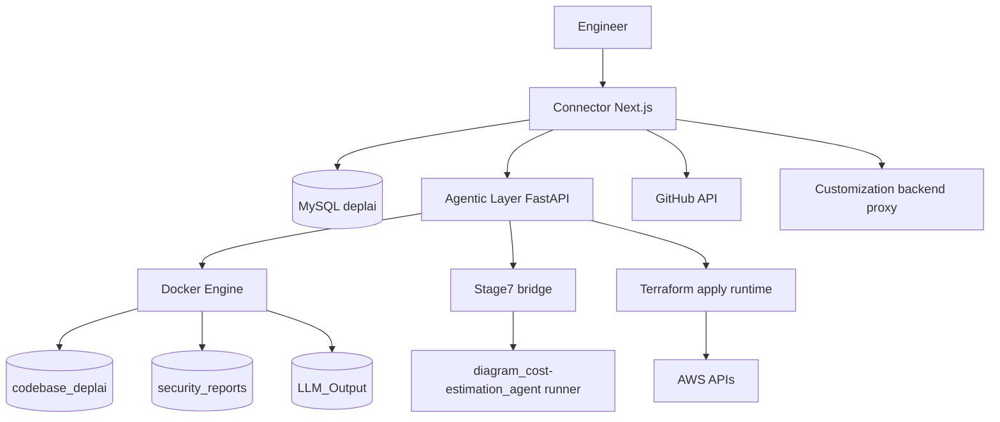
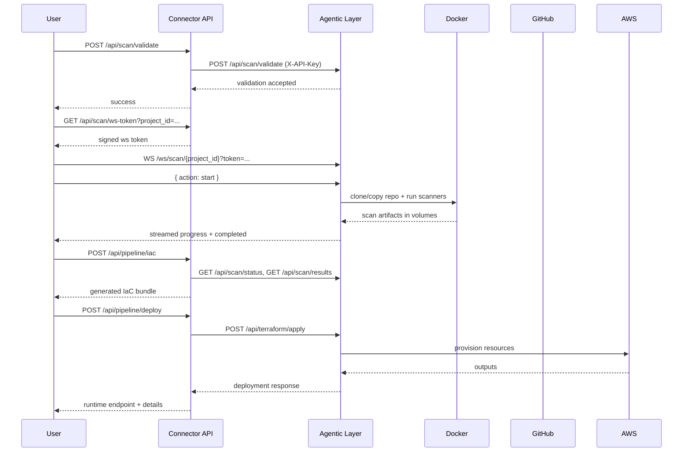
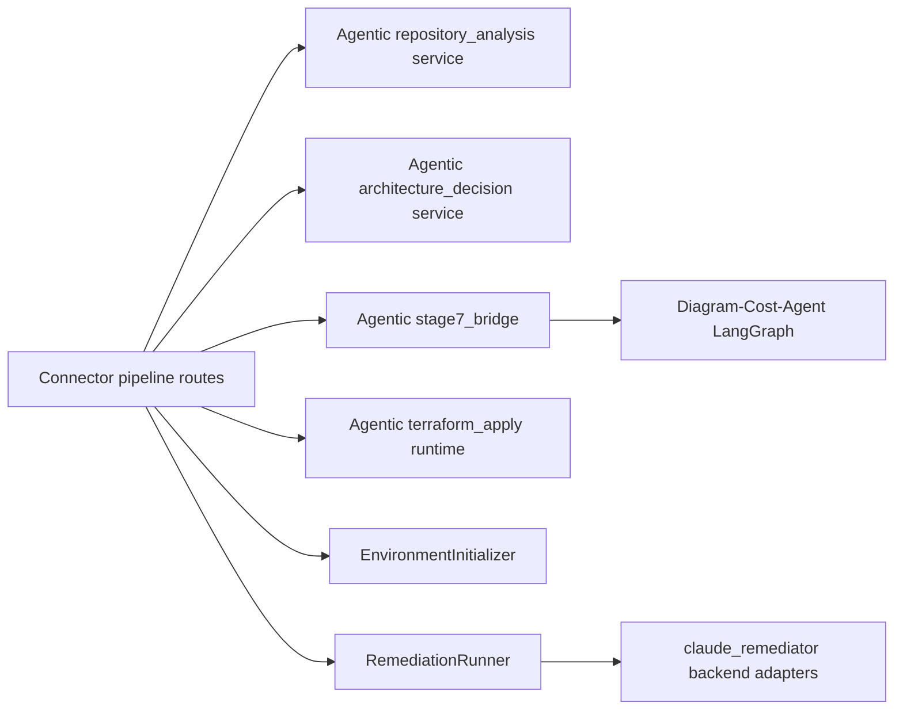
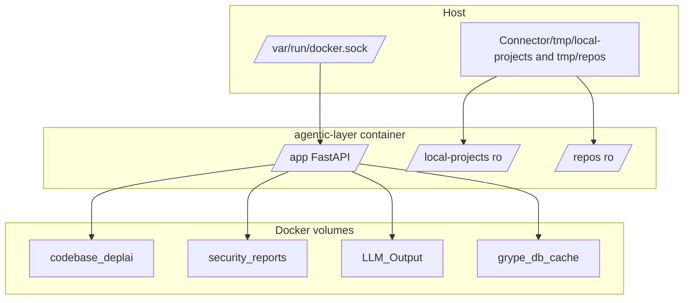
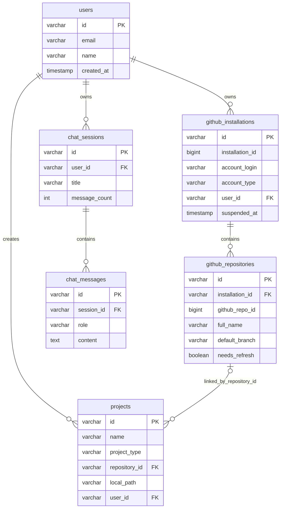

# DeplAI Architecture

## Table of Contents
- System Context
- Constraints and Non-goals
- Component Inventory
- End-to-End Data Flows
- Agent and Service Contracts
- Architecture Decision Records
- Non-functional Characteristics
- Security Model
- Diagrams

## System Context
DeplAI is an internal deployment orchestration platform with a clear control-plane and execution-plane split:
- Control plane: Connector (Next.js) authenticates users, enforces ownership checks, and exposes user-facing API routes.
- Execution plane: Agentic Layer (FastAPI) performs long-running scan/remediation/planning/deployment workflows.

The system is optimized for:
- Project-scoped isolation in Docker volumes.
- Ownership-validated operations before any backend execution.
- Progressive pipeline UX through websocket streaming and status polling.

## Constraints and Non-goals
### Hard constraints implemented in code
- Agentic Layer requires DEPLAI_SERVICE_KEY at startup; service refuses to boot without it.
- Websocket tokens are project-bound and short-lived (5 minutes), signed with WS_TOKEN_SECRET.
- Global cleanup is disabled unless ALLOW_GLOBAL_CLEANUP=true.
- Terraform runtime apply route enforces strict request size limits and stale bundle checks before execution.
- Multiple timeout guards exist across API-to-API calls and runtime operations.

### Explicit non-goals visible in implementation
- Multi-cloud runtime apply is not implemented: runtime_apply in Connector deploy route accepts AWS only.
- Agentic Layer does not persist scan contexts beyond in-memory process lifetime.
- Agentic health endpoint currently reports Docker and Neo4j checks only; deeper component checks are composed by Connector.

## Component Inventory
| Component | Type | Responsibility | Owns | Depends On |
|---|---|---|---|---|
| Connector | Next.js app + API routes | Authenticated UI and API facade for all workflow stages | Browser session state, API contracts, user settings endpoints | MySQL, Agentic Layer, GitHub API |
| Connector auth module | Server lib | Session auth and ownership checks for local/GitHub projects | Session cookie contract, ownership logic | iron-session, MySQL tables |
| Connector DB pool | Service | Shared MySQL execution pool | Connection pool (limit 10), SQL execution surface | MySQL server |
| Agentic Layer FastAPI app | Backend API | Scan/remediation/planning/terraform/aws endpoints + websocket buses | In-memory active workflow maps, endpoint contracts | Docker, boto3, optional Neo4j |
| EnvironmentInitializer | Runner | Scan orchestration with per-project volume scope | Scan pipeline state in websocket stream | Docker engine, Bearer, Syft, Grype |
| RemediationRunner | Runner | Root-cause dedup, remediation loops, approval-gated progression | Remediation cycle state | scan result parser, Claude model adapters, Docker |
| Repository analysis service | Analyzer | Derive repository_context document from codebase signals | context.json/context.md in runtime/repo-analyzer | filesystem, yaml/json parser |
| Architecture decision service | Planner | Generate review questions and deployment profile from repository context + answers | review_payload.json, deployment_profile.json, architecture_view.json | repository analysis, stage7 bridge |
| Stage7 bridge | Adapter | Invoke Stage7 subprocess or deterministic fallback payload | Approval payload object | Diagram-Cost-Agent runner path, cost estimator |
| Terraform apply runtime | Executor | Execute terraform init/plan/apply in ephemeral Docker volume and parse outputs | apply status cache, emitted pipeline events | hashicorp/terraform:1.9.0 image, AWS APIs |
| GitHub service (Connector) | Integration service | GitHub App installation tokens, clone/pull, webhook-related DB sync | Installation token cache | Octokit, MySQL |
| Diagram-Cost-Agent | LangGraph agent | Build diagram nodes/edges and cost/budget payload for Stage 7 | stage7_approval_payload.json output | langgraph, boto3/openai backends |
| Terraform Agent | LangGraph agent | Generate Terraform bundle from repository/deployment profile | output terraform bundle paths | langgraph, xAI/OpenAI-compatible model |

## End-to-End Data Flows
### Flow 1: Scan and remediation
1. User calls Connector POST /api/scan/validate with project_id, project_name, project_type, scan_type.
2. Connector validates session and ownership, enriches GitHub token for GitHub projects, forwards to Agentic POST /api/scan/validate.
3. Agentic stores scan context in memory and returns success.
4. Client obtains websocket token from Connector GET /api/scan/ws-token?project_id=... .
5. Client opens Agentic WS /ws/scan/{project_id} with token and sends action=start.
6. EnvironmentInitializer pipeline runs:
   - Validates Docker engine.
   - Ensures volumes exist.
   - Clears project-specific paths and stale reports.
   - Copies local project or clones GitHub repo to project-scoped folder in codebase_deplai volume.
   - Executes Bearer and/or Syft+Grype based on scan_type.
7. Agentic status endpoint returns running/found/not_found/not_initiated based on in-memory state and parsed volume reports.
8. Connector GET /api/scan/results returns parsed findings grouped by CWE and CVE metadata.
9. User starts remediation via Connector POST /api/remediate/start; Connector forwards validated payload to Agentic POST /api/remediate/validate.
10. Client opens WS /ws/remediate/{project_id}; remediation rounds proceed with continue_round, push_current, approve_push actions.

Failure behavior:
- Invalid/missing ws token closes socket with code 1008.
- Missing context on start emits websocket error status with explicit message.
- Backend connectivity failures are mapped to 502/504 by Connector routes.

### Flow 2: Planning to deployment
1. Connector POST /api/repository-analysis/run forwards to Agentic /api/repository-analysis/run.
2. Agentic resolves source path and writes runtime artifacts:
   - runtime/repo-analyzer/<workspace>/context.json
   - runtime/repo-analyzer/<workspace>/context.md
3. Connector POST /api/architecture/review/start requests review payload.
4. Agentic returns context_json + generated architecture questions and defaults.
5. Connector POST /api/architecture/review/complete sends operator answers.
6. Agentic returns:
   - answers_json
   - deployment_profile
   - architecture_view
   - approval_payload
7. Connector POST /api/pipeline/stage7 can also call Agentic /api/stage7/approval directly.
8. IaC generation path:
   - Connector POST /api/pipeline/iac builds AWS six-file bundle locally when provider=aws and architecture_json is valid.
   - Azure/GCP bundles are generated locally in Connector route.
9. Deployment path:
   - Runtime apply mode forwards to Agentic /api/terraform/apply.
   - GitOps mode creates/updates GitHub repo, pushes files, and writes repo workflow vars.
10. Runtime status/control paths call Agentic /api/terraform/apply/status and /api/terraform/apply/stop.
11. Runtime inventory and lifecycle call Agentic AWS endpoints:
   - /api/aws/runtime-details
   - /api/aws/instance-action
   - /api/aws/destroy-runtime

## Agent and Service Contracts
### EnvironmentInitializer contract
Input model:
- project_id: string (validated by regex in shared models)
- project_name: string
- project_type: local or github
- user_id: string
- scan_type: sast, sca, or all
- github_token/repository_url for GitHub projects

Output behavior:
- Streams message events with indexed ScanMessage payload.
- Emits final status completed or error over websocket.
- Persists scan artifacts to security_reports volume.

### RemediationRunner contract
Input model:
- project_id, project_name, project_type
- user_id
- optional cortex_context
- remediation_scope: major or all
- LLM override fields are normalized to Claude-compatible values

Interactive commands:
- continue_round
- push_current
- approve_push

Output behavior:
- Streams phase/info/success/error messages.
- Supports approval-gated transitions between remediation cycles.
- Reuses cached scan parse invalidation to force fresh post-remediation reads.

### Stage7 bridge contract
Input:
- infra_plan: dict
- budget_cap_usd: float
- pipeline_run_id: string
- environment: string

Output:
- approval payload containing diagram node/edge set, cost line_items, budget gate verdict, warnings, next stage metadata.

Fallback behavior:
- If expected runner path repo_root/diagram_cost-estimation_agent/run_stage7.py is missing, non-zero, empty, or invalid JSON, bridge returns deterministic fallback payload and warning text.

### Terraform apply runtime contract
Input model:
- project_id/project_name
- provider
- optional run_id/workspace references
- files[] where each item includes path/content/encoding
- aws_access_key_id/aws_secret_access_key/aws_region
- enforce_free_tier_ec2

Output model:
- success boolean
- outputs dict
- cloudfront_url string (if available)
- details object with execution metadata

Control endpoints:
- status endpoint returns idle/running/completed/error and cached result.
- stop endpoint toggles cancel_requested and attempts container kill/remove.

## Architecture Decision Records
### ADR-001: Session auth + backend API key dual boundary
Decision:
- Keep user identity and ownership checks in Connector, and service-to-service trust between Connector and Agentic via X-API-Key.

Context:
- Backend endpoints execute destructive and infrastructure-affecting operations and should not be directly internet-exposed.

Tradeoffs:
- Pros: simple boundary and explicit trust chain.
- Cons: requires env synchronization for DEPLAI_SERVICE_KEY and tighter deployment discipline.

### ADR-002: Websocket stream + REST polling coexistence
Decision:
- Use websocket streams for progress and REST status/results as durability fallback.

Context:
- Browser reload/navigation should not terminate long-running backend operations.

Tradeoffs:
- Pros: real-time UX plus recoverable state after disconnect.
- Cons: more endpoint surface and token choreography.

### ADR-003: Deterministic AWS architecture fallback in Connector
Decision:
- For AWS architecture route without explicit LLM override, generate deterministic architecture JSON directly in Connector.

Context:
- Reduces latency, cost, and dependency on model calls for common flow.

Tradeoffs:
- Pros: predictable outputs and no model dependency for baseline AWS path.
- Cons: less flexible than model-generated architecture for unusual requirements.

### ADR-004: Stage7 deterministic fallback payload
Decision:
- Return deterministic Stage7 payload if subprocess runner is unavailable or malformed.

Context:
- Stage 7 path mismatch can happen due folder naming differences between expected and implemented agent directories.

Tradeoffs:
- Pros: pipeline can continue with known-safe payload shape.
- Cons: cost/diagram fidelity is lower than live Stage7 graph output.

## Non-functional Characteristics
| Property | Implemented Target/Limit | Source in code |
|---|---|---|
| API upstream timeout (typical Connector -> Agentic) | 30s to 120s depending on route | AbortSignal.timeout in Connector routes |
| Runtime terraform apply timeout | 3600s request timeout in Connector deploy route | maxDuration and fetch timeout in deploy route |
| Docker operation timeout | 120s default | CONTAINER_OP_TIMEOUT in Agentic environment.py |
| Scanner timeout | 1200s to 1800s defaults | SCANNER_TIMEOUT_SECONDS usage in bearer/sbom modules |
| Grype timeout | 900s default | GRYPE_TIMEOUT_SECONDS in sbom.py |
| Websocket token TTL | 300 seconds | Connector scan ws-token route |
| MySQL connector pool size | 10 connections | Connector db.ts createPool config |
| Claude pipeline budget cap | 3.0 USD default | DEPLAI_CLAUDE_MAX_PIPELINE_COST_USD |
| Remediation model budget cap | 1.0 USD default | DEPLAI_MAX_REMEDIATION_COST_USD |

## Security Model
### Authentication and authorization
- Connector uses iron-session cookie auth.
- Every protected Connector API route calls requireAuth and returns 401 on missing session.
- Project-scoped routes call verifyProjectOwnership or repository ownership checks before acting.

### Service-to-service auth
- Connector injects X-API-Key header when DEPLAI_SERVICE_KEY is set.
- Agentic Layer enforces x_api_key header via dependency for most HTTP endpoints.

### Websocket authorization
- Connector mints short-lived HMAC tokens containing sub, project_id, exp.
- Agentic verifies signature, expiry, and project binding before accepting socket.
- Agentic also checks token sub against stored context user_id at workflow start.

### Secrets handling
- GitHub installation tokens are generated server-side and not persisted in database.
- Clone URLs embed token only transiently, then origin URL is reset to non-token form in cloned repo config.
- Session cookie uses httpOnly and secure in production.

### Network exposure
- Connector default dev port: 3000.
- Agentic Layer default port: 8000.
- Docker bridge network deplai is configured in compose.

## Diagrams
### 1) System Architecture Overview

### 2) Primary Data Flow

### 3) Agent Interaction Graph

### 4) Deployment Topology

### 5) Connector ER Diagram

