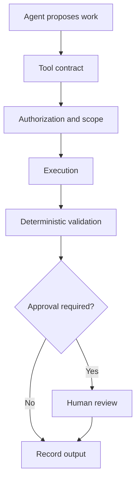

# Agents and workflows

DeplAI agents operate inside explicit workflows. They receive scoped context, produce structured or reviewable output, and cannot bypass the platform's identity, permission, validation, or approval layers.

## What agent means in DeplAI

The name covers several implementation styles:

- LangGraph state machines with named nodes and conditional transitions;
- model-assisted workers that return typed JSON to deterministic orchestration;
- deterministic analyzers and tool runners exposed as an agent-like service;
- a dashboard chat coordinator with a small allowlisted action registry.

The framework is secondary. The defining properties are bounded responsibility, inspectable state, known tools, validated output, and a clear handoff to the next system.

## Why multiple agents

| Reason | Practical effect |
| --- | --- |
| Bounded responsibility | A remediator does not also decide cloud authority. |
| Smaller context | Each model receives task-relevant evidence instead of the whole platform state. |
| Typed handoffs | Repository facts, deployment profiles, findings, and diffs can be validated between stages. |
| Targeted retries | A failed provider call or validator can be retried without replaying every stage. |
| Auditability | Stage, model, warnings, and resulting artifacts can be recorded separately. |
| Deterministic fallback | Supported paths can continue with explicit fallback provenance when a model is unavailable. Security remediation is an exception: it stays on the platform free-model route or reports that no eligible model is available. |

## Implemented workflow families

### Repository and deployment planning

Repository analysis produces structured context. Architecture review combines that evidence with user answers. The Infrastructure Advisor uses a graph to gather missing requirements, propose AWS tiers, estimate cost, evaluate budget fit, and finalize a decision. A separate diagram-and-cost graph packages the review payload.

### Terraform generation and execution

The active generator orchestrates context, profile refinement, structure planning, file generation, validation, and deterministic rescue renderers. Apply is a separate engine with state, locks, timeouts, plan confirmation, and event streaming.

### Security remediation

The current checkpoint-capable remediation graph uses master, planner, implementor, reviewer, and synthesizer roles. Its outer pipeline selects bounded findings and source context. Candidate diffs must survive local validation before review or GitHub handoff. Generation is constrained to DeplAI's platform OpenRouter route and an eligible free coding model; it does not use BYOK, paid models, direct provider adapters, or local fallbacks.

### Frontend customization

A conversation graph turns intent into a structured manifest. The implementation graph scans the frontend, plans, modifies, validates, and reports. Frontend-only mode omits backend modification stages. Snapshots, preview controls, and quality gates surround the graph.

### Dashboard chat

The dashboard assistant classifies intent, validates a narrow tool contract, optionally challenges a proposed action, maps results to UI actions, and reports failures. It is not a general shell.

## Tools and authority

Agents may use repository readers, scanner containers, model providers, patch generators, validators, Terraform helpers, cost estimators, and GitHub handoff services. Access to a tool does not imply direct authority over its target.

## State, checkpoints, and memory

Workflow state is the data for the current execution. A checkpoint is a recoverable snapshot of selected workflow state. Project records are durable facts and artifacts associated with the project. Model context is the temporary prompt payload sent for one task.

These are not interchangeable. Durable session logs do not necessarily contain complete graph state; a graph checkpoint may intentionally omit sensitive source excerpts; model context disappears after the request unless a subsystem explicitly records sanitized metadata.

The remediation path supports durable, redacted run status and optional MongoDB-backed LangGraph checkpoints, with an in-memory fallback. Other live execution contexts may remain process-local. Review the subsystem's recovery behavior before assuming resume is possible.

## Retries and fallbacks

Use retry for transient provider, network, or tool failures when inputs and project revision are unchanged. Restart a workflow when source, credentials, model access, policy, or architecture decisions changed. Deterministic fallback output is marked through warnings or provenance and should be reviewed for reduced scope.

Fallback never grants missing permission and never converts an unsupported cloud operation into a supported one. In particular, a remediation availability failure never becomes permission to use a BYOK key, a paid model, or another provider.

## Guardrails

- Connector resolves project ownership and organization permissions before upstream work.
- Browser input cannot select arbitrary server paths for customization.
- Live WebSocket tokens are short-lived and project-bound.
- Model output is parsed and validated before becoming an artifact.
- Remediation diffs are constrained and validated.
- DAST requires an authorized target grant.
- Terraform apply requires an explicit plan confirmation.
- Sensitive fields are redacted from ordinary events and responses.

## Limitations

Agents can make incorrect recommendations or incomplete changes. Model availability, quotas, and context limits can affect output. A workflow's successful status means its contract completed; it does not guarantee that the broader application is correct, secure, or production-ready.

Related: [Artifacts, state, and recovery](artifacts-and-state.md) | [Models and providers](model-providers.md) | [Security Agent](agents/security-agent.md) | [Deploy](agents/deploy.md)
