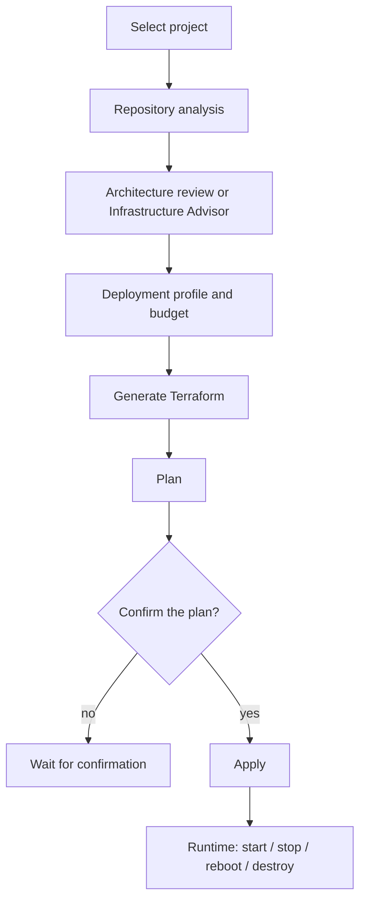

# Deploy

**Deploy** turns the selected project into Terraform for **AWS**, shows a plan, and applies only after you confirm. Azure and GCP may appear in planning/cost notes; this product does not apply to those clouds.

## Repository analysis

Deploy first inspects the project: languages, frameworks, data stores, build and start commands, and similar evidence. That inspection is what Terraform is generated from. DeplAI does not add a database because a prompt said “add RDS”; it adds one when the repo actually uses a database.

## Architecture review and Infrastructure Advisor

Two ways to get a **deployment profile**:

- A short guided review (compute, data, networking, runtime, DNS/TLS).
- **Infrastructure Advisor** — proposes baseline / recommended / resilient tiers against a monthly budget and can block a tier that exceeds the cap.

You choose the AWS region and whether free-tier-oriented sizing is in play.

## Terraform generation

Generation uses the profile plus what was found in the repo: curated modules, not an empty folder for a model to fill. If a database was detected but omitted from the profile, a small RDS setup can be added and wired with Terraform-resolved connection settings.

You get a file bundle, warnings, and a run id. Optional model refine can adjust the bundle; invalid output falls back to the deterministic generators. A fallback cannot invent an architecture those generators do not support.

## Plan, confirm, apply

1. DeplAI runs `terraform plan` with the generated files, region, and the AWS credentials you provided for the run.
2. Until you confirm, status stays waiting and **no apply runs**.
3. Confirming runs `terraform apply`. Progress streams in Deploy. Failures stay on the **session**; a failed apply is not marked successful.

Creating resources bills the AWS account, not DeplAI credits.

Terraform state for the run stays with that run. You do not hand-edit remote state inside DeplAI. Resources live in the AWS account you pointed at.

## After apply

- Runtime details for project-tagged resources.
- **Start** / **Stop** / **Restart** a target EC2 instance.
- **Destroy** DeplAI-tagged resources for that project (EC2, key pairs, eligible volumes, S3, CloudFront, security groups). Destroy is best-effort and cannot be undone from DeplAI.

## Failed apply

1. Read the session log and the Terraform error, not only the toast.
2. Check AWS for partial resources before applying the same bundle again.
3. Fix the profile or generated files, plan again, confirm again.

Related: [How it works](../how-it-works.md) · [Sessions](../sessions.md)
