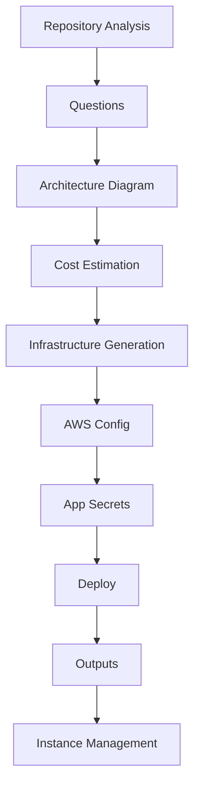
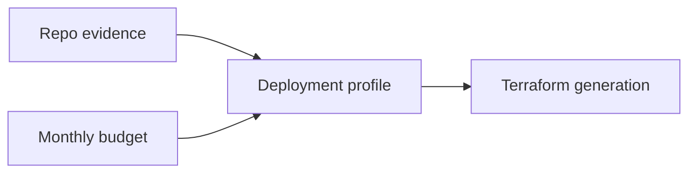
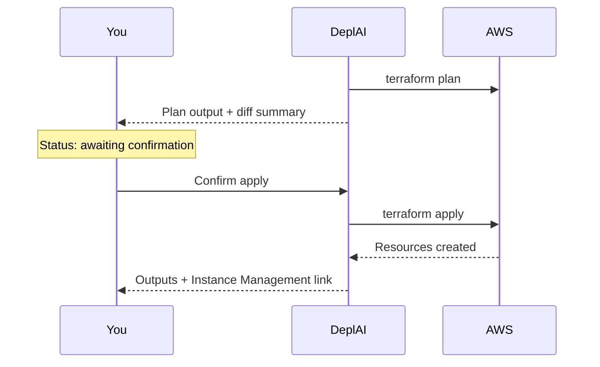

# Deploy

**Deploy** turns a connected project into **AWS Terraform**, shows a **plan**, and applies **only after you confirm**. Azure and GCP may appear in planning or cost notes; **apply** in this product is **AWS only**.

Open **Services → Deploy** (`/dashboard/deploy`) with a project selected. After a successful apply, operate resources in **Instance Management**.

DeplAI generates infrastructure from **repository evidence** and your chosen **deployment profile**—not from a blank template. **AWS bills your account** directly; Deploy does not consume DeplAI credits for cloud usage.

---

## Pipeline overview

| Stage | Purpose |
| --- | --- |
| **Repository Analysis** | Detect languages, frameworks, databases, build/start commands |
| **Questions** | Interactive Q&A to resolve ambiguities |
| **Architecture Diagram** | Visual topology (networking, compute, data, security) |
| **Cost Estimation** | Monthly estimate against your budget cap |
| **Infrastructure Generation** | Terraform bundle from profile + repo evidence |
| **AWS Config** | Region, credentials context, runtime inputs |
| **App Secrets** | Optional application secrets for the stack |
| **Deploy** | `terraform plan` → your confirmation → `terraform apply` |
| **Outputs** | URLs, credentials (masked), connection details |

The sidebar shows your current stage. You can revisit earlier stages before apply, but **confirming apply** is irreversible for provisioned resources until you **Destroy** from Instance Management.

---

## Repository analysis

Deploy inspects what is actually in the repository:

- Application language and framework
- Package managers and lockfiles
- Docker/container definitions
- Database usage and connection patterns
- Build and start commands
- Static vs dynamic hosting signals

Terraform is generated from this evidence combined with your **deployment profile**—not from a generic one-size-fits-all stack.

---

## Architecture review and Infrastructure Advisor

Two paths lead to a **deployment profile**:

### Guided architecture review

Walk through decisions for:

- **Compute** — EC2 App, ECS Fargate, or Static Site patterns
- **Data** — RDS, caches, object storage when detected
- **Networking** — VPC, subnets, load balancers, NAT
- **Runtime** — ports, health checks, environment variables
- **DNS / TLS** — domain and certificate strategy when applicable

### Infrastructure Advisor

Compare **baseline**, **recommended**, and **resilient** tiers against a **monthly budget**. Tiers above your cap are blocked or flagged so you cannot accidentally overspend in planning.

Choose an AWS **region** and whether **free-tier-oriented sizing** applies. **Cloud** (`/dashboard/cloud`) can supply org-approved account context when your organization has connected accounts.

---

## Terraform generation

Generation combines:

- Curated DeplAI modules (not an empty scaffold)
- Detected databases → RDS wiring with Terraform-resolved settings
- Profile choices (compute type, HA, scaling hints)

You receive:

- A **file bundle** with `main.tf`, variables, outputs, and modules
- **Warnings** when the repo has ambiguous or unsupported patterns
- A **run id** for session tracking

### Optional LLM refine

An optional **LLM refine** step can adjust the bundle using the same **Platform / BYOK / Auto** model picker as Security Agent. Invalid LLM output **falls back** to deterministic generators—apply never proceeds on broken Terraform.

---

## Plan, confirm, apply

1. DeplAI runs `terraform plan` with generated files, region, and AWS credentials for the run.
2. Until you **confirm**, status stays **waiting**—**no apply** occurs.
3. Confirming runs `terraform apply`. Progress streams in the Deploy UI.
4. **Failed applies** remain on the **Session**; they are **not** marked successful.

### Organization security gates

If your organization enables **Security policy**, Deploy may block confirmation until:

- Required **SAST**, **SCA**, **container scan**, or **DAST** evidence exists
- **Critical** or **high** findings are below configured thresholds
- **Exposed secrets** are not present in recent scans
- **Production approvals** count is satisfied

Fix findings in **Security Agent** or request an exception per your process. Details: [Organizations](../organizations.md).

---

## After apply

| Next step | Where |
| --- | --- |
| View runtime (EC2, IPs, DNS) | **Instance Management → Runtime** |
| Download Terraform / outputs | **Instance Management → IaC** |
| Start / stop / restart instance | **Instance Management** |
| Tear down environment | **Instance Management → Destroy** |
| Post-deploy dynamic test | **DAST** when verified target linked |

### Post-deploy security

When a **verified DAST target** exists, Deploy can run **Post-Deploy Security** after apply. Configure targets in [DAST](../dast.md) first.

---

## Instance Management relationship

Deploy **creates** infrastructure; **Instance Management** **operates** it until destroy.

| Action | Effect |
| --- | --- |
| **Start** | Start stopped EC2 |
| **Stop** | Stop running EC2 (compute billing pauses) |
| **Restart** | Reboot instance |
| **Destroy** | Best-effort deletion of DeplAI-tagged project resources (**irreversible**) |

Details: [Instance management](../instance-management.md).

---

## Integrations

| Integration | Role in Deploy |
| --- | --- |
| **GitHub** | Source repository for analysis |
| **AWS credentials** | Plan and apply in your account (org-approved or project-linked) |
| **Organizations** | Security policy gates, cloud account approval |
| **DAST** | Post-deploy security checks |
| **BYOK** | Optional LLM refine during Terraform generation |
| **Sessions** | History and logs for generate/apply runs |

---

## Troubleshooting

### Planning and generation

| Symptom | What to check |
| --- | --- |
| Analysis stuck or empty | Repo access via GitHub App; try re-selecting project |
| No Terraform files | Complete architecture review; check warnings |
| LLM refine produced errors | Retry or skip refine; deterministic fallback applies |
| Budget blocks all tiers | Raise cap or choose baseline tier |

### Plan and apply

| Symptom | What to check |
| --- | --- |
| **Awaiting plan confirmation** forever | Read plan output; confirm or cancel |
| Apply failed mid-run | **Sessions** log + AWS console for partial resources |
| IAM / credential errors | AWS key scope, region, org-approved account |
| Policy blocked apply | **Organizations → Security policy**; run required scans |

### After apply

| Symptom | What to check |
| --- | --- |
| Instance Management empty | Apply may have failed; check **Sessions** |
| URL not reachable | Security groups, health checks, DNS propagation |
| Destroy left orphans | Mixed AWS tagging; confirm in AWS console |

### Best practices

1. Always read the **full plan** before confirming—not only the summary toast.
2. Run **Security Agent Full Scan** before first production apply.
3. Use **staging** + **DAST Passive** before production **Active** scans.
4. Prefer **re-apply from Deploy** over manual console edits that drift from IaC.
5. **Stop** instances to save cost; **Destroy** only when decommissioning.

---

## Related documentation

- [Instance management](../instance-management.md)
- [Security Agent](security-agent.md)
- [DAST](../dast.md)
- [Organizations](../organizations.md)
- [Sessions](../sessions.md)
- [BYOK models](../byok-models.md)
