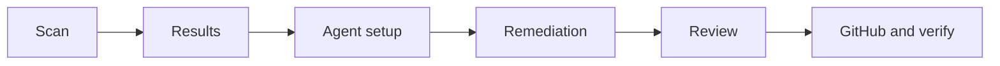

# Security Agent

Security Agent scans a project, shows findings, then (if you continue) proposes source fixes and can open a GitHub pull request. The stage rail is labeled **Pipeline**.

| Stage | What goes in | What you get |
| --- | --- | --- |
| **Scan** | The selected project and pipeline modules | Code, dependency, secret, infrastructure, API, and optional DAST findings |
| **Results** | The finished scan | Grouped findings you can select |
| **Agent setup** | Your plan and BYOK vault | The model that will propose fixes |
| **Remediation** | Selected findings + that model | Proposed diffs; you may run another round |
| **Review** | Proposed diffs | Your approval, or you stop |
| **GitHub & verify** | Approved diffs | Pull request, then a rescan |

## Scan

| Dialog label | What runs |
| --- | --- |
| **SAST** | Static code analysis. Grouped by CWE under code security. |
| **SCA** | Inventory + CVE match. Grouped by package/CVE under supply chain. |
| **Full Scan** | Both, plus secret scanning and infrastructure / Kubernetes / CI/CD / API checks when matching files exist. |

Dynamic testing (DAST) is configured inside Security Agent with an authorized public URL. It is not a generic “attack this target” control.

Severity is `critical`, `high`, `medium`, or `low`. Remediation’s **major** scope is critical and high.

Leave the tab open while the scan runs. When it completes, the pipeline moves to **Results**.

## Results

Code findings share a CWE (for example `CWE-79`). Supply-chain findings share a CVE and package. Counts are occurrences, not separate root causes.

Example from a real scan-report fixture:

| Category | Identifier | Detail |
| --- | --- | --- |
| SCA | `CVE-2021-23337` | `lodash` `4.17.20`, severity `high` |
| SAST | `CWE-79` | Cross-site scripting grouping |

An SCA fix usually bumps the package toward Grype’s fix version. A SAST fix is a source patch at the reported file and line.

## Agent setup

This is the model picker, not a second scan. The page heading is **Configure AI Agent**; the rail still says **Agent setup**.

| Access mode | What DeplAI uses |
| --- | --- |
| **Platform** | DeplAI-hosted keys. Free: **Best fast**, **Best cost**. Starter and above: full list including **Best coding**. |
| **BYOK** | A key from **BYOK → Credentials**. |
| **Auto** | Your key if one is saved; otherwise platform. |

**GitHub PAT (Optional)** is only for pushing the fix branch on this run and is not stored persistently.

## Remediation

1. Filters by the scope you chose (major vs all severities).
2. Groups the same root cause across files into one work item.
3. Asks the model for a patch, then checks that the diff stays in the project and addresses critical/high items.
4. Waits: run another round, or take this round’s fixes.

It does **not** write to GitHub on this stage.

## Review

You approve before anything is persisted. If you reject, you can still copy the diff and apply it yourself.

## GitHub & verify

For a GitHub project, DeplAI opens or updates a pull request with the approved files (GitHub App, not your login token), then re-runs Bearer, Syft, and Grype.

Local ZIP projects save diffs on the upload instead of opening a PR.

## Sessions

A Security Agent run appears under **Sessions**. Reopen the row for logs. The live scan does not resume from that page.

Related: [How it works](../how-it-works.md) · [BYOK](../security-and-data.md) · [Sessions](../sessions.md)
