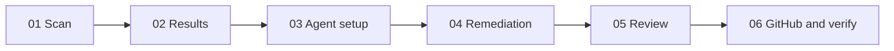
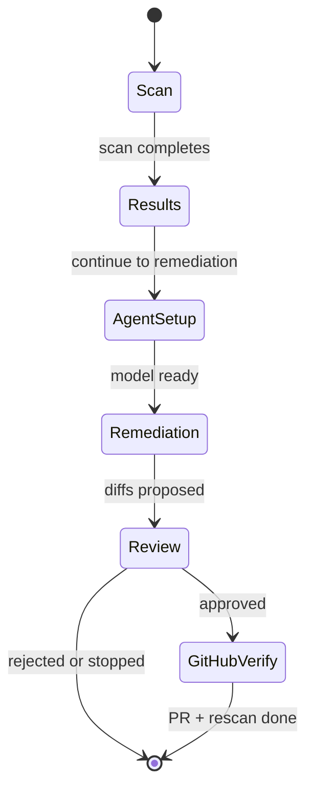
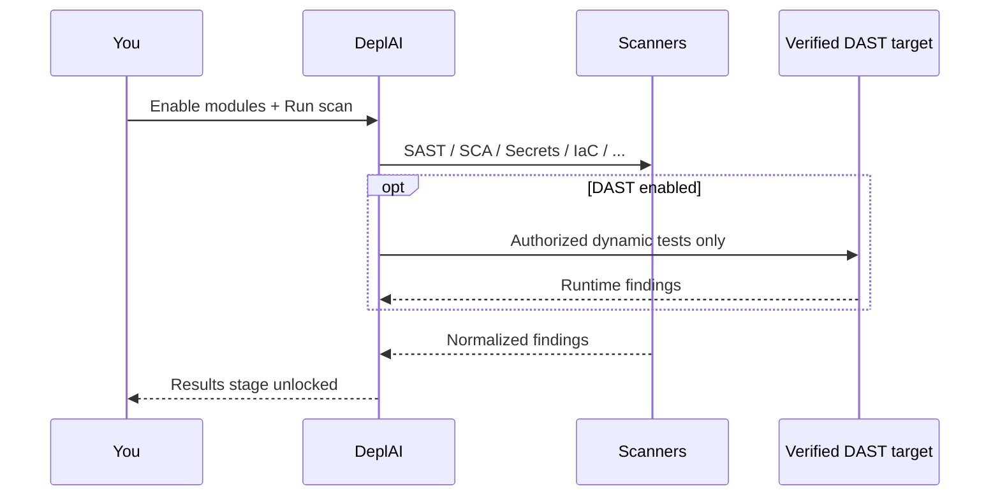

# Security Agent

**Security Agent** is DeplAI’s end-to-end application security workflow: scan a connected project, review grouped findings, configure an AI remediation agent, approve proposed fixes, and—when you use GitHub—open a pull request and verify the result with a follow-up scan.

Open it from **Services → Security Agent** after selecting a **project** in the workspace nav. The URL is `/dashboard/security-analysis/{projectId}`.

DeplAI is not a black-box auto-patcher. Every change to source code waits for your **Review** approval. Pull requests use the **GitHub App**, not your OAuth login token.

---

## At a glance

| Question | Answer |
| --- | --- |
| **What does it scan?** | Source (SAST), dependencies (SCA/SBOM), secrets, IaC, containers, Kubernetes, CI/CD, APIs, optional DAST, and cloud posture when available. |
| **What does it fix?** | Proposes source patches for selected findings; you approve before anything is written. |
| **What does it need?** | A GitHub project or ZIP upload, completed scan findings, and an available DeplAI platform remediation model. No BYOK key is used for remediation. |
| **What is the output?** | Grouped findings, proposed diffs, optional GitHub PR, PDF report, and a **Session** record. |

---

## Pipeline overview

The stage rail is labeled **Pipeline**. The header shows progress such as `01 / 06 · Scan`. Later stages stay **locked** until the previous stage completes.

| Stage | UI label | What goes in | What you get |
| --- | --- | --- | --- |
| **01** | **Scan** | Project + selected modules | Raw findings from all enabled scanners |
| **02** | **Results** | Finished scan | KPIs, grouped findings, export, remediation entry |
| **03** | **Agent setup** | Plan + model access | Configured AI agent (page title: **Configure AI Agent**) |
| **04** | **Remediation** | Selected findings + model | Proposed diffs only—nothing written to GitHub yet |
| **05** | **Review** | Proposed diffs | Approve, reject, or copy patches manually |
| **06** | **GitHub & verify** | Approved diffs | PR opened/updated + verification rescan |

---

## Stage 1 — Scan

### Quick-start presets

When you launch a scan, choose a preset or customize modules:

| Preset | What runs |
| --- | --- |
| **SAST** | Static application security testing—injection, XSS, and similar code patterns. |
| **SCA** | Dependency inventory and CVE matching (supply chain). |
| **Full Scan** (recommended) | SAST + SCA + secrets + infrastructure checks when matching files exist. DAST is configured separately. |

### Pipeline modules

On the **Scan** stage you can enable individual modules:

| Module | What it checks | When it is skipped |
| --- | --- | --- |
| **SAST** | Static code analysis | No scannable source for the configured languages |
| **SCA** | Known vulnerabilities in dependencies | No lockfiles or manifests detected |
| **SBOM** | Software bill of materials inventory | Same as SCA prerequisites |
| **Secrets** | Hard-coded credentials and tokens | No matching paths |
| **IaC** | Infrastructure-as-code misconfigurations | No Terraform/CloudFormation/etc. files |
| **Containers** | Container image and Dockerfile issues | No container artifacts |
| **Kubernetes** | Workload and manifest security | No Kubernetes manifests |
| **CI/CD** | Pipeline and workflow security | No CI config files |
| **API Security** | OpenAPI/Swagger and API surface risks | No API specs detected |
| **DAST** | Dynamic tests against a **verified** HTTP target | No verified target linked—see [DAST](../dast.md) |
| **Cloud** | Live AWS posture (Results tab) | Shown after deploy when cloud context exists |

Skipped modules display a reason in the scan output—they are not treated as failures.

### Severity model

Findings use four severities: **critical**, **high**, **medium**, and **low**.

Remediation’s default **major** scope includes **critical** and **high** only. You can widen scope when starting remediation.

### Running the scan

1. Select your **project** in the workspace nav.
2. Open **Security Agent**.
3. Choose presets or enable modules on **Scan**.
4. If using **DAST**, select a **verified target** (configured under **Services → DAST**).
5. Click **Run first scan** (or equivalent run control).
6. **Keep the browser tab open** while the scan runs. When it completes, the pipeline advances to **Results**.

---

## Stage 2 — Results

### Results surfaces

The **Results** stage organizes evidence for triage:

| Surface | Contents |
| --- | --- |
| **Overview** | Summary KPIs and entry to remediation |
| **Findings** | Primary vulnerability list with filters |
| **Secrets** | Exposed credentials and sensitive values |
| **Supply Chain** | Packages, CVEs, fix versions |
| **Infrastructure** | IaC and cloud configuration issues |
| **Cloud** | Post-deploy AWS posture when available |
| **APIs** | API specification findings |
| **Dynamic Testing** | DAST results from verified targets |
| **Risk** | Aggregated risk view |
| **Assets** | Discovered asset inventory |
| **Attack Paths** | Chained risk visualization |

### Saved views

Filter quickly with built-in views such as **All open**, **Critical**, **Secrets**, **Exploitable**, and **Infrastructure**.

### KPIs

The header shows counts for **Critical**, **High**, **Medium**, **Low**, and **Auto-fixable** findings.

### How findings are grouped

| Category | Grouped by | Example |
| --- | --- | --- |
| **Code security (SAST)** | CWE identifier | `CWE-79` (cross-site scripting) across files |
| **Supply chain (SCA)** | CVE + package | `CVE-2021-23337` on `lodash@4.17.20` |
| **DAST** | Runtime check + endpoint | Misconfiguration on a verified URL |

Counts reflect **occurrences**, not necessarily distinct root causes. Remediation groups the same root cause into one work item.

### Export

Use **Download PDF** on Results to export a security report for stakeholders or compliance records.

### Continue to remediation

When findings exist, an **AI Auto-Remediation Available** banner appears. Continue to **Agent setup** when you are ready to generate patches—not before you have reviewed what matters.

---

## Stage 3 — Agent setup

This stage configures **which model** proposes fixes. It does **not** run another scan.

The page heading is **Configure AI Agent**; the pipeline rail still shows **Agent setup**.

### Remediation model policy

Security remediation always uses DeplAI's **platform OpenRouter route** and an eligible **free coding model**. The model list is filtered for zero-priced, active coding variants that meet the workflow's context and output requirements.

| Allowed for remediation | Not used for remediation |
| --- | --- |
| An eligible free platform OpenRouter coding model | Your BYOK key or provider account |
| A replacement eligible free model when the saved choice is unavailable | Paid OpenRouter models or paid-model opt-in |
| DeplAI-managed request limits and temporary cooldown handling | Direct provider SDKs, local models, or worker-held provider keys |

This is intentionally narrower than the general **BYOK** and **Compare** features. Saving a provider key, changing profile routing, upgrading a plan, or selecting a paid model elsewhere does not change the remediation route.

### Choose a model

1. Select an available free remediation model from the list in **Configure AI Agent**.
2. Start remediation. DeplAI checks availability and request capacity before generation.
3. If the selected model became unavailable, DeplAI may use another eligible free remediation model. If none is available, wait and retry from the same stage.

The picker does not expose a BYOK, Auto, or paid-model remediation option. You do not need to provide an OpenRouter key.

### GitHub PAT (optional)

**GitHub PAT (Optional)** on this screen is used **only for pushing the fix branch on this run**. It is **not** stored in the BYOK vault and is **not** your persistent GitHub login.

Use it when the GitHub App alone cannot push to the branch you need. Pull request creation still flows through the App after **Review**.

### Organization context

If your project belongs to an **organization**, org **Security policy** may require certain scan types before downstream deploy steps. Security Agent itself does not bypass policy—you still approve every fix in **Review**.

---

## Stage 4 — Remediation

Remediation turns selected findings into **proposed diffs**. Nothing is written to GitHub on this stage.

### What happens

1. Filters findings by the scope you chose (**major** = critical + high by default).
2. Groups the same root cause across files into one work item.
3. Sends grouped items to the configured model.
4. Validates that diffs stay inside the project and address the requested severities.
5. Presents patches for your decision: **run another round** or proceed to **Review**.

### States you may see

| State | Meaning |
| --- | --- |
| **Awaiting your decision** | Patches ready—choose another round or continue |
| **Awaiting final approval** | Transitioning toward Review |
| **Remediation Failed** | Model error, access issue, or validation failure—see troubleshooting |

### Availability and usage

Remediation uses the platform's free-model route. It does not debit a BYOK provider account and does not send a remediation request with a key saved in **BYOK → Keys**. General platform/BYOK usage views may still show other product activity; they are not a way to select or fund a different remediation provider.

---

## Stage 5 — Review

**Review** is the human gate. DeplAI does not persist fixes or open pull requests until you approve.

### Your options

| Action | Result |
| --- | --- |
| **Approve** | Unlocks **GitHub & verify** (GitHub projects) or saves diffs (ZIP projects) |
| **Reject** | Stops the pipeline; you can copy diffs manually if useful |
| **Copy diff** | Apply patches outside DeplAI |

Inspect every hunk. Security Agent proposes fixes; **you** remain accountable for merged code.

---

## Stage 6 — GitHub & verify

For **GitHub-connected projects**:

1. DeplAI opens or updates a **pull request** with approved files.
2. The PR uses the **GitHub App** installation you granted—not your OAuth token.
3. DeplAI re-runs static and dependency scanners on the result.
4. When clean, you may **Continue to deployment** from the security flow.

For **ZIP uploads**:

- Approved diffs are saved on the upload record.
- No pull request is created—connect GitHub if you need PR-based workflow.

### Verification rescan

The follow-up scan confirms that critical/high items from the remediation scope are addressed. If issues remain, the UI tells you before you treat the run as complete.

---

## Integrations

### GitHub

| Step | Integration |
| --- | --- |
| Sign in | Identity only (email, profile, org membership) |
| Repository access | **GitHub App** install on **Account → Integrations** or **Your Profile → Integrations** |
| Pull requests | GitHub App after **Review** approval |
| Optional push | Single-run **GitHub PAT** on **Agent setup** |

### DAST

Dynamic testing never uses a free-form URL in Security Agent.

1. Add and **verify** targets under **Services → DAST** (`/dashboard/dast`).
2. On **Scan**, enable **DAST** and select the verified target.
3. Findings appear under **Dynamic Testing** in Results.

Full workflow: [DAST](../dast.md).

### Organizations

Organization **Security policy** can require SAST, SCA, container scan, or DAST evidence before production deploys. Security Agent supplies the scan evidence; **Deploy** enforces policy at apply time.

Details: [Organizations](../organizations.md).

### Deploy

After a clean **GitHub & verify** pass, use **Continue to deployment** to move into the Deploy pipeline with security context carried forward.

Details: [Deploy](deploy.md).

### BYOK and other model features

**BYOK → Keys**, Catalog, Compare, and profile routing are available for the product features that support them. They do **not** apply to Security Agent remediation, which remains on the platform free-model route.

Details: [BYOK models](../byok-models.md) · [Security and data](../security-and-data.md).

---

## Sessions

Every Security Agent run creates a **Session** under **Services → Sessions** (`/dashboard/sessions`).

| Field | Use |
| --- | --- |
| **Status** | queued, running, completed, failed, needs review |
| **Service** | Security Agent |
| **Logs** | Scanner output and pipeline events |

**Important:** Reopening a session shows the pipeline rail as **history**. It does **not** resume a live scan. Start a **new scan** from Security Agent to continue interactive work.

Copy the **session id** when contacting support.

Details: [Sessions](../sessions.md).

---

## Troubleshooting

### Scan stage

| Symptom | Likely cause | What to do |
| --- | --- | --- |
| **Scan Error** / **Scan Failed** | Scanner timeout, repo access, or tool failure | Read the scanner log; retry with fewer modules |
| **Project Access Required** | GitHub App not installed or repo not granted | **Integrations** → reinstall or add repository |
| **No scan results yet** | Scan not started or still running | Enable modules → **Run first scan**; keep tab open |
| Module shows **SKIPPED** | No matching files or module not selected | Expected—enable relevant modules or add files |
| **DAST skipped** | No verified target | Open **DAST** → verify host → select on Scan |
| Progress lost after closing tab | Live scan is tab-scoped | Check **Sessions** for logs; start new scan |

### Results stage

| Symptom | Likely cause | What to do |
| --- | --- | --- |
| **Results Unavailable** | Transient load or incomplete scan | **Retry Loading Results** |
| Empty findings but scan “completed” | Clean repo or modules skipped | Confirm modules; check skipped reasons |
| **Unauthorized target** (DAST) | Verification expired or wrong hostname | Re-verify in **DAST** |

### Agent setup & remediation

| Symptom | Likely cause | What to do |
| --- | --- | --- |
| Cannot start remediation | No findings or scan incomplete | Return to **Results** |
| **No remediation model available** | No eligible free platform model is currently available or the selected model is stale | Refresh the model list or retry later; do not add a BYOK key for this workflow |
| **Remediation Failed** | Platform availability, malformed model output, or patch validation failure | Retry from the stage; select another eligible free model when offered; review the failure detail |
| BYOK call failed | Invalid or revoked key | **BYOK → Keys** → validate; check provider quota |

### Review & GitHub

| Symptom | Likely cause | What to do |
| --- | --- | --- |
| PR not created | ZIP project or approval missing | Use GitHub project; complete **Review** |
| Push failed | Branch protection or missing PAT | Add optional **GitHub PAT** on Agent setup |
| Verify still shows critical/high | Fix incomplete or new issues | Review PR diff; run another remediation round |

### Organization policy

| Symptom | Likely cause | What to do |
| --- | --- | --- |
| Deploy blocked after security pass | Org policy requires additional scan types | Run required modules; check **Organizations → Security policy** |
| DAST required but missing | Policy on, no verified target | Complete [DAST](../dast.md) setup |

---

## Best practices

1. **Run Full Scan** on first connect, then tune modules per repo type.
2. **Verify staging URLs** in DAST before enabling dynamic tests on production.
3. **Use major scope** for first remediation pass; widen only when needed.
4. **Always Review** diffs—treat AI patches like any other contributor’s PR.
5. Select an eligible free remediation model and retry later if the platform reports temporary availability limits; BYOK and paid-model settings cannot bypass this policy.
6. **Export PDF** from Results for audit trails before remediation changes the picture.
7. **Link GitHub** early if you want PR-based workflow; ZIP is fine for evaluation only.

---

## Related documentation

- [DAST](../dast.md) — verify targets and scan profiles
- [Deploy](deploy.md) — infrastructure after security sign-off
- [Organizations](../organizations.md) — roles and security policy
- [BYOK models](../byok-models.md) — model catalog and recommendations
- [Sessions](../sessions.md) — run history and logs
- [Security and data](../security-and-data.md) — GitHub scopes and key handling
- [Glossary and FAQ](../glossary.md) — quick answers
