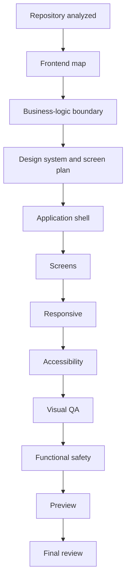

# UI/UX customizer

**UI/UX customizer** restyles a project’s **frontend only**: design tokens, screens, responsive layout, accessibility, and visual assets. It does **not** rewrite APIs, authentication, database logic, or other backend business rules.

If a proposed patch touches a protected business-logic file, **Functional safety** fails and the change is rejected.

Open **Services → UI/UX customizer** with a project selected.

---

## What it can change

| Capability | Examples |
| --- | --- |
| **Targeted screen** | Specific routes and components you select |
| **Design system upgrade** | Colors, typography, spacing, component tokens |
| **Responsive upgrade** | Tablet and mobile layouts |
| **Accessibility upgrade** | Focus order, contrast, skip links, ARIA labels |
| **Assets** | Logo, favicon, OG image, and other uploaded brand assets |
| **Full UI/UX transformation** | Broad visual pass—still constrained by the business-logic boundary |

---

## What it cannot change

| Protected area | Why |
| --- | --- |
| API routes and handlers | Backend contract stability |
| Auth and session logic | Security boundary |
| Database models and migrations | Data integrity |
| Server-side business rules | **Functional safety** gate |

Acceptance criteria include **“No business logic changes.”** Patches to protected paths fail validation.

---

## Pipeline

### Studio tabs

| Tab | Purpose |
| --- | --- |
| **Preview** | Live preview (desktop / tablet / mobile) |
| **Changes** | File-level change list |
| **Quality** | Automated quality checks |
| **Manifest** | Planned scope for the run |
| **Assets** | Uploaded images and brand files |
| **Settings** | Run configuration |

### Bottom tabs

| Tab | Purpose |
| --- | --- |
| **Diff** | Unified diff view |
| **Logs** | Agent and build output |
| **Checkpoints** | Saved intermediate states |
| **GitHub** | Open PR when project is on GitHub |
| **Review** | Final approval before persist |

---

## Model and BYOK

Starting a run requires a ready model—the same **Platform / BYOK / Auto** picker as Security Agent.

| Mode | Behavior |
| --- | --- |
| **Platform** | DeplAI-hosted keys; consumes credits |
| **BYOK** | Your key from **BYOK → Keys** |
| **Auto** | BYOK if saved; otherwise platform |

If blocked: *“Choose a platform model or a saved BYOK credential first.”*

For visual-heavy transformations, **Best multimodal** or flagship models with vision support work well. See [BYOK models](../byok-models.md).

---

## Step-by-step workflow

1. Select the **project** and open **UI/UX customizer**.
2. Describe the design goal in natural language.
3. Pick a **mode** (targeted screen, design system, responsive, accessibility, or full transformation).
4. Confirm the **manifest** (files and screens in scope).
5. Inspect **Changes** / **Diff**, **Preview**, and **Quality** tabs.
6. Complete **Final review**—last gate before changes persist.
7. On GitHub projects, open a **pull request** from the **GitHub** tab.

The run appears under **Sessions** for history and logs.

---

## GitHub integration

| Step | Integration |
| --- | --- |
| Source | GitHub App–connected repository |
| Output | Pull request after **Final review** (GitHub projects only) |
| ZIP projects | Local diff export only—no PR |

Same GitHub App model as Security Agent: login is identity only; writes use the App after your approval.

---

## Troubleshooting

| Symptom | What to do |
| --- | --- |
| **Functional safety** failed | Patch hit backend/business-logic file—narrow scope or pick frontend-only screens |
| Preview blank | Check build logs; confirm frontend framework detected |
| Model picker blocked | Add BYOK key or use allowed platform alias on your plan |
| No GitHub PR option | Connect GitHub project—not available for ZIP uploads |
| Quality checks failed | Review contrast/accessibility report; adjust manifest |

---

## Best practices

1. Start with **Targeted screen** before a **Full UI/UX transformation**.
2. Run **Security Agent** separately—UI/UX customizer does not replace security scanning.
3. Use **Preview** on all three breakpoints before **Final review**.
4. Keep brand assets in **Assets** rather than hot-linking external URLs.

---

## Related documentation

- [Security Agent](security-agent.md) — security scanning (separate workflow)
- [BYOK models](../byok-models.md)
- [Sessions](../sessions.md)
- [Security and data](../security-and-data.md)
