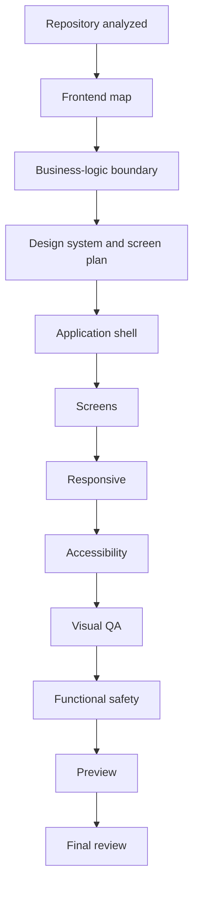

# UI/UX customizer

**UI/UX customizer** restyles a project’s frontend: tokens, screens, responsive behavior, accessibility. It does not rewrite APIs, auth, or other backend business logic. If a patch hits a protected business-logic file, **Functional safety** fails.

Studio tabs include Preview, Changes, Quality, Manifest, Assets, Settings. Bottom tabs include Diff, Logs, Checkpoints, GitHub, Review.

## What it can touch

- Frontend routes and selected screens (**Targeted screen**).
- Design tokens, type, spacing, components (**Design system upgrade**).
- Tablet/mobile layout (**Responsive upgrade**).
- Focus order, contrast, skip links, labels (**Accessibility upgrade**).
- Uploaded assets (logo, favicon, OG image, and the other **Assets** options).
- A full visual pass (**Full UI/UX transformation**), still constrained by the boundary.

## What it cannot touch

Frontend only. Backend files are skipped. Acceptance includes “No business logic changes.” A patch to a protected path fails **Functional safety**.

## Model / BYOK

Start requires a ready model in the same picker as Security Agent: platform, BYOK, or auto. If the picker is blocked: “Choose a platform model or a saved BYOK credential first.”

## Flow

1. Select the project and open **UI/UX customizer**.
2. Describe the goal; pick a mode and optional screens.
3. Confirm the manifest.
4. Inspect **Changes** / **Diff**, **Preview** (desktop / tablet / mobile), **Quality**.
5. **Final review** is last. You can open a GitHub PR from the GitHub tab when the project is a GitHub repo.

The run also appears under **Sessions**.

Related: [BYOK](../security-and-data.md) · [Sessions](../sessions.md)
