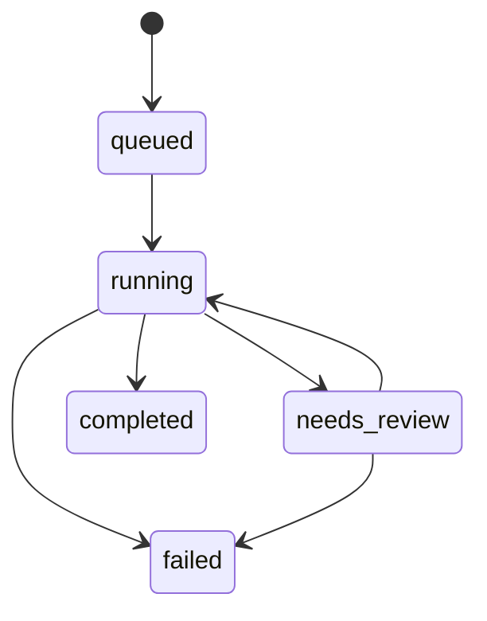

# Artifacts, state, and recovery

DeplAI workflows produce artifacts with different owners, lifetimes, and recovery guarantees. Knowing which evidence is durable prevents a live status indicator from being mistaken for the system of record.

## Artifact map

| Artifact | Producer | Typical storage or handoff | Review concern |
| --- | --- | --- | --- |
| Repository context | Repository analyzer | Project/run result | Staleness and conflicting evidence |
| Scan reports and findings | Security engine | Report volumes and API result | Scanner coverage, skipped modules, false positives |
| SBOM | Syft-based scan path | Security report artifact | Package completeness and source revision |
| Remediation diff | Remediation workflow | Run state, review UI, optional GitHub PR | Correctness, scope, tests, unsafe behavior changes |
| Customization manifest | Conversation workflow | Customization run | Whether intent and frontend boundary are accurate |
| Snapshot and preview | Customization service | Repository snapshot and preview process | Preview is not production validation |
| Architecture decision | Review and advisor | Project deployment state | User assumptions, budget, reliability, data needs |
| Diagram and estimate | Planning workflow | Stage review payload | Estimate freshness and excluded usage costs |
| Terraform bundle and plan | Terraform engine | Run workspace and optional remote artifact/state | Provider scope, destructive changes, drift |
| Deployment record | Deployment executor | MySQL plus execution service state | Artifact identity, environment, health result |
| Session and logs | Connector | MySQL | Summary may outlive live worker context |

## Four kinds of state

### Durable product state

Users, organizations, memberships, projects, GitHub installations, sessions, AI configuration and usage, billing records, DAST assets, and deployment execution records live in MySQL. These records are tenant-scoped and survive normal process restarts.

### Workspace artifacts

Repository clones, uploaded projects, scan reports, customization snapshots, and Terraform files live in configured workspaces or volumes. Their durability depends on deployment configuration, volume retention, and cleanup policy.

### Live execution state

WebSocket subscribers, some orchestration dictionaries, preview processes, and in-flight tasks can be process-local. If the worker restarts, the durable session may remain while live execution is gone.

### External state

GitHub pull requests, AWS resources, Terraform remote state, Secrets Manager entries, and provider usage belong to external systems. DeplAI records references and results, but those systems remain authoritative.

## Session lifecycle

The common session statuses are deliberately small. Service-specific stages provide more detail. Deployment execution also uses statuses such as `CREATED`, `COMPLETED`, `FAILED`, `CANCELLED`, and `ROLLED_BACK` in its own record.

## Retry, resume, restart, and rollback

| Action | Use when | Important condition |
| --- | --- | --- |
| Retry | A transient stage failed | Inputs and source revision are still valid |
| Resume | The subsystem exposes resumable state for an interrupted execution | A compatible durable checkpoint or execution record exists |
| Restart | Context, source, credentials, or decisions changed | Create a fresh run and preserve old evidence for comparison |
| Rollback | A deployment artifact must return to a recorded prior state | The executor has a valid rollback target; infrastructure rollback is not automatic application recovery |

Never use rollback as a substitute for understanding database migrations or external side effects. A previous application image cannot necessarily reverse data changes.

## Recovery checklist

1. Record the project, session, run, and deployment identifiers.
2. Read the last durable event or log, not only the browser toast.
3. Determine whether the worker is still running.
4. Verify that source revision, credentials, and environment are unchanged.
5. Check whether an artifact was partially created externally.
6. Retry only the supported failed action; otherwise start a new run.
7. For deployment, inspect Terraform state, bootstrap status, and HTTP health independently.

## Production retention

Back up MySQL and any persistent artifact volumes required by your recovery objective. Configure and protect Terraform remote state. Retain GitHub and AWS audit evidence according to your organization policy. Do not assume session logs are a complete compliance archive.

Related: [Sessions](sessions.md) | [Deployment](agents/deploy.md) | [Production operations](production-operations.md) | [Troubleshooting](troubleshooting.md)
