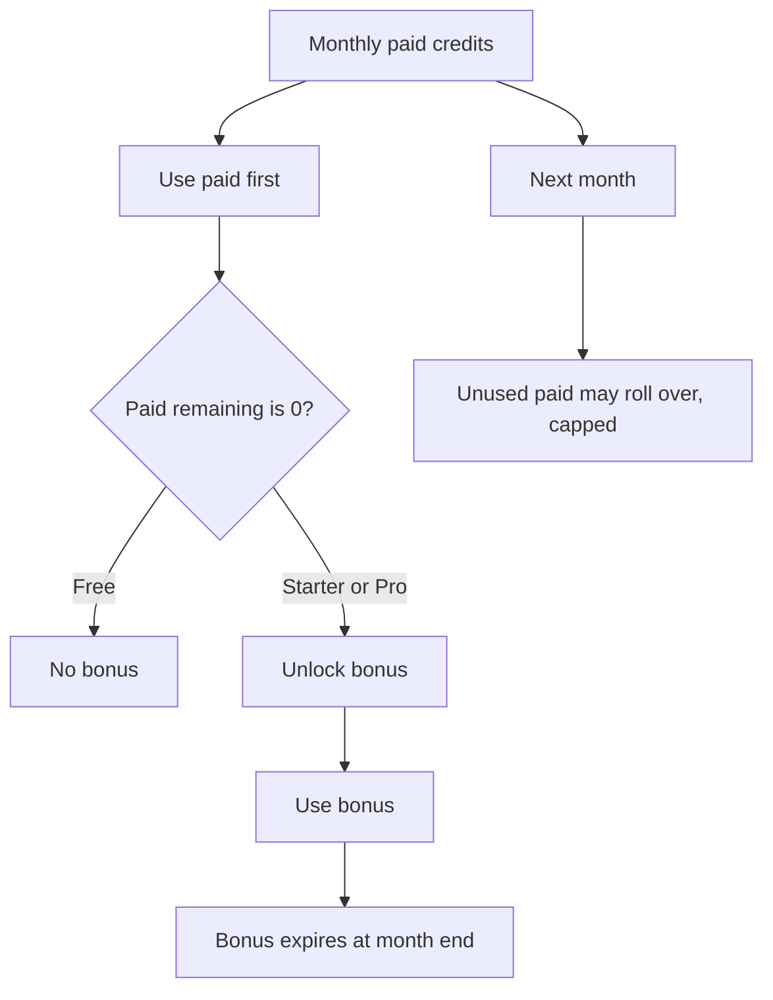

# Plans, credits, and billing

DeplAI charges a **subscription** (Free / Starter / Pro / Enterprise) and grants **credits** each calendar month (UTC). Buy extra packs on **Credits**. Invoices go through Razorpay with GST (India).

Open **Subscription**, **Credits**, and **Invoices** under **Account**. Balance is also on **Your Profile**.

Prices below match the public pricing page. If **Subscription** shows different numbers from the database, what you see in the app wins.

## Plans

| Plan | List price | Paid credits each cycle | Bonus after paid hits zero | Unused paid rollover |
| --- | --- | --- | --- | --- |
| **Free** | $0 | 5 | None | None |
| **Starter** | $20 / month or $192 / year | 20 | Up to 25% extra | 1 extra month |
| **Pro** | $50 / month or $480 / year | 50 | Up to 40% extra | 2 extra months |
| **Enterprise** | Contract (`founders@deplai.tech`) | From contract | From contract | From contract |

Checkout is Razorpay (INR + GST). Enterprise is not self-serve.

What the pricing page lists as included:

| Plan | Features listed |
| --- | --- |
| Free | 1 project, repo analysis, basic security scan, community support |
| Starter | Unlimited projects, security scanning, Terraform generation, email support |
| Pro | Everything in Starter, frontend customizations, vulnerability fixes, traffic-based cost estimation, priority support |
| Enterprise | Everything in Pro, custom contracts, pooled credits, dedicated support, SLA |

**Platform models:** Free may use **Best fast** and **Best cost**. Starter and above unlock the rest (**Best coding**, **Best reasoning**, …). A BYOK key is not limited by that list — [Security and data](security-and-data.md).

## What a credit is

The **Credits** balance is paid remaining plus bonus remaining.

1. **Paid credits** — granted with the plan, plus packs and promo codes. Used first.
2. **Bonus credits** — Starter and Pro only. Unlock after paid remaining hits zero. Size is 25% (Starter) or 40% (Pro) of the paid grant, rounded down. They expire at the end of the UTC calendar month they unlocked. They never roll over.

| Plan | Paid grant | Bonus if unlocked | Max paid that can roll |
| --- | --- | --- | --- |
| Free | 5 | 0 | 0 |
| Starter | 20 | 5 | 20 |
| Pro | 50 | 20 | 100 |

If both buckets are empty, checkout and platform-model picks that need credits will fail until you upgrade, buy a pack, or wait for the next cycle.

**Rollover** applies to unused **paid** credits only (none on Free, one month on Starter, two on Pro). Yearly billing still refreshes credits monthly.

## Top-ups, promos, auto top-up

- **Credits** packs: 10 for $12, 25 for $32, 50 for $70. Paid plans only.
- **Your Profile** promo code adds paid credits.
- **Your Profile** auto top-up: “Automatically add credits when your balance falls below $N.” Amounts are in USD.

Packs add paid credits. They do not unlock bonus by themselves.

## Credits vs BYOK usage

| You see it on | What it is |
| --- | --- |
| **Subscription**, **Credits**, **Your Profile**, model picker | Plan allotment and packs. Controls which **platform** models you may pick. |
| **BYOK → Usage** and **Costs** | Tokens and estimated USD for LLM calls, split platform vs BYOK. |

Those are different meters. AWS charges from **Deploy** are on your AWS invoice.

## Invoices

**Invoices** lists plan and credit-pack invoices. Download the PDF from the row.

## What you set vs what is fixed

| You set | Fixed |
| --- | --- |
| Plan (Free / Starter / Pro) | Paid credits are used before bonus |
| Credit packs (paid plans) | Bonus expires at UTC month end |
| BYOK keys and access mode | Free platform models: **Best fast**, **Best cost** |
| Auto top-up and promo codes | Razorpay + GST invoices |
| Enterprise via `founders@deplai.tech` | — |

Related: [BYOK](security-and-data.md) · [Core concepts](concepts.md)
