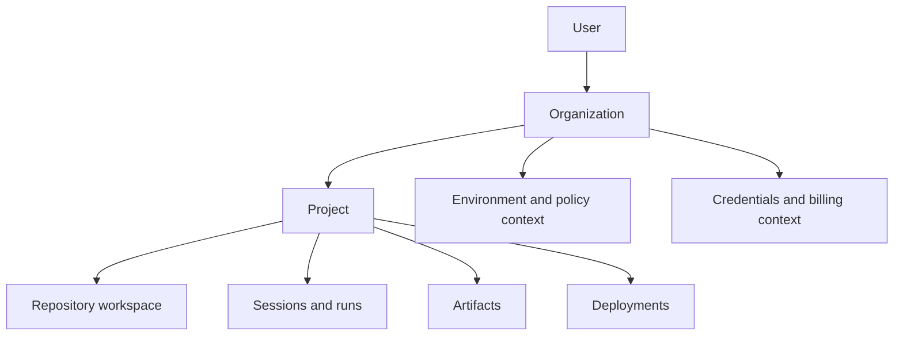

# Core concepts

DeplAI organizes work around a small set of durable nouns and bounded execution concepts. Understanding their relationships makes every service easier to reason about.

## Resource hierarchy

## User

A user authenticates with GitHub and receives an encrypted browser session. Identity and profile data are distinct from GitHub App repository access. A personal API token can authenticate supported server routes, but it carries the same user identity and does not bypass ownership checks.

## Organization

An organization is a tenant and governance boundary for members, teams, roles, projects, policies, integrations, usage, billing context, and audit activity. Every user receives a personal organization. Shared organization management is currently Beta.

## Project

A project is the stable scope for application work. It points to either a GitHub repository or an uploaded ZIP workspace and records ownership, organization, source metadata, and links to workflow output. A project is not a deployment and does not imply that its source has been changed.

## Repository workspace

The repository workspace is the server-side source snapshot used by analysis and workflows. GitHub repositories are synchronized through an installation; uploaded ZIPs are extracted into a user-scoped path. Service routes resolve the path after authorization instead of accepting an arbitrary browser path.

## Environment

An environment represents deployment context such as development, staging, or production. Environment permissions exist in the organization model, while individual deployment flows also carry an environment name and environment-specific configuration. Environment isolation is therefore a governance and execution concern, not merely a label.

## Session and run

A session is the durable dashboard record for a Security Agent, UI/UX customizer, Deploy, or reserved Code Reviewer workflow. Its status is `queued`, `running`, `needs_review`, `completed`, or `failed`. A run is the service-specific execution behind that record and may have finer-grained stages, live events, and artifacts.

Do not assume that reopening a session resumes an in-memory live workflow. Sessions preserve summary and logs; live process state depends on the subsystem. See [Artifacts, state, and recovery](artifacts-and-state.md).

## Workflow

A workflow is an ordered set of deterministic and optionally model-assisted steps. Some workflows are LangGraph state machines; others are explicit TypeScript or Python orchestration. The shared property is a bounded contract, not the framework used to implement it.

## Agent

In DeplAI, an agent is a specialized reasoning role inside a workflow or the user-facing service built around that workflow. An agent does not automatically receive shell, repository, GitHub, or cloud authority. Tools and mutations remain mediated by normal application services and approval gates.

## Artifact

An artifact is a reviewable output: a repository context document, scan report, SBOM, finding set, diff, snapshot, ZIP, architecture decision, diagram, cost estimate, Terraform bundle, plan, log stream, runtime output, or pull request reference. Artifacts have different durability; the guide calls this out per subsystem.

## Finding and remediation

A finding is normalized security evidence from a scanner, including severity and source-specific metadata such as CWE, CVE, package, file, or endpoint. Remediation groups selected findings, gathers limited source context, generates candidate changes, validates them, and waits for review before persistence or GitHub handoff.

For Security Agent remediation, generation always uses an eligible free model through DeplAI's platform OpenRouter route. It does not use BYOK keys, paid models, direct provider calls, or local-model fallbacks. If the selected free model is unavailable, the workflow may select another eligible free model or ask you to retry.

Severity describes security impact. Remediation priority also considers patchability, location, grouping, and selected scope.

## Deployment and infrastructure

Infrastructure is the cloud resource configuration represented by an architecture decision and Terraform. A deployment is an execution record that promotes a particular application artifact into an environment. Planning, Terraform generation, plan, apply, bootstrap, and health verification are separate states; infrastructure creation alone is not application readiness.

## Provider, model, and credential

A provider is an adapter for a model API. A model is a catalog entry with lifecycle, capabilities, context, pricing, and aliases. A credential supplies authority to call a provider. Access mode chooses platform-managed credentials, BYOK, or automatic selection.

## Policy and approval

Permissions decide whether a member may request an action. Policy decides whether the project or deployment meets organization rules. Approval is an explicit decision for a particular high-impact transition. These are separate layers: permission to deploy does not mean every plan automatically satisfies policy.

Related: [Repository intelligence](repository-intelligence.md) | [Agents and workflows](agents-and-workflows.md) | [Organizations](organizations.md) | [Models and providers](model-providers.md)
