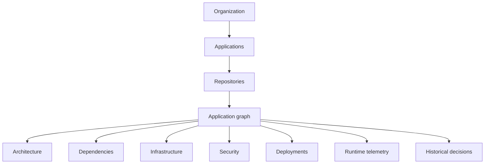
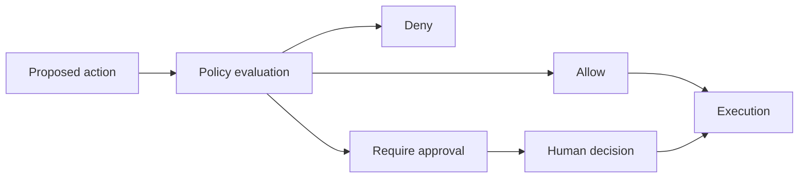

# Future direction

This page describes design direction, not currently available product behavior. Current capabilities are documented elsewhere in the guide and should not be inferred from this roadmap.

## From workflows to an engineering control plane

Today DeplAI coordinates project-scoped customization, security, remediation, deployment planning, AWS execution, model access, and governance. The long-term direction is a control plane that can understand how source, architecture, infrastructure, security, runtime, cost, ownership, and history relate over time.



This graph does not exist today as a complete durable product model.

## Application graph

A future Application Graph could connect repositories to services, dependencies, APIs, databases, containers, infrastructure, findings, deployments, owners, and runtime signals. Agents could retrieve a relevant subgraph instead of rediscovering the whole repository for each task.

Potential uses include impact analysis, vulnerability reachability, deployment planning, dependency intelligence, architecture visualization, root-cause analysis, and context selection. Building this safely requires tenant isolation, freshness tracking, source attribution, deletion semantics, and confidence on every edge.

## Autonomy levels

| Level | Description | Position |
| --- | --- | --- |
| 0 | Manual tools with no model assistance | Common engineering baseline |
| 1 | AI recommendations | Available in bounded parts of DeplAI |
| 2 | AI generates plans or changes | Available with review in several workflows |
| 3 | AI executes bounded workflows under policy and approval | Partially implemented; not continuous autonomy |
| 4 | Continuous operation inside defined policies | Future direction |
| 5 | Highly autonomous software-engineering infrastructure | Research horizon, not a current commitment |

DeplAI's philosophy is bounded autonomy. More autonomy should require stronger evidence, policy, observability, reversibility, and human override.

## Continuous security

The current flow scans, normalizes, remediates selected findings, and can verify through another scan. Future work could connect detection to reachability, exploitability, runtime evidence, regression prevention, policy, and compliance evidence.

```text
Detect -> Understand -> Prioritize -> Remediate -> Validate -> Prevent recurrence
```

Continuous security would need event freshness, suppression/exception governance, reproducible scanner versions, safe patch rollout, and protection from noisy automated loops.

## Self-healing deployments

A future recovery loop could observe a deployment, detect a regression, diagnose it, propose a recovery plan, evaluate policy, roll back or repair, and validate health. Today DeplAI exposes bounded deployment lifecycle, health, runtime actions, retry, and rollback-related endpoints; it is not a continuous self-healing system.

Database migrations, external side effects, and multi-service compatibility make automatic rollback especially risky. Human approval must remain available for high-impact recovery.

## Infrastructure and FinOps intelligence

Future planning could combine repository requirements with runtime telemetry to improve compute sizing, availability, networking, security, scaling, and cost. FinOps could add deployment cost attribution, anomalous spend detection, right-sizing, idle-resource detection, model-token attribution, and environment budgets.

Current estimates are planning aids and current model usage records are not a complete cross-cloud cost system.

## AI cost intelligence

The current gateway already models capability, latency, cost, credentials, health, policy, and routing. Future routing could use measured task outcomes and reliability to select among fast, reasoning, coding, long-context, and specialized models while respecting data and spend policy.

Outcome-based routing requires careful evaluation. Lowest token price is not lowest task cost if retries or poor artifacts increase engineering work.

## Organization knowledge

A future organization memory could preserve architecture decisions, coding conventions, infrastructure standards, security policies, deployment history, previous failures, remediation outcomes, and approved patterns. Access must follow organization, project, and environment boundaries, with retention and deletion controls.

This should not become an unrestricted prompt transcript. Knowledge needs provenance, scope, freshness, and explicit rules for sensitive source and incidents.

## Policy engine

A broader policy engine could evaluate every proposed high-impact action:



Potential policies include production approval, vulnerability gates, protected files, spend ceilings, environment restrictions, and model/data rules. Current organization permissions and security policy are foundations, not this complete future engine.

## Software digital twin

A software digital twin would combine source, architecture, infrastructure, dependencies, security, deployments, runtime, cost, ownership, and history into a continuously updated model. This is a long-term concept. It is only useful if it stays explainable, source-linked, and demonstrably fresher than the decisions it informs.

## Event-driven agents

Future workflows could respond to events such as a pull request, dependency update, critical CVE, deployment failure, latency regression, cost anomaly, certificate expiry, or infrastructure drift. Policies would decide whether to observe, recommend, open a review, or execute a bounded action.

The current platform is primarily user-triggered. Event-driven operation would require deduplication, backpressure, replay, loop prevention, ownership routing, and incident-safe defaults.

## Directional end state

The direction is an intelligent control plane for building, securing, deploying, operating, and improving software. AI supplies reasoning and adaptation. Deterministic systems supply identity, permissions, policy, execution boundaries, validation, persistence, recovery, and evidence.

Related current behavior: [Introduction](introduction.md) | [Agents and workflows](agents-and-workflows.md) | [Production operations](production-operations.md)
