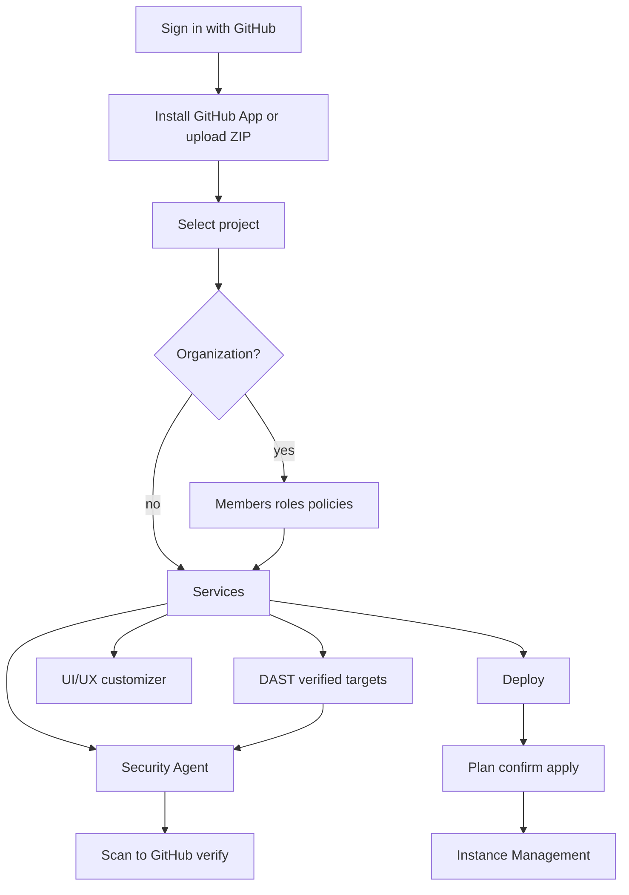

# How it works

From a connected repository (or ZIP) to a pull request or an AWS apply, work stays on one **project** in the workspace. Organizations add members, roles, and deployment gates on top.

## Connect a repo

1. Sign in with GitHub—identity only (email, profile, org membership).
2. Install the GitHub App and grant repositories DeplAI may access.
3. Or upload a ZIP from the project picker.

Signing in does **not** authorize pushes to your default branch. Pull requests use the GitHub App after you approve **Review**.

## Security path (repo → PR)

| Stage | What you do |
| --- | --- |
| **Scan** | SAST, SCA, or Full Scan; optional DAST when a verified target exists. |
| **Results** | Review grouped findings; export or select for remediation. |
| **Agent setup** | Pick platform or BYOK model; optional GitHub PAT for one push. |
| **Remediation** | Agent proposes diffs; nothing persisted yet. |
| **Review** | Approve or reject before GitHub write. |
| **GitHub & verify** | Pull request opened or updated; rescan. |

Details: [Security Agent](agents/security-agent.md) · [DAST](dast.md).

## Deploy path (repo → AWS)

Deploy analyzes the repo, helps choose a profile and budget, generates Terraform, shows a **plan**, and applies **only after you confirm**. Organization **Security policy** may block apply until scan evidence passes.

After apply, **Instance Management** covers start/stop/restart/destroy for tagged resources.

Details: [Deploy](agents/deploy.md) · [Instance management](instance-management.md).

## UI/UX path (frontend only)

UI/UX customizer restyles the frontend without changing APIs or backend business logic. Review diffs and open a PR on GitHub projects.

Details: [UI/UX customizer](agents/uiux-customizer.md).

## Account and governance

| Area | Path | Role |
| --- | --- | --- |
| **Billing** | `/dashboard/billing` | Plans + credit packs; Razorpay INR checkout. |
| **Organizations** | `/dashboard/organization` | Teams, roles, policies, audit. |
| **BYOK** | `/dashboard/ai` | Keys, catalog, compare, usage. |
| **Profile / Usage / Invoices** | `/profile`, `/dashboard/usage`, `/dashboard/invoices` | Identity, activity wrap, PDFs. |

## After a run finishes

Open **Sessions** for Security Agent, UI/UX, and Deploy history and logs. Live work resumes from the service page, not from Sessions alone.

Related: [Getting started](getting-started.md) · [Organizations](organizations.md) · [Billing](billing.md) · [Sessions](sessions.md)
