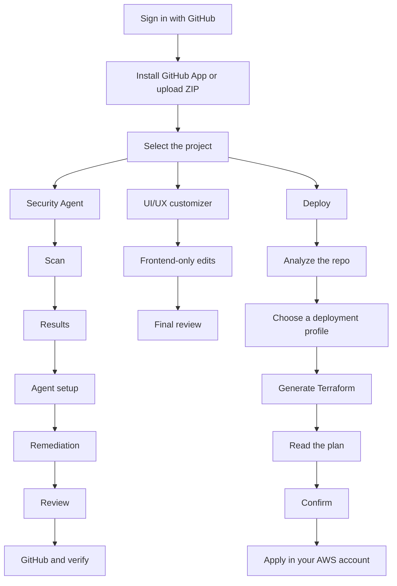

# How it works

From a connected repository (or ZIP) to a pull request or an AWS apply, work stays on one **project** in the workspace.

## Connect a repo

1. Sign in with GitHub. DeplAI asks only for identity: email, profile, and org membership so you can pick the right account.
2. Install the GitHub App and grant the repositories you want DeplAI to see. Anything you do not grant will not appear.
3. Or upload a ZIP from the project picker if the code is not in GitHub yet.

Signing in does **not** let DeplAI push to your default branch. Pull requests use the GitHub App, and only after you approve **Review**.

## Security path (repo → PR)

| Stage | What you do |
| --- | --- |
| **Scan** | Run SAST, SCA, or Full Scan. |
| **Results** | Read grouped findings and choose what to fix. |
| **Agent setup** | Pick a platform or BYOK model. Optional GitHub PAT for that push only. |
| **Remediation** | The agent proposes diffs. Nothing is pushed yet. |
| **Review** | You approve before anything is persisted to GitHub. |
| **GitHub & verify** | DeplAI opens or updates a pull request, then re-scans. |

Details: [Security Agent](agents/security-agent.md).

## Deploy path (repo → AWS)

Deploy reads the repository, helps you choose a profile and budget, generates Terraform, shows a plan, and applies **only after you confirm**. Azure and GCP may appear in cost notes; apply in this product is AWS.

Details: [Deploy](agents/deploy.md).

## UI/UX path (frontend only)

UI/UX customizer restyles the frontend. It does not change APIs or other business logic. You review diffs and can open a PR when the project is on GitHub.

Details: [UI/UX customizer](agents/uiux-customizer.md).

## After a run finishes

Open **Sessions** to find past Security Agent, UI/UX, and Deploy runs and their logs.

Related: [Getting started](getting-started.md) · [Sessions](sessions.md) · [Security and data](security-and-data.md) · [Billing](billing.md)
