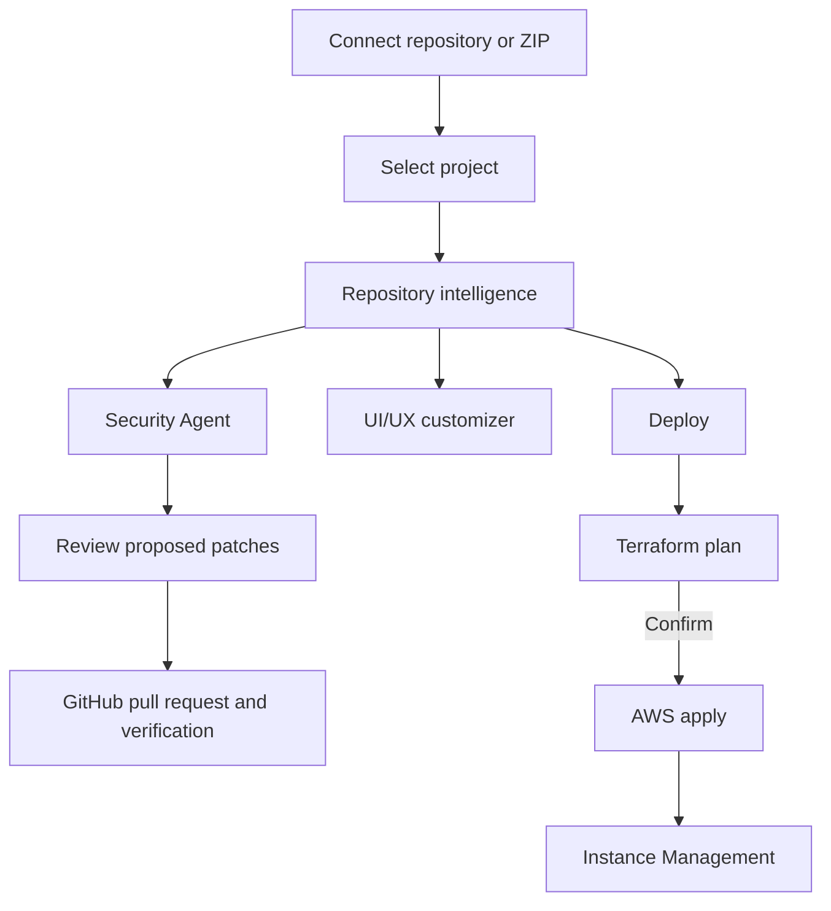

# Repository to production

DeplAI keeps security, frontend change, infrastructure planning, and deployment work attached to one selected **project**. A project is either a repository granted through the GitHub App or a ZIP you upload. You choose which workflows to run; completing one does not automatically start another.

## The delivery path

| Step | What DeplAI does | Your decision point |
| --- | --- | --- |
| Connect | Uses the GitHub App grant or processes a ZIP in the selected project. | Choose the repository or archive. |
| Understand | Detects source, manifests, build signals, and deployment evidence relevant to the requested workflow. | Review questions or warnings where a workflow asks for them. |
| Secure | Runs selected scanners and presents normalized findings. | Select scope and review findings. |
| Remediate | Produces validated proposed patches for selected findings. | Review every patch before persistence or PR creation. |
| Customize | Plans and applies frontend-only visual changes. | Review scope, quality evidence, and final diff. |
| Deploy | Produces Terraform and an AWS plan. | Confirm the plan before an AWS apply. |
| Operate | Shows DeplAI-managed runtime resources after apply. | Start, stop, restart, or destroy deliberately. |

## Security path

1. Open **Services → Security Agent** after selecting a project.
2. Run SAST, SCA, Full Scan, and any relevant optional modules. DAST requires a verified target first.
3. Review the grouped findings in **Results** and choose findings for remediation.
4. In **Configure AI Agent**, select an eligible free remediation model.
5. Inspect the proposed diffs in **Review**. Nothing is written to source at this point.
6. Approve only the changes you accept. GitHub projects can open or update a pull request and run verification; ZIP projects retain downloadable/local patch output instead.

Security remediation always uses DeplAI's platform OpenRouter route with an eligible free coding model. BYOK credentials, paid models, direct provider calls, and local model fallbacks are not remediation options. If no eligible model is available, refresh the list or retry later rather than changing provider settings.

## Frontend customization path

**UI/UX customizer** is a separate frontend-only workflow. It maps the frontend, limits planned files and screens, evaluates visual and functional-safety checks, and presents a reviewable result. It must not be treated as a replacement for Security Agent or as authority to alter APIs, authentication, databases, or other business logic.

The customizer has its own model-access behavior. Its Platform/BYOK/Auto choices do not change the Security Agent remediation policy.

## Deploy path

1. Open **Services → Deploy** for the selected project.
2. Review repository evidence, answer architecture questions, and choose a deployment profile and budget.
3. Inspect the generated Terraform bundle and the `terraform plan` output.
4. Confirm the plan explicitly to permit `terraform apply` in your AWS account.
5. Use **Instance Management** for DeplAI-managed resources after a successful apply.

Deploy is AWS apply only. Planning notes may mention other clouds, but they are not an authorization to create resources there. Organization policy can require security evidence or approvals before confirmation.

## State, history, and boundaries

A live workflow is not the same as a saved **Session**. Sessions preserve status, logs, and available artifacts for later review; returning to a Session does not resume an interrupted interactive scan or apply. Return to the originating service to begin another run.

GitHub remains the source-code system of record. Your AWS account remains the infrastructure system of record. DeplAI coordinates bounded workflows and approval gates; it does not auto-merge source changes or apply cloud changes without the required user decision.

## Choose the right next page

| Goal | Guide |
| --- | --- |
| Run and remediate a scan | [Security Agent](agents/security-agent.md) |
| Authorize a runtime security target | [DAST](dast.md) |
| Restyle a frontend safely | [UI/UX customizer](agents/uiux-customizer.md) |
| Plan and apply AWS infrastructure | [Deploy](agents/deploy.md) |
| Understand artifacts and resume limits | [Artifacts, state, and recovery](artifacts-and-state.md) |
| Review platform and provider access | [Models and providers](model-providers.md) |
