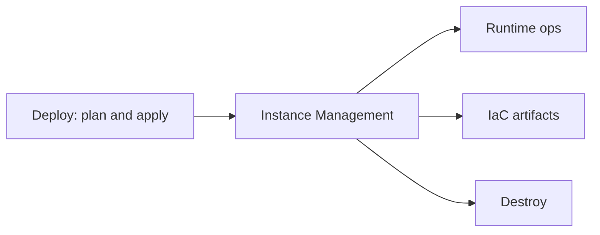

# Instance management

**Instance Management** (`/dashboard/instances`) is the operations console for AWS resources DeplAI created or tagged for your **project** after **Deploy** apply. Use it for runtime visibility, power management, infrastructure artifacts, and controlled teardown—not for editing Terraform by hand.

Open it from **Services → Instance Management** with a project selected, or from Deploy after a successful apply.

## What you see

| View | Purpose |
| --- | --- |
| **Runtime** | Live EC2 instance state, IPs, DNS, VPC/subnet, region, and resource counts (EC2, S3, CloudFront). |
| **IaC** | Generated Terraform bundle, outputs, and apply history tied to the deployment session. |

Runtime data is read from your AWS account using credentials supplied for that project or org-approved cloud account. If lookup fails, the UI shows **not found** or **unavailable** with an error hint—check IAM scope and region.

## Lifecycle actions

After apply, you can operate **project-tagged** resources without returning to the full Deploy wizard:

| Action | Effect |
| --- | --- |
| **Start** | Start a stopped EC2 instance. |
| **Stop** | Stop a running instance (compute billing pauses; storage may still accrue). |
| **Restart** | Reboot the instance. |
| **Destroy** | Best-effort deletion of DeplAI-tagged resources for this project. |

**Destroy** is irreversible from DeplAI. It targets tagged EC2, key pairs, eligible volumes, S3 buckets, CloudFront distributions, and security groups created for the project. Always confirm in AWS if partial resources remain after a failed destroy.

## Managed environments

Instance Management lists **managed environments** per project: deployment id, region, instance id, public URL when available, and last known stage. This is the map of what is running—not a second source of truth for billing (AWS invoices remain authoritative).

## Downloads and access

- Export Terraform files or logs from the **IaC** tab when you need an offline copy for audit or drift review.
- Sensitive outputs (passwords, keys) are masked in the UI; retrieve secrets through your approved secret store or AWS console per your policy.

## Who can do what

| Role (organization) | Typical access |
| --- | --- |
| **DevOps / Admin** | Full runtime and destroy actions on approved cloud accounts. |
| **Developer** | Start/stop/restart on non-production; production may require **Security** approval if org policy is enabled. |
| **Viewer** | Read runtime and IaC metadata only. |

Personal workspaces without an organization follow your account permissions on the linked AWS credentials.

## Relationship to Deploy

Deploy creates infrastructure; Instance Management maintains it until you destroy or remove the project. Failed applies stay in **Sessions**—fix the bundle in Deploy, do not assume Instance Management will repair a half-provisioned stack.

## Best practices

1. **Tag discipline** — Only destroy from DeplAI when you intend to remove DeplAI-managed resources; mixed tagging in AWS can leave orphans.
2. **Stop vs destroy** — Stop instances to save compute during quiet periods; destroy when decommissioning the environment.
3. **Re-apply** — Material changes to architecture belong in Deploy (new plan → confirm → apply), not manual console edits that drift from generated IaC.

Related: [Deploy](agents/deploy.md) · [Sessions](sessions.md) · [Security and data](security-and-data.md)
