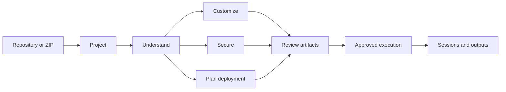

# Introduction to DeplAI

DeplAI is an application engineering and delivery workspace. It connects a GitHub repository or ZIP project to bounded workflows for repository analysis, frontend customization, security testing, remediation, infrastructure planning, and AWS deployment.

## What DeplAI is

DeplAI coordinates several kinds of software rather than presenting one unrestricted AI agent:

- deterministic repository inspection and validation;
- specialized model-assisted workflows with explicit inputs and outputs;
- security scanners executed in isolated containers;
- typed infrastructure decisions and Terraform artifacts;
- ownership, permission, and policy checks in the control plane;
- human review before source or infrastructure changes;
- durable records for sessions, findings, billing, and organization state.

The useful mental model is a control plane for engineering work. A project anchors source, evidence, decisions, generated artifacts, and execution history. Each service consumes only the context it needs and returns a reviewable result.

The paths are composable, not mandatory. You can run a security scan without customizing the frontend, or plan infrastructure without running remediation.

## Why it exists

Moving a repository toward production usually crosses source hosting, security scanners, design work, cloud architecture, Terraform, model providers, and operational diagnostics. Each tool sees a different fragment of the application. DeplAI keeps those fragments attached to one project and carries verified evidence between workflows.

This reduces repeated discovery, but it does not remove engineering judgment. Scanner findings can be false positives. Generated patches require review. Infrastructure estimates are planning inputs. A successful infrastructure apply does not prove that an application is healthy.

## Current capabilities

| Area | Current behavior |
| --- | --- |
| Source | GitHub App repositories and local ZIP uploads become project-scoped workspaces. |
| Understanding | Repository analysis identifies languages, manifests, frameworks, data stores, runtime signals, CI, health checks, and infrastructure hints. |
| Customization | A frontend-focused workflow creates a structured customization manifest, proposed changes, validation results, snapshots, and previews. |
| Security | SAST, SCA, SBOM, secrets, IaC, container, Kubernetes, CI/CD, API, optional DAST, and optional AWS cloud checks run when their prerequisites exist. |
| Remediation | Findings are grouped and prioritized before candidate diffs are generated, validated, reviewed, and optionally sent to GitHub. |
| Deployment | Repository evidence and user decisions produce architecture options, estimates, Terraform, plan output, and an approval-gated AWS apply path. |
| Models | Platform and BYOK credentials use a shared provider catalog, routing policies, health, normalized errors, and usage records. |
| Governance | Organizations provide members, roles, teams, projects, security policies, billing context, and audit events. Organizations are currently Beta. |

## Control and responsibility

DeplAI deliberately separates proposals from authority. Models can explain, classify, and generate candidates. Deterministic code checks identity, ownership, permissions, paths, payloads, policy, and required confirmation. Cloud credentials remain the customer's responsibility, and AWS charges remain on the customer's account.

High-impact operations have explicit boundaries:

- remediation output is reviewed before persistence or pull-request handoff;
- DAST requires a verified, authorized target;
- Terraform apply requires confirmed plan intent;
- runtime start, stop, reboot, and destroy are separate actions;
- secrets are masked in ordinary UI and logs.

## What DeplAI does not guarantee

- It does not guarantee detection of every vulnerability.
- It does not prove application correctness after a deployment.
- It does not auto-merge remediation into a protected branch.
- It does not turn an unsupported infrastructure shape into a supported apply path.
- It does not replace organization-specific security, compliance, disaster-recovery, or cost review.
- It does not currently provide an autonomous, continuously operating software lifecycle.

## Where to start

Read [DeplAI in 5 minutes](getting-started.md) for the shortest working path. Read [How DeplAI fits together](platform-architecture.md) for service and trust boundaries, or [Core concepts](concepts.md) for the vocabulary used throughout the guide.

Related: [Why DeplAI](why-deplai.md) | [Repository to production](how-it-works.md) | [Design principles](design-principles.md)
