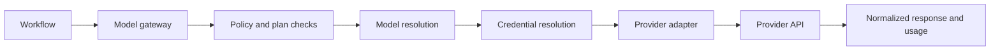

# Models and providers

The DeplAI model gateway separates workflows from provider-specific authentication and response formats. A workflow requests a model or logical capability; the gateway resolves policy, credentials, routing, health, and usage before calling an adapter.

## Architecture

This boundary lets remediation, customization, deployment assistance, and Compare use common request and normalized-error infrastructure. It does not guarantee that every model supports every task. Security remediation deliberately applies a stricter route than the general gateway.

## Implemented providers

The current adapter registry contains OpenAI, Anthropic, MiniMax, xAI/Grok, Google Gemini, Kimi/Moonshot, GLM/Z.AI, Groq, and OpenRouter. Provider definitions record capabilities such as streaming, tools, vision, audio, embeddings, batch, reasoning, and structured output.

Provider presence in the catalog means the adapter and credential path exist. Actual availability still depends on enabled configuration, a valid credential, provider region and account access, model lifecycle, quota, and organization policy.

For current model identifiers and task recommendations, use [BYOK model catalog](byok-models.md). Catalog entries can change faster than conceptual workflow documentation.

## Access modes

| Mode | Credential source | Billing boundary | Failure behavior |
| --- | --- | --- | --- |
| **Platform** | DeplAI-managed provider credential | DeplAI plan and credit rules | Fails or falls back only within configured platform policy |
| **BYOK** | Your stored provider credential | Your provider account | Fails if the key is invalid, disallowed, out of quota, or lacks model access |
| **Auto** | Valid BYOK first, then platform where permitted | Depends on resolved source | Honors organization and fallback policy |

An ephemeral credential can be supplied by specific workflows where implemented, but it is not the same as a stored BYOK record.

### Security remediation exception

Security Agent remediation always uses DeplAI's platform OpenRouter route and an eligible zero-priced coding model. It does not resolve `auto`, BYOK, a paid model, a direct provider credential, or a local-model fallback. The normal provider catalog and access-mode tables describe other eligible product surfaces; they do not override this remediation policy.

## Credentials

BYOK credentials are validated through the provider adapter, encrypted at rest, and represented by a masked value in normal responses. Credential states include pending, valid, invalid, expired, revoked, rate-limited, quota-exceeded, and error.

Use a separate provider key for production automation where possible. Limit its provider-side permissions and spending. Rotation creates a new validation boundary; do not assume an old in-flight run can continue with a replaced key.

## Model selection

Choose on task fit, not name alone:

| Factor | Why it matters |
| --- | --- |
| Capability | Coding, reasoning, tools, structured output, vision, or long context may be required. |
| Context window | Repository snippets and finding groups must fit without silently dropping essential evidence. |
| Output limit | Large patches or structured plans may exceed a small output allowance. |
| Latency | Interactive planning and large remediation have different acceptable wait times. |
| Cost | Platform credit use or BYOK provider charges scale with tokens and model price on features that support those modes. Security remediation is limited to the platform free-model route. |
| Reliability | Preview, deprecated, or unhealthy models may fail even when a credential is valid. |
| Policy | An organization can constrain providers, models, credential modes, logging, tokens, and spend. |

Logical aliases such as `best_coding`, `best_reasoning`, `best_fast`, and `best_cost` let workflows request a capability. Resolution scores the catalog and available credential context; it does not make every provider interchangeable.

## Routing and fallback

Routing policies can specify primary and secondary aliases, a fallback model, access mode, provider allowlists, and weights for capability, reliability, policy, credential, latency, cost, and preference. Cross-provider fallback occurs only when enabled and allowed.

Fallback should be observable. The resolved provider and model belong in usage and diagnostic records. A fallback result may differ in style or capability, so review generated artifacts even when the workflow completes. Security remediation does not use this cross-provider fallback: it may move only to another eligible free remediation model or stop with a normalized availability error.

## Failure model

Provider errors are normalized into categories including authentication, authorization, rate limit, quota, model not found, provider unavailable, timeout, invalid request, content policy, context limit, token limit, unsupported capability, and policy denied.

| Error | First response |
| --- | --- |
| Authentication | Validate or rotate the selected credential. |
| Authorization or model not found | Confirm that the provider account can access the exact model. |
| Rate limit | Retry after the provider window or choose another permitted model. |
| Quota exceeded | Increase provider quota or choose platform mode if permitted. |
| Context/token limit | Narrow the task, reduce selected findings, or choose a larger-context model. |
| Provider unavailable/timeout | Retry once, then use an allowed fallback or pause the workflow. |
| Policy denied | Change the selection or ask an organization admin to update policy. |

## Production considerations

- Pin an explicit model for reproducibility-sensitive workflows; aliases intentionally evolve.
- Record the resolved model, access mode, and artifact review outcome.
- Use spend limits at both DeplAI policy and provider-account levels.
- Disable providers your organization does not approve.
- Treat prompt and response logging as a data-governance decision.
- Test a fallback before depending on it during an outage.

Related: [BYOK models](byok-models.md) | [Security and data](security-and-data.md) | [Troubleshooting](troubleshooting.md)
