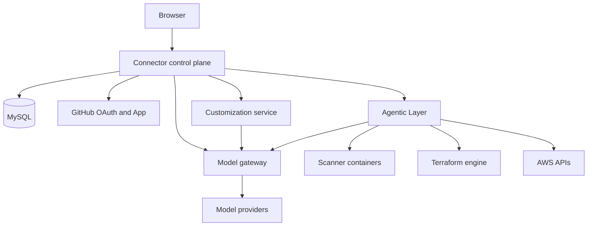
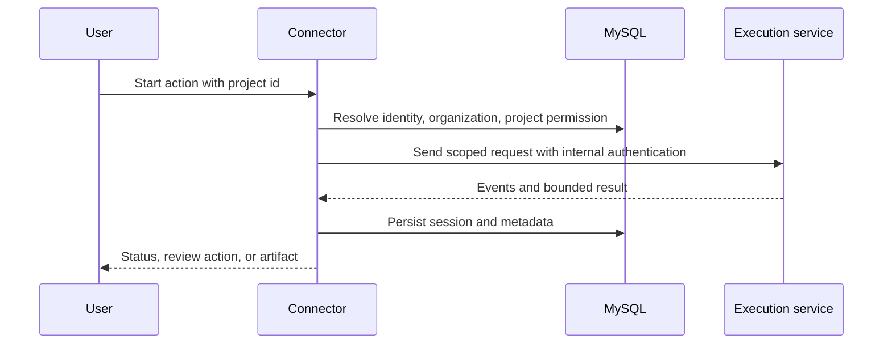

# How DeplAI fits together

DeplAI separates browser-facing control from long-running execution. The Connector owns identity and authorization; execution services receive project-scoped work only through controlled server routes.

## Platform map

## Layers and contracts

| Layer | Responsibility | Input | Output and state | Security boundary |
| --- | --- | --- | --- | --- |
| Connector control plane | UI, GitHub login, session, project and organization authorization, API facade | Browser requests | MySQL records, scoped upstream requests, UI responses | Encrypted session or API token; ownership and permission checks |
| Project system | Resolve GitHub or ZIP source into a project workspace | Authorized project id | Repository metadata and server-side path | Browser cannot choose arbitrary filesystem paths |
| Repository intelligence | Collect bounded source evidence | Project workspace | Typed repository context and summary | Read-oriented analysis with file-size and exclusion rules |
| Agentic Layer | Run scans, remediation, architecture, Terraform, and deployment work | Service-authenticated project request | Events, reports, plans, apply results | Internal service key and project-bound WebSocket token |
| Customization service | Turn a design conversation into scoped frontend changes and validation | Authorized repository context plus manifest | Diffs, snapshots, quality results, preview | Reached through Connector proxy; frontend-only mode is default |
| Security engine | Execute scanners and normalize findings | Project source plus selected modules | Reports, findings, skip reasons | Containerized tools; DAST and cloud need separate authorization or credentials |
| Deployment planner | Convert evidence and user answers into architecture and cost decisions | Repository context, environment, requirements, budget | Typed profile, alternatives, diagram, estimate | Advisory output has no apply authority |
| Terraform engine | Generate, validate, plan, and apply supported AWS configurations | Approved context and AWS credentials | Terraform bundle, plan, outputs, state, events | Plan confirmation, workspace locking, timeouts, redaction |
| Model gateway | Resolve model, credential, routing, policy, and usage | Task, model or alias, access mode | Provider response plus usage and normalized errors | Provider keys stay server-side and are masked in UI |
| Observability records | Preserve run summaries, logs, events, findings, and deployment records | Workflow updates | Sessions and subsystem records | Tenant-scoped reads and sanitized payloads |

## Request path

A browser action does not call an execution container directly.

Live security and deployment progress may use a short-lived token bound to the user and project. This token is distinct from the server-to-server key and cannot be reused as general API authority.

## Control plane versus execution plane

The control plane answers who may do what to which project. The execution plane answers how a permitted workflow performs its bounded work. Keeping those decisions separate prevents a scanner, model, or Terraform process from becoming the identity system.

The execution plane can be powerful. It runs containerized tools and, in the deployment path, can call AWS. Production operators must keep it on a private network and treat access to the container runtime as privileged.

## Data and durability

Durable records include users, organizations, projects, GitHub installations, sessions and logs, billing data, AI credentials and usage, DAST assets and scans, and deployment execution records. Repository workspaces, reports, and Terraform artifacts can also persist on configured volumes or state stores.

Some live orchestration context remains process-bound. A service restart can disconnect WebSockets or end an in-flight run even when the session row and generated files survive. Consult the service status and artifacts before retrying.

## Deployment topology

Local development can expose Connector and execution services on local ports. Production uses a reverse proxy as the public edge; Connector, Agentic Layer, customization, database, and supporting services stay private. Browser WebSockets use the same public origin and a restricted route.

## Boundaries that remain external

GitHub remains the source-of-truth for repository history. AWS remains the source-of-truth for cloud resources and charges. Model providers remain the source-of-truth for provider quotas and BYOK billing. DeplAI coordinates these systems but cannot override their permissions, outages, or retention policies.

Related: [Repository intelligence](repository-intelligence.md) | [Agents and workflows](agents-and-workflows.md) | [Security and data](security-and-data.md) | [Production operations](production-operations.md)
