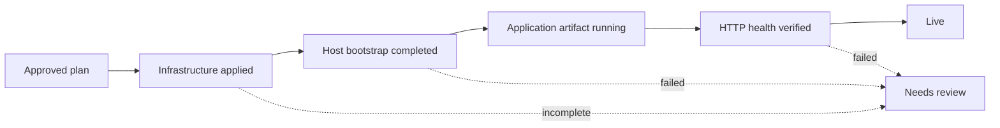

# Production operations

Production readiness is a chain of verified states. Terraform success proves that an infrastructure action completed; it does not prove that bootstrap, application startup, dependencies, or HTTP health succeeded.

## Readiness model

Report a deployment as live only after the relevant bootstrap and health gates pass. Non-EC2 targets may have different lifecycle signals, but the same principle applies: use target-specific readiness, not a generic success flag.

## Recommended promotion path

1. Freeze or identify the source revision and application artifact.
2. Run repository analysis and applicable security modules.
3. Resolve blocking organization policy findings.
4. Review architecture assumptions, estimate, Terraform, and plan.
5. Apply to a non-production environment.
6. Verify bootstrap, service health, logs, secrets, network reachability, and data migrations.
7. Exercise rollback or recovery before production promotion.
8. Repeat the approved process for production with tighter access and retained evidence.

## Production topology

The production stack uses a public reverse proxy for TLS and keeps Connector, execution services, database, and supporting services on private container networks. Browser traffic reaches the Connector and a restricted same-origin WebSocket path. Connector calls execution services with a server-side service credential.

The Agentic Layer has privileged access to the container runtime so it can launch scanners and Terraform helpers. Treat its host as a trusted execution environment. Restrict host access, protect the Docker socket, patch the host, and do not publish internal service ports directly.

## Credentials and secrets

| Credential | Production practice |
| --- | --- |
| GitHub OAuth/App | Use production callback and webhook URLs; grant minimum repository access; rotate secrets deliberately. |
| AWS | Prefer narrowly scoped, short-lived credentials; separate environments and accounts where practical. |
| BYOK | Use workload-specific provider keys, provider spend limits, and organization policy. |
| Internal service keys | Generate distinct random values and keep them server-side. |
| Session and encryption keys | Use non-placeholder production values; back up only through an approved secret system. |
| Application secrets | Deliver through the deployment secret flow; do not commit them to source or Terraform. |

## State and backups

Back up MySQL because it contains the control-plane records required to interpret projects, sessions, organizations, billing, DAST, AI configuration, and deployment history. Protect persistent project/report volumes according to your recovery target. Configure Terraform remote state and locking, restrict bucket and lock-table access, and test recovery.

External systems also need their own retention: GitHub repository history, AWS logs and state, provider billing records, and payment-provider records are not replaced by a DeplAI session.

## Observability

Use three layers of evidence:

- session status and logs for user-facing workflow history;
- service and container logs for Connector, Agentic Layer, customization, database, and reverse proxy health;
- external provider logs for GitHub delivery, AWS operations, model API failures, and payments.

Correlate with project, session, run, deployment, and external request identifiers. Do not place secret values in incident notes.

## Failure domains

| Domain | Typical symptom | Production response |
| --- | --- | --- |
| Control plane | Login, database, or authorization failures | Restore Connector/database health before retrying work |
| Execution plane | Lost socket, worker unavailable, stuck run | Inspect durable record and worker logs; determine whether resume is supported |
| Provider | Rate limit, timeout, invalid model | Use approved retry/fallback and preserve resolved model evidence |
| Terraform/AWS | Plan/apply error or lock | Read diagnostics, state, and lock ownership before any recovery action |
| Bootstrap | Infrastructure exists but app is unavailable | Read sanitized bootstrap phase and instance logs; do not report deployed |
| Application | Health check fails after startup | Roll back artifact or fix app/config; preserve infrastructure if healthy |
| Data | Migration or database failure | Follow application-specific recovery; image rollback alone may be unsafe |

## Change management

Use organization roles and security policy to separate who can read, run, approve, configure credentials, and operate deployments. A production approval should identify the source revision, artifact digest where available, environment, plan, expected cost, security evidence, rollback target, and operator.

## Current limits

AWS is the implemented infrastructure apply and runtime provider. Azure and GCP can appear in advisory architecture/cost paths but are not equivalent production apply targets. Some live workflow context is process-local. DeplAI is not currently a full runtime monitoring or incident-management platform.

Related: [Deploy](agents/deploy.md) | [Instance management](instance-management.md) | [Artifacts and recovery](artifacts-and-state.md) | [Security and data](security-and-data.md)
