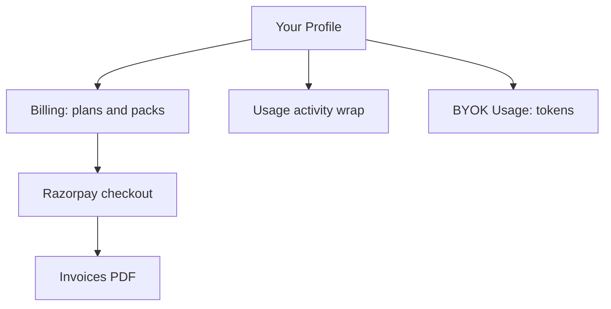

# Profile, usage, and invoices

Account surfaces outside **Billing** live on **Your Profile**, **Usage**, and **Invoices**. Together they show who you are on DeplAI, how you spend credits and model tokens, and what Razorpay charged.

## Your Profile

Open **Dashboard → Your Profile** (`/profile`).

| Area | What you manage |
| --- | --- |
| **Identity** | Display name, avatar, email (from GitHub), LinkedIn and GitHub links. |
| **Credits** | Paid and bonus balance, current plan name; links to **Billing**. |
| **Routing** | Workspace routing mode and efficient model pool for automated picks. |
| **Auto top-up** | Optionally add credits when balance falls below a USD threshold (paid plans). |
| **Promo codes** | Redeem codes for paid credits. |
| **API token** | Personal API token for integrations; masked after creation. |
| **Integrations** | GitHub App installs (same capability as **Account → Integrations**). |

Profile routing modes align with agent pickers:

| Mode | Behavior |
| --- | --- |
| **Default** | Balanced platform routing for most tasks. |
| **Efficient** | Prefer lower-cost models from your efficient pool. |
| **Quality** | Prefer higher-capability models where your plan allows. |
| **BYOK preferred** | Use your saved provider keys when present. |

Changes save explicitly; agents pick up routing on the next run.

## Usage (dashboard)

**Dashboard → Usage** (`/dashboard/usage`) is a year-style activity wrap: scans, deploys, customization runs, and credit consumption trends—not per-token LLM metering.

Use it for:

- Executive summaries and team reviews.
- Spotting which services consumed the most activity in a period.

For token-level detail, open **BYOK → Usage** (`/dashboard/ai/usage`).

## Invoices

**Account → Invoices** (`/dashboard/invoices`) lists Razorpay-settled charges:

- Subscription checkouts (monthly or yearly).
- Credit pack purchases.

Each row includes invoice number, date, amount in INR (tax inclusive where applicable), and a **PDF download**. Successful checkout from **Billing** links here immediately.

GST appears on Indian invoices per seller and buyer state (CGST/SGST or IGST). Legal entity and GSTIN are on the PDF, not repeated in this guide.

## How the pieces fit

| Question | Where to look |
| --- | --- |
| What plan am I on? | **Profile** credit card, **Billing** Plans tab, or **Organizations → Billing & usage**. |
| How many credits left? | **Profile**, **Billing** balance widget, or **Credit packs** tab. |
| What did I pay in INR? | **Invoices** (authoritative after payment). |
| How many tokens did models use? | **BYOK → Usage**. |
| GitHub connected? | **Profile → Integrations** or **Account → Integrations**. |

## Role-based access (organizations)

| Role | Profile | Usage | Invoices |
| --- | --- | --- | --- |
| Any member | Own profile always | Org usage if `usage.read` | Own invoices; org invoices if `invoice.read` |
| **Billing Admin** | Own profile | Org usage | Org billing and invoices |
| **Viewer** | Own profile | May be limited | Usually no invoice access |

Personal accounts see only their own data.

## Security notes

- API tokens are secrets—store them in a vault; DeplAI shows only a masked suffix after creation.
- Invoice PDFs may contain billing address and tax identifiers; treat downloads like financial records.
- Promo codes and auto top-up use the same Razorpay rails as **Billing**; failed payments do not add credits until verification completes.

Related: [Billing](billing.md) · [Security and data](security-and-data.md) · [Organizations](organizations.md)
