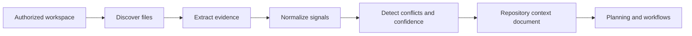

# Repository intelligence

Repository intelligence is the evidence layer that turns a source tree into structured facts for planning and execution. It is deterministic discovery, not a model's guess about an application.

## What it inspects

The analyzer walks a bounded project workspace and combines several forms of evidence:

| Evidence | Examples of inferred information |
| --- | --- |
| Language files and counts | Primary languages and mixed-runtime repositories |
| Dependency manifests and lockfiles | Frameworks, package managers, libraries, and data-store clients |
| Framework configuration | Build behavior, frontend entry points, and runtime assumptions |
| Dockerfiles and Compose | Services, ports, images, process layout, and dependencies |
| Environment references | Required variable names and configuration dependencies, never secret values in documentation output |
| Source signals | Database usage, health routes, uploads, background work, and service boundaries |
| CI and infrastructure files | Existing pipelines, Terraform, cloud hints, and deployment conventions |
| Documentation | Declared commands and operational intent that can be compared with code evidence |

Large generated directories, dependencies, binaries, and oversized files are excluded or bounded. This keeps analysis focused and reduces accidental context expansion.

## Analysis lifecycle

The output records evidence, derived facts, conflicts, and low-confidence signals. Downstream deployment questions can then focus on requirements that source cannot answer, such as traffic, recovery targets, budget, domain ownership, and compliance constraints.

## How downstream systems use it

- Deployment review derives defaults and tailored questions from detected runtime and data requirements.
- Architecture planning maps confirmed requirements into supported compute, networking, data, and operations profiles.
- Terraform generation consumes the typed profile rather than a free-form request alone.
- Security modules use repository contents and manifests to decide which scanners have applicable input.
- Customization performs its own frontend-focused scan before planning changes.

Repository context is evidence, not authorization. It cannot approve an apply, grant GitHub access, or expose a credential.

## Example

Consider a Next.js repository with a lockfile, Prisma schema, Dockerfile, `DATABASE_URL` reference, and `/api/health` route. Analysis can report a Node.js web runtime, dependency installation strategy, database requirement, container support, and health-check candidate. It cannot infer the expected production traffic, acceptable downtime, or whether the database should be migrated during deployment. Those remain review questions.

## Conflicts and confidence

A repository can contain stale files. A README may name one start command while the container uses another; multiple lockfiles may suggest competing package managers; example environment files may mention services not used in source. Treat conflict output as a prompt for human confirmation.

When source changes materially, rerun analysis before relying on an old deployment profile. A retry is appropriate for a transient analyzer failure; a fresh run is appropriate when the repository revision changed.

## Context management for model-assisted stages

DeplAI does not send an entire large repository to every model call. Workflows select task-relevant files, summaries, manifest evidence, or finding-adjacent snippets. Remediation bounds finding groups and source excerpts. Customization begins with a manifest and frontend scan. Deployment uses a structured repository document.

This approach reduces context cost and makes the reason for including a file easier to inspect. It does not eliminate model context limits; very large or unusually coupled changes may need narrower scope or multiple runs.

## Limitations

- Dynamic behavior, traffic shape, private dependencies, and external infrastructure may not be visible in source.
- Monorepos can contain multiple deployable units; confirm which unit the selected project represents.
- Generated or vendored code may be intentionally excluded.
- A detected configuration file does not prove it is used in production.
- Repository analysis does not replace tests, a threat model, or runtime observability.

## Troubleshooting

| Symptom | Check |
| --- | --- |
| Framework not detected | Confirm the manifest/config file is inside the selected project and not excluded. |
| Wrong start command | Compare package scripts, Docker command, and declared documentation; answer the review question explicitly. |
| Database requirement missing | Confirm dependency and environment references are committed and rerun analysis. |
| Analysis appears stale | Refresh the GitHub repository or re-upload the ZIP, then start a new analysis. |
| Monorepo result is too broad | Select or package the intended deployable unit where the product flow allows it. |

Related: [Core concepts](concepts.md) | [Repository to production](how-it-works.md) | [Deploy](agents/deploy.md)
