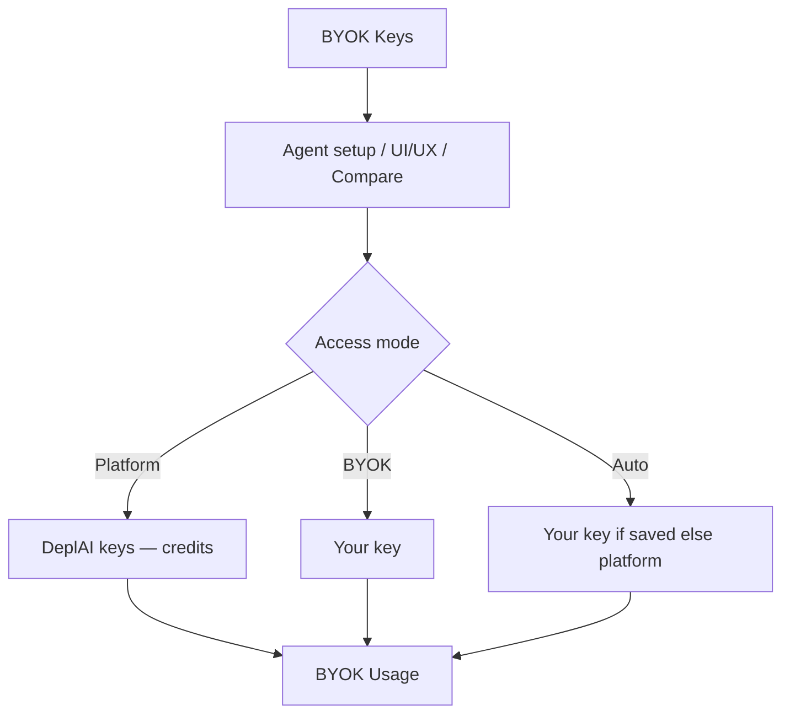

# Security and data handling

What DeplAI can access, what you approve, and what **BYOK** changes. This page describes customer-visible behavior—not DeplAI’s internal hosting architecture.

## GitHub

### Sign-in

GitHub login is **identity only**:

| GitHub scope | Why |
| --- | --- |
| Email | Bind your DeplAI user. |
| Profile | Display name, login, avatar. |
| Organization membership | Pick the correct GitHub App installation. |

Repository contents require the **GitHub App** install and repo grant.

### Repositories

You choose repositories when installing the GitHub App. DeplAI clones granted repos for scans and analysis. ZIP uploads are stored under your account.

Pull requests use the GitHub App (**Contents: Read & write**, **Pull requests: Read & write**) only after you approve **Review**—not your OAuth login token.

### Optional GitHub PAT

On **Agent setup** (**Configure AI Agent**), **GitHub PAT (Optional)** applies to that remediation push only. It is not stored in BYOK keys.

## AWS and cloud accounts

Deploy and **Instance Management** use AWS credentials you provide or an organization-approved cloud account. DeplAI can create, start/stop/reboot, and destroy **project-tagged** resources. Scope IAM principals narrowly. Charges appear on **your AWS bill**.

Organization **Cloud & AI** tracks which accounts are approved for members. See [Organizations](organizations.md).

## DAST and authorization

Dynamic tests run only against **verified** targets (DNS or HTTP proof). Unverified hosts are rejected. Do not configure targets you do not own or lack written permission to test.

## Your code, keys, and logs

| Asset | Handling |
| --- | --- |
| Repository or ZIP | Held on DeplAI servers for active scans, customization, deploy work. |
| Scan / remediation | Live in the workspace; **Sessions** for history if you leave the tab. |
| Terraform plan / apply | Tied to the Deploy session; confirm before apply. |
| BYOK keys | Encrypted at **BYOK → Keys**; UI shows masked suffix only. |
| GitHub PAT on Agent setup | One-run push only; not saved as a credential. |
| LLM prompts / responses | Not stored by default; logging toggles may exist in advanced workspace policy. |

DeplAI is not the system of record—GitHub for code, your AWS account for infrastructure.

## BYOK across the platform

**BYOK** means the model call uses a provider key **you** stored, not DeplAI platform keys.

Add keys at **BYOK → Keys** (`/dashboard/ai`). Validate; status shows **VALID** when healthy. Full key material is never shown again.

### BYOK navigation

| Item | Path | Purpose |
| --- | --- | --- |
| **Keys** | `/dashboard/ai` | Add, validate, revoke provider keys. |
| **Catalog** | `/dashboard/ai/catalog` | Models and providers available to the workspace. |
| **Compare** | `/dashboard/ai/compare` | Side-by-side model comparison / playground. |
| **Usage** | `/dashboard/ai/usage` | Tokens, requests, estimated USD—platform vs BYOK. |

**Dashboard → Usage** is a year-style activity summary. **BYOK → Usage** is LLM token metering.

### Access modes (agents)

| Picker label | Meaning |
| --- | --- |
| **Platform** | DeplAI-hosted keys; gated by plan and credits. Free: **Best fast**, **Best cost** only. |
| **BYOK** | Your saved key; fails if none valid for that provider. |
| **Auto** | Your key if present; otherwise platform. |

**Your Profile → Routing** sets workspace-default routing modes that align with these picks.

### Where you choose access mode

| Surface | Control |
| --- | --- |
| Security Agent → **Agent setup** | **Remediation is an exception:** choose an eligible free platform remediation model only. BYOK, Auto, paid models, and direct provider routing are unavailable for remediation; an optional GitHub PAT is still one-run push authority only. |
| UI/UX customizer | Platform / BYOK / Auto model selection before start. |
| Deploy | Platform / BYOK / Auto when an LLM-refine step runs. |
| **Compare** | Explicit mode for ad-hoc chat. |

The remediation restriction is intentional: it keeps security patch generation on a centrally budgeted and validated platform route. A key stored under **BYOK → Keys** is never sent for a remediation request.

### What BYOK changes economically

- Provider invoice goes to **your** vendor account for BYOK calls.
- DeplAI still processes workflow context (findings, frontend files) required for the task.
- **Usage** splits platform vs BYOK; USD estimates on Usage—not deducted from credits. See [Billing](billing.md).

## Organization security

- **Roles** limit who can connect repos, run agents, approve deploys, or read audit logs.
- **Security policy** can require scan types and block deploys on critical findings or secrets.
- **Audit log** records membership and governance events (role-dependent).

## Compliance-oriented practices

- Use **Organizations** with least-privilege roles in production workspaces.
- Prefer BYOK when contractual data residency requires your provider agreement.
- Download **Invoices** and audit exports for your retention policy.
- Rotate BYOK keys from **Keys** after personnel changes.

Related: [Organizations](organizations.md) · [Billing](billing.md) · [DAST](dast.md) · [Security Agent](agents/security-agent.md)
