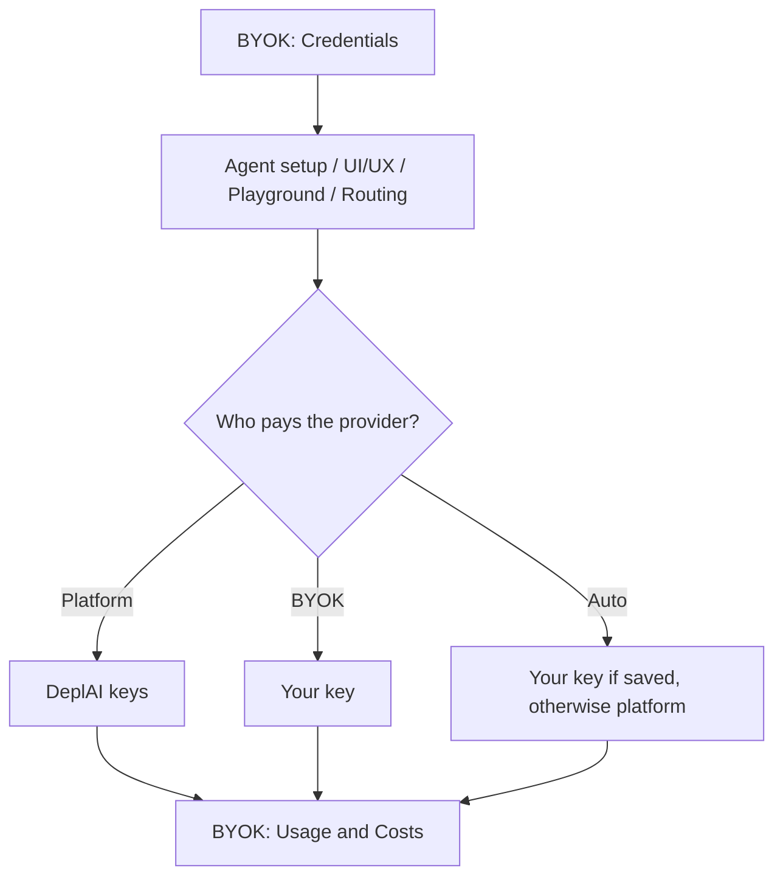

# Security and data handling

What DeplAI can access, what you approve, and what **BYOK** changes. This page does not describe DeplAI’s internal hosting or how the platform stores its own credentials.

## GitHub

### Sign-in

GitHub login is identity only:

| GitHub asks for | Why |
| --- | --- |
| Email | Bind your DeplAI user to an email. |
| Profile | Display name, login, avatar. |
| Organization membership | So you can pick the right GitHub App install. |

That grant does **not** include repository contents. You still install the GitHub App and choose which repos DeplAI may see.

### Repositories

You pick the repositories when you install the GitHub App. DeplAI clones those repos on its servers for scans and analysis. A ZIP upload is stored under your account instead of GitHub.

Pull requests use the GitHub App with **Contents: Read & write** and **Pull requests: Read & write**. Those permissions are used only after you approve **Review**. They are not your OAuth login token.

### Optional GitHub PAT

On **Agent setup** (page heading **Configure AI Agent**) the field **GitHub PAT (Optional)** is for that run’s push only. Copy on the field: it is not stored persistently. Use it if the GitHub App token cannot create the PR.

ZIP projects can still produce diffs. They cannot open a GitHub pull request until the project is a GitHub repo.

## AWS

Deploy uses the AWS credentials you submit for that run. DeplAI can create, start/stop/reboot, and destroy **project-tagged** resources from the Deploy UI. Scope the IAM principal you provide. AWS usage is billed to that account, not as DeplAI credits.

## Your code, keys, and logs

| What | What happens |
| --- | --- |
| Repository or ZIP | Held on DeplAI servers for the duration of scans, customization, and deploy work. |
| Scan / remediation | Progress is live in the workspace. If you close the tab, reopen **Sessions** for logs. |
| Terraform plan / apply | Stays with that Deploy run. Confirm the plan before apply. |
| BYOK keys | You save them under **BYOK → Credentials**. They are encrypted. The UI shows a masked suffix only, never the full key. |
| GitHub PAT on Agent setup | Sent with that one remediation start. Not saved in Credentials. |
| LLM prompts and replies | Not stored unless you turn on **Prompt logging** or **Response logging** under **BYOK → Policies** (both off by default). |

DeplAI is not the source of record. GitHub remains the repository of record. Your AWS account remains the account of record.

## BYOK across the platform

**BYOK** means the model call uses a provider key **you** stored, not DeplAI’s platform keys.

Add keys at **BYOK → Credentials** (`/dashboard/byok` opens the same page). Validate the key; you will see statuses such as **VALID**. Full key material is never shown again.

### Access modes

Security Agent **Agent setup** and UI/UX customizer use **Platform**, **BYOK**, and **Auto**. **Routing** uses the same three values with different labels:

| Picker | Routing | Meaning |
| --- | --- | --- |
| **Platform** | **Platform only** | DeplAI-hosted keys. Blocked if **BYOK required** is on. Free plan: **Best fast** and **Best cost** only. |
| **BYOK** | **BYOK only** | Your saved key. Fails if none is valid for that provider. |
| **Auto** | **BYOK preferred** | Use your key if one is saved; otherwise platform. |

Defaults on **Agent setup**:

| Plan | BYOK key saved? | Starts on | Default model |
| --- | --- | --- | --- |
| Starter / Pro / Enterprise | either | **Platform** | **Best coding** |
| Free | yes | **BYOK** | **Best fast** unless you change it |
| Free | no | **Platform** | **Best fast** |

### BYOK nav

| Item | What it is |
| --- | --- |
| **Overview** | Counts of models, keys, and provider health. |
| **Playground** | Chat with an explicit access mode. Same model routing as agents. |
| **Models** | Catalog of models you can pick. |
| **Providers** | Which vendors are available, and whether BYOK is supported. |
| **Credentials** | Add, validate, or revoke keys. Masked suffix only. |
| **Routing** | Per-task alias and access mode. |
| **Policies** | Workspace gates (table below). |
| **Usage** | Token and request totals, platform vs BYOK. Last 30 days. |
| **Costs** | Estimated USD, platform vs BYOK. |
| **Health** | Whether a provider looks healthy. |
| **Audit** | Credential and routing events. |

**Dashboard → Usage** is a year-style activity wrap. **BYOK → Usage** is LLM token metering.

### Policies

| Title | Effect |
| --- | --- |
| **BYOK required** | Every call must use your key. Platform keys are ignored. |
| **Platform credentials** | Allow DeplAI keys when Auto is on or no customer key is present. |
| **Fallback allowed** | If the chosen model fails, try another eligible model. |
| **Cross-provider fallback** | A fallback may use a different vendor. |
| **Prompt logging** | Store prompt text. Off by default. |
| **Response logging** | Store model output. Off by default. |
| **Spend and token caps** | Optional limits. Empty means no cap. |
| **Allowed providers** | Empty = all. A selection is an allowlist. |

### What BYOK changes

- The provider invoice goes to **your** account.
- DeplAI still sends the prompt the workflow needs (findings, frontend context, chat). Your clone or ZIP is unchanged.
- **Usage** and **Costs** split platform vs BYOK. Platform calls show list price plus a platform surcharge. BYOK calls show $0 provider cost on DeplAI’s side (you pay the vendor) plus a platform surcharge. The USD is on **Costs**, not subtracted from credits. See [Billing](billing.md).

### Where you pick it

| Surface | Control |
| --- | --- |
| Security Agent → **Agent setup** | **Platform** / **BYOK** / **Auto** + model. Optional GitHub PAT. |
| UI/UX customizer | Same picker. If blocked: “Choose a platform model or a saved BYOK credential first.” |
| Deploy | Uses the same access-mode setting when an LLM refine step runs. |
| **Playground** / **Routing** | Explicit access mode. |

On Free, flagship **platform** models stay locked until you add a BYOK key or upgrade to Starter.

Related: [Security Agent](agents/security-agent.md) · [Billing](billing.md) · [Core concepts](concepts.md)
