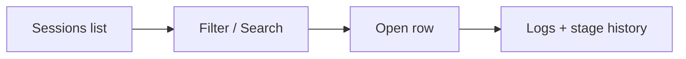

# Sessions

**Sessions** is the audit trail and log viewer for DeplAI agent runs. Every significant workflow—scan, remediation, customization, Terraform generate/apply, and DAST—creates a **session** you can reopen for status, stage history, and logs.

Open **Services → Sessions** (`/dashboard/sessions`).

Sessions is **history and observability**. Live interactive work resumes from the **service page** (Security Agent, Deploy, UI/UX customizer)—not by “continuing” a session in place.

---

## What creates a session

| Service | When a session is created |
| --- | --- |
| **Security Agent** | Scan starts; persists through remediation and GitHub verify |
| **UI/UX customizer** | Customization run starts |
| **Deploy** | Terraform generation and/or apply |
| **DAST** | Authorized dynamic scan (via DAST page or Security Agent module) |
| **Code Reviewer** | Reserved—nav shows **Soon** |

---

## Session statuses

| Status | Meaning |
| --- | --- |
| **queued** | Run accepted; waiting to start |
| **running** | Active work in progress |
| **completed** | Finished successfully |
| **failed** | Terminal error—check logs |
| **needs review** | Waiting for human approval (e.g. Review stage) |

---

## Finding a session

1. Open **Sessions**.
2. **Filter** by service (Security Agent, Deploy, UI/UX, DAST) or status.
3. **Search** by title, repository name, or project.
4. **Copy session id** when contacting `support@deplai.tech`.

---

## What you see when reopening

### Security Agent

- **Pipeline** rail shows stages **01–06** as a **historical record** (Scan → Results → Agent setup → Remediation → Review → GitHub & verify).
- **Does not resume** a live scan. Start a **new scan** from Security Agent to continue interactive work.
- Scanner logs and remediation output remain available.

### Deploy

- Stages such as **Queued → Generate → Plan → Apply → Done**.
- Terraform logs and apply output.
- Failed applies show error detail—use this before re-running apply.

### UI/UX customizer

- **Queued → Running → Review → Done**.
- Diff, preview checkpoints, and quality results where captured.

### DAST

- Target URL, profile (Passive / Active / API), and finding summary when linked from a scan session.

---

## Logs

- **Logs** update while status is **queued** or **running**.
- After completion, logs are read-only.
- For long Terraform applies, keep the Deploy tab open during apply; Sessions captures output if you navigate away.

---

## Sessions vs live pages

| Need | Use |
| --- | --- |
| See what happened yesterday | **Sessions** |
| Run a new scan | **Security Agent** |
| Apply infrastructure changes | **Deploy** |
| Restyle frontend | **UI/UX customizer** |
| Export PDF security report | **Security Agent → Results** (not Sessions) |

---

## Organization and compliance

- Organization **Audit log** (`/dashboard/organization`) records governance events (invites, role changes, policy updates)—not per-scanner stdout.
- Use **Sessions** for technical run logs; use **Audit log** for who changed org settings.
- Copy **session id** + **organization id** when escalating to support.

---

## Troubleshooting

| Symptom | What to do |
| --- | --- |
| Session missing | Run may not have started; check service page for errors |
| Stuck on **running** | Refresh; check service page; contact support with session id |
| Logs empty | Run may have failed before logging started |
| Cannot resume scan from Sessions | Expected—start new scan from Security Agent |
| Deploy session failed | Read Terraform error; check AWS for partial resources before re-apply |

---

## Related documentation

- [Security Agent](agents/security-agent.md)
- [Deploy](agents/deploy.md)
- [UI/UX customizer](agents/uiux-customizer.md)
- [DAST](dast.md)
- [Organizations](organizations.md)
