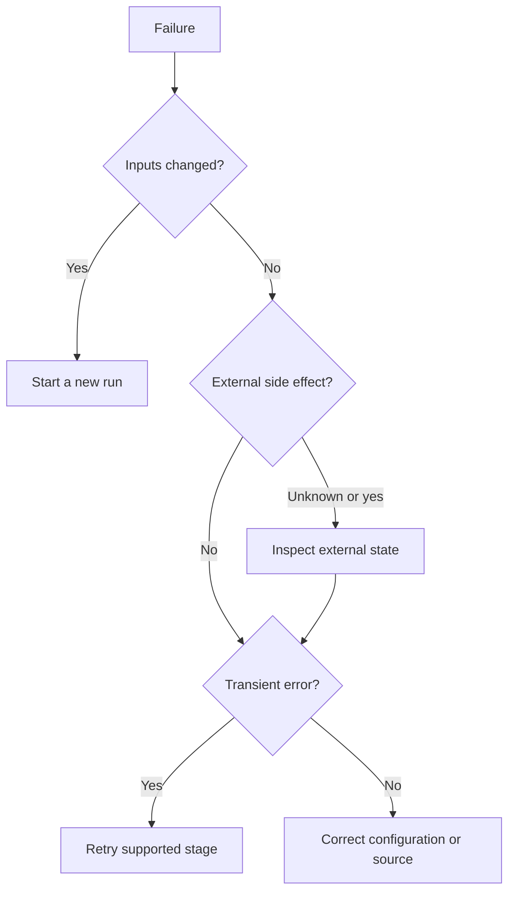

# Troubleshooting

Troubleshoot DeplAI by identifying the failed boundary: browser, Connector, project authorization, execution service, external provider, generated artifact, or deployed application.

## First five checks

1. Record the project, session, run, and deployment identifiers shown in the UI.
2. Confirm the selected project and active organization.
3. Read the last durable log or event and note its stage.
4. Decide whether the failure occurred before or after an external side effect.
5. Retry only if source, credentials, policy, and decisions remain valid.

## Authentication and session

| Symptom | Likely boundary | What to check |
| --- | --- | --- |
| GitHub login returns configuration error | Connector OAuth configuration | Client id/secret are present and the callback exactly matches the public application URL |
| State mismatch or login loop | Browser session/callback origin | Cookies are enabled, callback uses the same canonical origin, and the OAuth attempt is not older than ten minutes |
| Login works but repositories are missing | GitHub App, not OAuth | Installation exists, repository is granted, and installation sync succeeds |
| Signed in but API returns unauthorized | Expired session or token | Refresh session; validate the personal API token format and ownership scope |

GitHub OAuth authenticates the user. GitHub App installation authorizes repository access. Diagnose them independently.

## Project and repository

| Symptom | Check |
| --- | --- |
| Wrong project content | Project picker, active organization, repository revision, ZIP version |
| GitHub source is stale | Refresh installation/repository and start a new run |
| ZIP cannot be read | Archive integrity, supported structure, upload ownership, extraction result |
| Access forbidden | Project ownership, organization membership, role permission, installation ownership |

## Security scan

| Symptom | Response |
| --- | --- |
| Module skipped | Read the skip reason; confirm required manifests, files, image, credentials, or DAST URL exist |
| Scanner image unavailable | Restore container registry/network access and pre-pull required worker images |
| Empty report | Distinguish a clean result from a parser/tool failure using module status and raw diagnostics |
| DAST rejected | Verify the asset, authorization grant, target hostname, and public reachability |
| Cloud scan rejected | Supply authorized AWS credentials and region; do not reuse unrelated deploy credentials casually |
| Findings changed unexpectedly | Compare source revision, scanner database freshness, selected modules, and target environment |

## Remediation and customization

| Symptom | Response |
| --- | --- |
| No patch generated | Confirm selected findings/files are patchable and model access is valid |
| Context limit | Reduce finding scope or customization breadth; use a permitted larger-context model |
| Diff rejected | Inspect path, applicability, protected-file, and validation errors; do not bypass the validator |
| Preview fails | Check package install/start diagnostics and required environment-variable names |
| Preview looks correct but tests fail | Treat tests and functional validation as authoritative; revise the change |
| GitHub PR fails | Confirm installation permissions, branch/default branch, and repository grant |

## Models and BYOK

| Symptom | Response |
| --- | --- |
| Credential invalid | Validate exact provider/key pairing and rotate if revoked |
| Model unavailable | Confirm current provider model id and account entitlement; choose another catalog model |
| Rate limited | Wait for reset or use an allowed fallback |
| Quota exceeded | Increase provider quota or select a permitted credential source |
| Policy denied | Review organization provider/model/access-mode restrictions |
| Usage missing | Confirm the request reached the shared gateway; legacy/fallback paths may report differently |

## Deployment planning and Terraform

| Symptom | Response |
| --- | --- |
| Analysis contradicts source | Review conflicting evidence and rerun after refreshing the repository |
| Estimate exceeds budget | Change requirements or choose a lower tier before Terraform generation |
| Terraform validation fails | Read file and contract diagnostics; regenerate after correcting decisions |
| Plan includes unexpected replacement | Stop; inspect state, source revision, environment, and changed variables |
| Apply waits | Explicit plan confirmation or organization approval may still be required |
| Workspace locked | Identify the active lease/run before attempting supported lock recovery |
| AWS permission error | Add only the missing action/resource scope or choose an approved account |

## Deployment runtime

| Symptom | Response |
| --- | --- |
| Infrastructure complete, app unavailable | Inspect bootstrap phase, service logs, configuration, database connectivity, then HTTP health |
| Bootstrap cannot build database URL | Verify endpoint, port, database name, user, and encoded password inputs |
| Health check fails | Confirm listener port, health path, security group, reverse proxy, TLS, and application logs |
| Retry would create duplicates | Inspect Terraform state and AWS resources before another apply |
| Rollback fails | Verify previous artifact and executor support; handle database changes separately |

## Retry decision

## Escalation packet

Include identifiers, UTC timestamp, stage, sanitized error code/message, source revision, selected model/access mode, environment, whether an external mutation occurred, and the last known-good state. Never include OAuth secrets, provider keys, AWS secret keys, session cookies, private keys, or unredacted Terraform sensitive outputs.

Related: [Artifacts and recovery](artifacts-and-state.md) | [Production operations](production-operations.md) | [Sessions](sessions.md)
