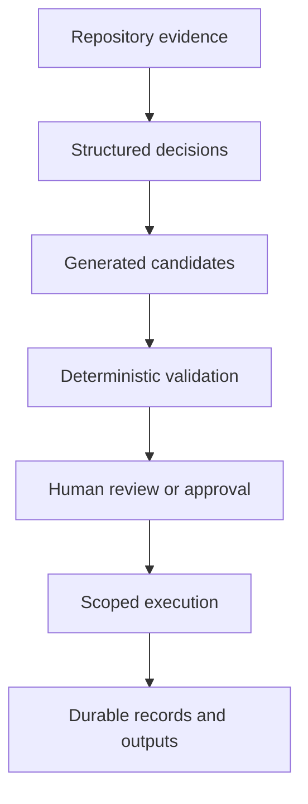

# Why DeplAI

DeplAI exists to keep repository understanding, security evidence, generated changes, infrastructure decisions, and execution history in one controlled workflow.

## The fragmentation problem

A production change often begins with a source repository but immediately leaves it. A developer inspects manifests, a scanner emits findings, a model proposes code, a platform engineer translates runtime needs into infrastructure, and an operator diagnoses the deployed result. The handoffs are where context and accountability are commonly lost.

| Fragment | Typical consequence |
| --- | --- |
| Repository analysis lives in one tool | Downstream plans repeat discovery or rely on assumptions. |
| Scanner outputs use different formats | Findings are difficult to prioritize and remediate consistently. |
| AI receives broad source access | Context becomes expensive, noisy, and harder to govern. |
| Infrastructure is generated from a prompt alone | Runtime and data requirements can be missed. |
| Apply is coupled to generation | A plausible answer can become a cloud mutation without review. |
| Live progress is transient | Operators lose the evidence needed to understand failure. |

## DeplAI's response

DeplAI attaches work to a project and uses structured boundaries between stages:

This structure matters more than any single model. The platform can replace or route models while preserving ownership checks, policy, validation, and the execution contract.

## Why specialized workflows

A security remediator and an infrastructure planner need different context, tools, output schemas, and failure handling. DeplAI therefore uses bounded workflows rather than one prompt with universal access.

- Repository analysis is evidence collection.
- Security scanning is tool execution plus normalization.
- Remediation is finding-to-diff orchestration.
- Customization is manifest-to-validated-frontend change.
- Deployment is repository evidence plus explicit architecture decisions, cost review, Terraform, and apply gates.
- Model routing is a supporting service, not the product authority layer.

Specialization limits unnecessary context and gives each workflow a concrete completion condition. It also makes retries and audit records meaningful: a retry can target the failed stage rather than repeating an opaque conversation.

## When DeplAI is a good fit

Use DeplAI when you want a guided, reviewable path from an existing application repository to one or more of these outcomes:

- a clearer model of the application's runtime requirements;
- a frontend-only design transformation with validation and preview;
- a multi-module security assessment and normalized findings;
- candidate remediation patches with a human review gate;
- an AWS architecture and cost conversation grounded in source evidence;
- generated Terraform and an approval-gated apply;
- a shared organization boundary for members, roles, policy, and activity.

## When to use another tool

Use source-native tooling directly when you need a very narrow operation, such as one local unit test or a manual one-file edit. Use a dedicated security platform when you require certifications, proprietary rules, or enterprise evidence DeplAI does not expose. Use your cloud platform and incident tooling as the source of truth for runtime operations, telemetry, and disaster recovery.

DeplAI complements GitHub and AWS; it does not replace either system of record.

## Production posture

Treat generated output as an engineering proposal until its relevant gate passes. Review source diffs, scan evidence, Terraform plans, cost estimates, credential scope, and health signals. For production, use organization permissions and security policy, isolate execution services, rotate credentials, and retain the audit material required by your own controls.

Related: [Introduction](introduction.md) | [Design principles](design-principles.md) | [Production operations](production-operations.md)
